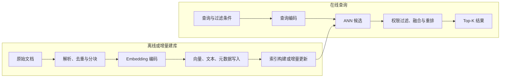

# 向量检索：从 Embedding 到候选文档

向量检索解决「在给定打分空间里寻找候选」，不保证找到的就是能回答问题的证据。编码器决定语义关系，索引近似决定漏掉哪些近邻，权限过滤与重排再改变最终集合。评估应拆开这些误差，而不是只报告一个 Recall。

::: info 符号与约定
沿用[数学与符号约定](../foundations/math-notation.md)。$q,x_i\in\mathbb{R}^d$ 分别是查询向量与第 $i$ 个候选向量，$N$ 是候选总数，$K$ 是返回数量，$s(q,x_i)$ 是相似度；$\operatorname{TopK}_{\mathrm{exact}}$ 与 $\operatorname{TopK}_{\mathrm{ANN}}$ 分别表示精确搜索和近似搜索的前 $K$ 个结果集合。
:::

~~~mermaid
flowchart LR
	Q["查询"] --> E["查询编码"]
	E --> A["ANN 召回"]
	K["向量索引"] --> A
	M["元数据过滤"] --> A
	A --> H["与关键词结果融合"]
	H --> R["重排"]
	R --> O["Top-K 文档"]
~~~

---

## 精确搜索与 ANN

HNSW 的基本思路是在多层邻接图中先粗后细寻找接近查询的节点，搜索宽度控制探索多少候选；IVF 先把向量分到粗聚类单元，查询时只探测部分单元；PQ 则把向量拆为子空间并用小码本近似，重点减少存储和距离计算。

它们改变的对象不同：图索引改变遍历路径，倒排聚类改变候选区域，量化改变向量或距离近似，可以组合但不是同一种算法。扩宽搜索通常增加成本并提高与精确 Top-K 的一致度，仍不能修复编码器把正确证据排得很低的问题。

若精确搜索把相关文档排到 100 名外，提高 ANN 对精确排序的复现度不能保证将它送进 Top-10。近似误差可能偶然返回它，但不应依赖误差修复语义排序。精确排名良好而 ANN 漏掉时，才应优先调整索引。

给定查询 $q\in\mathbb{R}^{d}$ 与 $N$ 个候选向量，精确搜索计算：

$$
\operatorname{arg\,topk}_{i\in\{1,\ldots,N\}}s(q,x_i)
$$

逐个比较的代价近似为 $O(Nd)$。候选规模很大或查询延迟严格时，系统使用近似最近邻（Approximate Nearest Neighbor, ANN）减少访问的向量数量，以少量召回损失换取速度。

常见索引族解决不同瓶颈：

| 方法 | 核心做法 | 主要折中 |
| --- | --- | --- |
| HNSW | 构建多层近邻图并沿图搜索 | 召回高、内存占用较大 |
| IVF | 先分桶，只搜索相近簇 | 需要训练聚类中心和调节探测簇数 |
| PQ | 用码本压缩向量 | 节省存储但引入量化误差 |
| Flat | 保存原向量并精确比较 | 结果精确，规模受吞吐限制 |

不存在脱离数据分布和硬件的「最佳索引」。应在真实向量与查询上绘制 Recall–Latency–Memory 曲线。

ANN 自身的近似误差应与 embedding 模型质量分开测量。固定同一批查询，先用 Flat 精确搜索得到向量空间中的真实 Top-K，再比较 ANN 返回结果：

$$
\operatorname{ANNRecall@K}
=
\frac{|\operatorname{TopK}_{\mathrm{ANN}}\cap\operatorname{TopK}_{\mathrm{exact}}|}{K}
$$

这个指标只说明索引复现精确向量排序的程度，不说明这些文档在语义上是否相关。业务 Recall@K 仍需人工或任务标签定义相关集合。

---

## 度量必须与训练一致

点积、余弦和欧氏距离的排序不总相同。若训练时对向量归一化并优化余弦相似度，索引也应使用兼容度量；否则向量模长可能改变候选顺序。

归一化向量满足：

$$
\|q\|_2=\|x\|_2=1
$$

此时：

$$
\|q-x\|_2^2=2-2q^\top x
$$

欧氏距离、点积和余弦会给出等价排序。这个等价关系依赖归一化条件。

---

## 过滤、更新与分块

先取全局 Top-10 再按权限过滤，可能只剩一条；先限制授权候选再检索，目标集合不同。可通过扩大候选再过滤或索引级过滤实现，但需要测过滤选择率与召回，不能靠泄露未授权候选来调试。

真实查询常带租户、权限、时间、语言或文档类型条件。过滤发生在 ANN 之前、之中还是之后，会影响召回和延迟；先召回再过滤可能导致最终候选不足。

索引还必须明确更新语义：

- 新文档何时可见；
- 删除或权限变更多久生效；
- 模型升级后旧向量如何重算；
- 文档和向量版本如何对应。

长文档通常切成多个 chunk。块太短会失去上下文，太长又会稀释局部事实并增加编码成本。切分应服从检索单元：一个候选最好能独立支持下游判断或回答。

建库路径与查询路径应分别定义：

文档删除不能只移除展示文本而保留可检索向量；权限变化也不能等待下一次完整重建才生效，除非系统明确接受这段可见性窗口。向量、原文、chunk 元数据、权限和模型版本需要能够对应到同一逻辑文档。

---

## 稀疏、稠密与混合检索

稠密向量擅长语义改写，BM25 等稀疏方法擅长精确词项、编号和稀有实体。二者失败模式互补，混合检索通常分别召回，再用排名融合或学习排序合并候选。

召回之后可按成本逐层增强：

1. 规则去重和权限过滤；
2. late interaction 保留 token 级匹配；
3. cross-encoder 联合读取 query 与 document；
4. 在 RAG 中把少量最终证据交给生成模型。

召回层追求不漏掉相关内容，重排层追求把最相关内容置顶。若相关文档没有进入候选池，后续模型无法恢复它。

---

## 系统验收

向量检索至少需要同时验证：

- 质量：Recall@K、MRR、NDCG 与困难查询分层；
- 性能：P50/P95/P99 延迟、吞吐和构建时间；
- 资源：内存、磁盘、向量维度与副本数量；
- 变化：增量写入、删除、模型升级和索引重建；
- 权限：过滤前后候选是否越权或不足。

指标公式和多阶段归因见[检索评估](../evaluation/retrieval-evaluation.md)。向量数据库只是承载这些能力的一类系统，不会自动解决 embedding 质量、切分策略或评测集偏差。

多阶段链路出现问题时，应按层归因：

| 现象 | 优先检查 |
| --- | --- |
| 精确搜索也找不到相关文档 | embedding、分块、标签或候选库 |
| 精确搜索能找到，ANN 找不到 | 索引参数、压缩和探测预算 |
| ANN 候选中存在，但最终结果消失 | 过滤、融合、去重或重排 |
| 离线指标正常，线上查询失败 | 查询分布、模型版本、权限或新鲜度 |
| 生成回答无依据 | 证据选择、上下文拼装与生成忠实性，而非只看召回 |

---

## 参考文献

- Malkov, Y. A., and Yashunin, D. A. (2020). [*Efficient and Robust Approximate Nearest Neighbor Search Using Hierarchical Navigable Small World Graphs*](https://arxiv.org/abs/1603.09320).
- Johnson, J., Douze, M., and Jégou, H. (2019). [*Billion-scale Similarity Search with GPUs*](https://arxiv.org/abs/1702.08734).
- Khattab, O., and Zaharia, M. (2020). [*ColBERT: Efficient and Effective Passage Search via Contextualized Late Interaction over BERT*](https://arxiv.org/abs/2004.12832).
