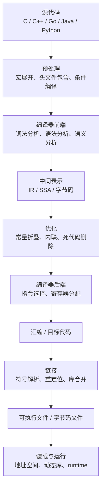

# 编译与链接学习路线

高级语言代码从文本文件变成正在运行的程序，并不是单个「编译」动作完成的，而是由编译器、汇编器、链接器、装载器、操作系统、语言运行时和 CPU 共同完成的一条链路。

本文是编译、链接与运行机制的总览页，用来建立学习路径。具体阶段拆分到 `compiler/` 子目录中展开。

---

## 总览图

这条链路可以分成三层：

| 层次 | 主要问题 | 典型产物 |
|------|----------|----------|
| 编译期 | 源代码是否合法，如何翻译为更低层表示 | Token、AST、IR、汇编、目标文件 |
| 链接与装载期 | 多个模块和库如何组合成可运行程序 | 可执行文件、共享库、进程地址空间 |
| 运行期 | 程序如何被执行、优化和管理 | 机器码执行、JIT、GC、调度器 |

---

## 学习顺序

建议按下面顺序阅读：

1. [`classic-pipeline.md`](./compiler/classic-pipeline.md)：先建立 C/C++ 这类 AOT 语言的经典流水线。
2. [`frontend.md`](./compiler/frontend.md)：细看词法分析、语法分析、语义分析分别负责什么。
3. [`intermediate-and-backend.md`](./compiler/intermediate-and-backend.md)：理解 IR、优化、汇编与机器码生成。
4. [`linking.md`](./compiler/linking.md)：重点掌握符号表、重定位、静态链接、动态链接、PLT/GOT。
5. [`vm-jit-runtime.md`](./compiler/vm-jit-runtime.md)：理解解释器、字节码、虚拟机、JIT 和 GC 的取舍。
6. [`language-runtime-tradeoffs.md`](./compiler/language-runtime-tradeoffs.md)：对比 C/C++、Java、Go、Rust 等语言在编译运行方向上的设计选择。

---

## 一句话主线

如果只抓最核心的逻辑，可以记住这句话：

> 编译器负责把源代码翻译成目标代码，链接器负责把分散的目标代码和库补齐成完整程序，装载器和运行时负责把这个程序放进进程地址空间并真正执行起来。

这也是为什么学习编译和链接时，不能只看「语法怎么变成机器码」，还必须继续追到：

- 函数和变量的地址何时确定。
- 多个源文件如何互相调用。
- 标准库和动态库如何被找到。
- `main` 之前为什么还有启动代码和动态链接器。
- VM/JIT 语言为什么能先发字节码，再在运行时生成机器码。

---

## 和其他文档的关系

- 进程被装载后如何进入 `main`，参考 [`os/process_startup_to_main.md`](./os/process_startup_to_main.md)。
- 可执行文件中的段如何映射到进程内存，参考 [`os/memory_layout.md`](./os/memory_layout.md)。
- Go 编译器源码级流程，参考 [`language/golang/others/compile.md`](../language/golang/others/compile.md)。

