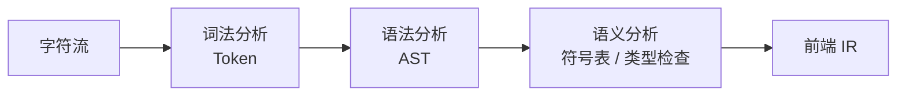
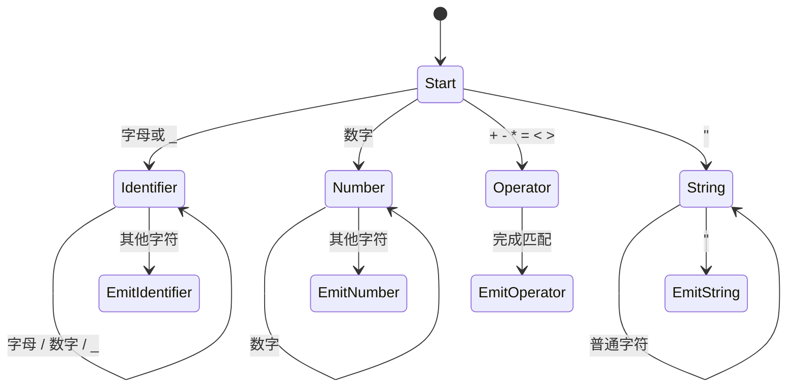

# 编译器前端

编译器前端主要负责理解源代码。它不急着生成最终机器码，而是先把源代码从字符流转换为结构化的语法和语义表示。

典型流程如下：



---

## 词法分析

词法分析（Lexical Analysis）负责把连续字符切分成 token。它关心的是「这段字符能不能组成一个合法词」，而不是整句代码有没有意义。

例如：

```c
int age = 25;
```

可以切分为：

| Token 类型 | 值 |
|------------|----|
| 关键字 | `int` |
| 标识符 | `age` |
| 操作符 | `=` |
| 整数字面量 | `25` |
| 分隔符 | `;` |

空格、换行、注释通常会在词法阶段被过滤掉，除非语言语义需要保留它们。

### 词法分析的边界

词法分析器通常是「局部」的，它不负责判断完整程序逻辑。

例如：

```c
inr age = 25;
```

`inr` 很可能会被切成一个合法标识符，而不是立刻报「类型写错」。只有到了语法分析或语义分析阶段，编译器才会发现这里本应出现类型名或声明结构。

相反，如果出现非法字符，例如当前语言不支持的字符组合，词法分析阶段就可能直接报错。

---

## 有限状态机

词法分析器常用有限状态机（Finite State Machine, FSM）实现。它会不断读取字符，并根据当前状态和新字符决定下一步。

以一个简化 C 风格词法分析器为例：



真实编译器会更复杂，但基本思想一致：

- 当前处于什么状态。
- 读到什么字符。
- 是否继续收集。
- 是否输出一个 token。
- 是否回退一个字符给下一轮处理。

### 多字符操作符

词法分析器通常采用最长匹配原则。例如读取到 `=` 时，不能立刻输出 `=`，还要继续看下一个字符是不是 `=`。

```text
=  →  赋值操作符
== →  相等比较操作符
```

类似地，`/` 也需要区分：

- `/`：除法操作符。
- `//`：单行注释。
- `/* ... */`：多行注释。

这类判断说明词法分析虽然看起来只是切词，但仍然需要精确处理语言规则。

---

## 语法分析

语法分析（Syntax Analysis）负责检查 token 序列是否符合语言文法，并构造抽象语法树（AST）。

例如：

```c
int total = 5 * 3 + 1;
```

可以形成类似 AST：

```text
VariableDecl
  Type: int
  Name: total
  Init:
    BinaryExpr(+)
      BinaryExpr(*)
        Literal(5)
        Literal(3)
      Literal(1)
```

AST 的价值在于表达层级关系。`5 * 3 + 1` 不是平铺的四个 token，而是先乘法、后加法的表达式树。

### 语法错误

如果写成：

```c
int total = 5 * 3 + ;
```

词法分析仍然可以切出合法 token，但语法分析无法在 `+` 后面找到合法表达式，因此会报语法错误。

这说明：

- 词法分析解决「词是否合法」。
- 语法分析解决「句子结构是否合法」。

---

## 语义分析

语义分析（Semantic Analysis）负责检查代码在语言规则下是否「有意义」。

常见检查包括：

- 变量是否声明。
- 名字是否在当前作用域可见。
- 类型是否匹配。
- 函数参数数量和类型是否正确。
- 返回值是否符合函数签名。
- `break`、`continue` 是否出现在合法位置。

例如：

```c
int total = "apple" * 3 + 1;
```

语法结构没有问题，但语义上字符串不能直接参与整数乘法，因此会在语义分析时报类型错误。

### 符号表

语义分析离不开符号表。符号表记录了名字和其属性之间的关系，例如：

| 名字 | 类别 | 类型 | 作用域 |
|------|------|------|--------|
| `total` | 变量 | `int` | 当前函数 |
| `printf` | 函数 | `int(const char *, ...)` | 外部声明 |
| `PI` | 宏或常量 | 取决于语言阶段 | 翻译单元 |

当编译器看到 `total + 1` 时，它会先查符号表，确认 `total` 是否存在，以及它是什么类型。

---

## 运行时错误不一定是编译错误

并不是所有错误都能在编译期被拦住。

例如：

```c
int a = 10;
int b = a / 0;
```

从类型角度看，整数除以整数是合法表达式。基础语义分析未必把它作为编译错误处理。真正执行到除法指令时，CPU 或运行时环境才可能触发除零异常。

现代编译器可能通过常量传播、数据流分析等发现明显问题，并给出警告。但这仍然不等于所有运行时错误都能静态消除。

---

## 前端的核心价值

可以把编译器前端理解为三层过滤：

| 阶段 | 关注单位 | 典型问题 |
|------|----------|----------|
| 词法分析 | 字符与 token | 这个字符序列能否组成合法词 |
| 语法分析 | token 与语法树 | 这些词能否组成合法句子 |
| 语义分析 | AST 与语言规则 | 这句话在程序语义上是否成立 |

只有通过这三层检查，后端才有足够稳定的结构信息去生成 IR、优化和机器码。

