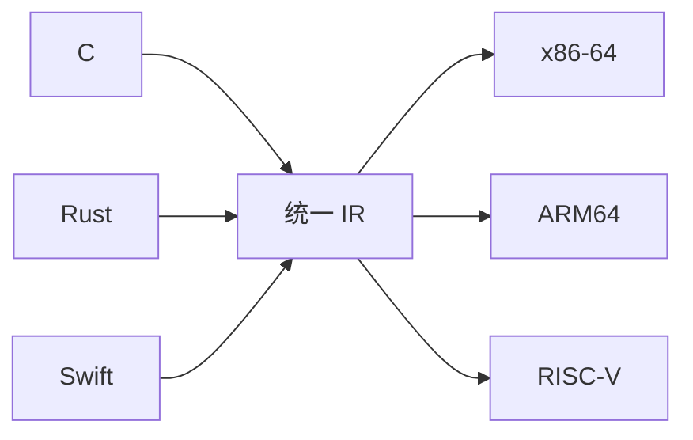

# 中间表示、优化与后端

编译器前端负责理解源代码，后端负责生成目标机器代码。中间表示（Intermediate Representation, IR）位于两者之间，是现代编译器实现可扩展性的关键。

---

## 为什么需要 IR

如果每种高级语言都要直接适配每种 CPU 架构，那么需要维护的翻译器数量会接近：

```text
语言数量 × CPU 架构数量
```

IR 的作用是把这个问题拆开：



这样，语言前端只需要生成 IR，机器后端只需要消费 IR。前端和后端不必两两绑定。

---

## IR 的基本形态

IR 通常比 AST 更接近机器，但又不直接绑定某个具体 CPU。它会显式表达控制流和数据流。

例如源代码：

```c
int c = a + b * 2;
```

可以降低为类似三地址码：

```text
t1 = b * 2
t2 = a + t1
c = t2
```

这类表示比 AST 更适合优化，因为每一步计算的输入和输出都更清楚。

---

## SSA

SSA（Static Single Assignment）是一种常见 IR 形式，核心约束是每个变量只赋值一次。

普通代码：

```c
x = 1;
x = x + 2;
```

SSA 风格可以表示为：

```text
x1 = 1
x2 = x1 + 2
```

这种形式让数据依赖关系变得清晰，方便编译器做：

- 常量传播。
- 死代码删除。
- 公共子表达式消除。
- 循环优化。
- 寄存器分配前的活跃变量分析。

在存在分支合流时，SSA 通常会引入 `phi` 节点，用来表示某个值来自不同控制流路径。

```text
if cond:
    x1 = 1
else:
    x2 = 2
x3 = phi(x1, x2)
```

---

## 常见优化

优化阶段的目标是在不改变程序可观察语义的前提下，生成更快、更小或更节省资源的代码。

### 常量折叠

```c
int total = 5 * 3 + 1;
```

编译器可以直接计算为：

```c
int total = 16;
```

这样运行时不需要再执行乘法和加法。

### 常量传播

```c
int a = 10;
int b = a + 1;
```

如果 `a` 在这段路径上不会改变，编译器可以把 `b` 的初始化看成 `10 + 1`，再继续折叠。

### 死代码删除

```c
return x;
x = x + 1;
```

`return` 后面的语句不可达，可以删除。

### 函数内联

```c
int add(int a, int b) {
    return a + b;
}

int x = add(1, 2);
```

编译器可以把调用展开为：

```c
int x = 1 + 2;
```

这能减少函数调用开销，也能暴露更多优化机会。

### 逃逸分析

逃逸分析判断一个对象是否会离开当前作用域。如果对象不会逃逸，编译器更有机会把它放在栈上或直接优化掉；如果会逃逸，则可能需要放到堆上。

这类优化对 Go、Java 等带运行时的语言尤其重要，因为它会影响堆分配次数和 GC 压力。

---

## 后端生成代码

后端负责把 IR 转成目标机器可以执行的形式。它通常包含：

| 步骤 | 作用 |
|------|------|
| 指令选择 | 把 IR 操作匹配为目标 CPU 指令 |
| 指令调度 | 调整指令顺序，减少流水线停顿 |
| 寄存器分配 | 决定哪些值放在寄存器，哪些溢出到栈 |
| 栈帧布局 | 安排局部变量、返回地址、保存寄存器等位置 |
| 机器码输出 | 生成目标文件中的二进制指令 |

例如，一个简单加法在不同架构上会生成不同指令。编译器后端必须理解目标架构的寄存器、寻址模式、调用约定和指令集限制。

---

## 汇编与机器码

汇编语言可以理解为机器码的人类可读表示：

```asm
movl $16, -4(%rbp)
```

它最终会被汇编器翻译成二进制机器指令。CPU 实际执行的是机器码，而不是汇编文本。

在很多现代编译器中，「生成汇编」可能只是可观察的中间形式；编译器也可以直接生成目标文件。无论实现细节如何，后端最终都必须输出某种目标平台能装载或继续链接的二进制表示。

---

## 编译期优化与运行时信息

AOT 编译器在程序运行前工作，因此它看到的是静态代码和有限的静态推断结果。它很擅长做确定性的、平台相关的优化，但不知道程序在真实运行中会走哪些路径。

这也是 JIT 编译器的重要优势之一：JIT 可以在运行时收集 profile 信息，再对热点路径做更激进的优化。相关内容见 [`vm-jit-runtime.md`](./vm-jit-runtime.md)。

