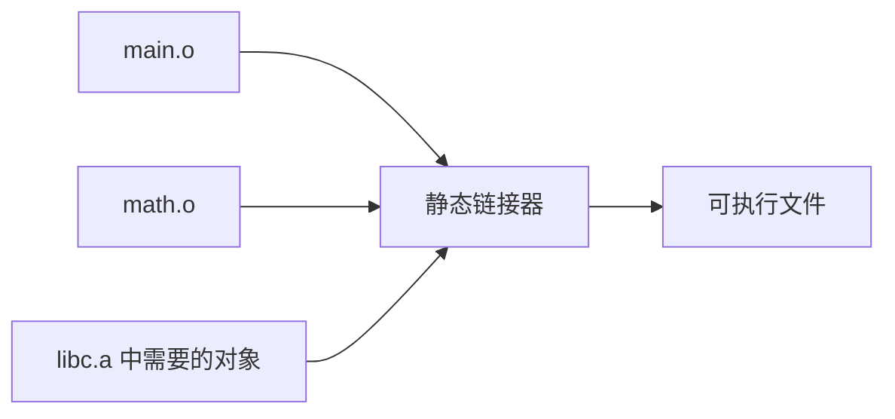
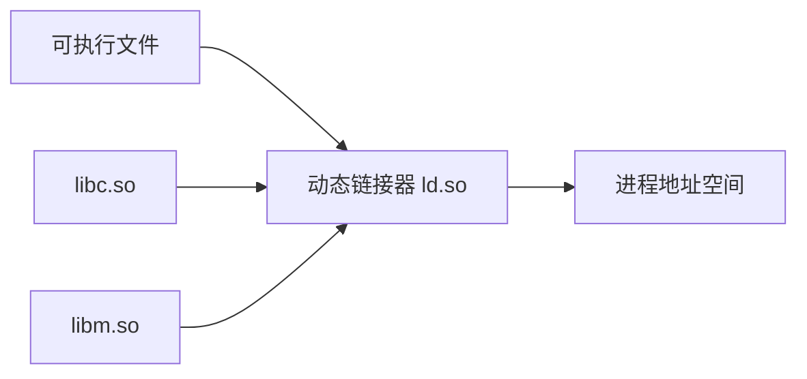

# 链接

编译器通常以单个源文件或翻译单元为粒度工作，而真实程序往往由多个源文件、静态库和动态库共同组成。链接（Linking）的核心任务，就是把这些分散的目标文件和库组织成一个可执行整体。

---

## 链接解决什么问题

假设有两个文件：

```c
// main.c
int add(int a, int b);

int main() {
    return add(1, 2);
}
```

```c
// math.c
int add(int a, int b) {
    return a + b;
}
```

分别编译后得到：

```text
main.o
math.o
```

`main.o` 中知道自己要调用 `add`，但它未必知道 `add` 的机器码最终位于哪里。链接器要做的就是：

- 在 `math.o` 中找到 `add` 的定义。
- 把 `main.o` 中对 `add` 的引用连接过去。
- 修正调用指令或相关表项中的地址。
- 生成最终可执行文件。

---

## 符号表

符号（symbol）可以理解为程序中需要跨区域引用的名字，例如：

- 函数名：`main`、`add`、`printf`。
- 全局变量名：`global_count`。
- 某些段或内部辅助标记。

目标文件中的符号大致可以分为：

| 类型 | 含义 |
|------|------|
| 已定义符号 | 当前目标文件提供了实现或存储位置 |
| 未定义符号 | 当前目标文件引用了它，但定义在别处 |
| 局部符号 | 只在当前目标文件内部使用 |
| 全局符号 | 可被其他目标文件或库引用 |

链接器进行符号解析时，会把未定义符号和其他目标文件或库中的定义匹配起来。

---

## 重定位

编译单个源文件时，很多地址无法最终确定。例如：

- `add` 最终会被放在哪个地址。
- 全局变量会落在哪个数据段位置。
- 字符串常量相对代码段的偏移是多少。

因此，目标文件里会保留重定位记录。重定位表相当于告诉链接器：

> 这里有一个还没最终确定的地址，等你知道所有文件布局后，请回来修正它。

一个简化示意如下：

```text
main.o
  .text:
    call add    ; 这里暂时不知道 add 的最终地址

  relocation:
    offset: call 指令所在位置
    symbol: add
    type: 函数调用重定位
```

链接器完成布局后，会根据 `add` 的真实位置修正这条调用。

---

## 静态链接

静态链接会把依赖库中需要的目标代码合并进最终可执行文件。



优点：

- 部署简单，依赖更少。
- 启动路径通常更直接。
- 某些场景下可重复性更强。

缺点：

- 可执行文件体积更大。
- 多个程序可能各自携带一份相同库代码，浪费磁盘和内存。
- 库升级后通常需要重新链接或重新发布程序。

静态链接更像在构建阶段把「全家桶」打包好。

---

## 动态链接

动态链接不会把共享库完整复制进每个可执行文件，而是在可执行文件中保留依赖信息。程序启动或运行时，由动态链接器把共享库装入进程地址空间。



优点：

- 多个程序可以共享同一份库代码页。
- 可执行文件更小。
- 库可以独立升级。

缺点：

- 启动时需要装入共享库并解析部分符号。
- 首次调用某些外部函数时可能有延迟绑定开销。
- 运行环境中的库版本会影响程序行为。

动态链接更像把一部分工作推迟到装载期和运行期。

---

## 动态链接器

在 Linux ELF 中，动态链接程序通常包含 `INTERP` 段，指向动态链接器路径，例如：

```text
/lib64/ld-linux-x86-64.so.2
```

程序启动时，内核会先装入主程序和动态链接器，然后把控制权交给动态链接器。动态链接器负责：

- 装入依赖的 `.so`。
- 解析必要符号。
- 完成重定位。
- 初始化 GOT / PLT 等结构。
- 运行共享库初始化逻辑。
- 最终把控制权交给程序入口。

这也是为什么动态链接程序并不是从内核直接跳到 `main`。更完整的启动链路可参考 [`../os/process_startup_to_main.md`](../os/process_startup_to_main.md)。

---

## PIC

动态库可能被加载到不同地址。为了配合 ASLR 和共享库复用，动态库通常需要生成位置无关代码（Position Independent Code, PIC）。

PIC 的核心思想是：

- 尽量使用相对寻址，而不是把绝对地址写死在 `.text` 中。
- 需要运行时确定的外部地址，放到可写数据结构中间接访问。
- 保持代码段只读可执行，减少运行时修改代码段的需求。

这为 PLT / GOT 机制提供了基础。

---

## GOT 和 PLT

动态链接中有一个核心矛盾：

- 代码段 `.text` 应该只读、可执行，不能随意修改。
- 动态库真实加载地址要到运行时才知道。
- 外部函数和变量的真实地址必须能被程序访问。

解决思路是把「可变地址」放到可写数据表，把「固定跳板」放到只读代码段。

| 结构 | 全称 | 位置倾向 | 作用 |
|------|------|----------|------|
| GOT | Global Offset Table | 可读写数据段 | 保存外部符号的真实地址或中间地址 |
| PLT | Procedure Linkage Table | 可执行代码段 | 为外部函数调用提供固定跳板 |

### 函数调用过程

以 `printf` 为例，编译链接后调用可能变成：

```text
call printf@plt
```

第一次调用时：

```text
call printf@plt
  ↓
PLT 读取 GOT[printf]
  ↓
GOT[printf] 暂时指向 PLT 内部的解析入口
  ↓
动态链接器被调用，查找 printf 真实地址
  ↓
动态链接器把真实地址写回 GOT[printf]
  ↓
跳转到真正的 printf
```

后续调用时：

```text
call printf@plt
  ↓
PLT 读取 GOT[printf]
  ↓
GOT[printf] 已经是真实 printf 地址
  ↓
直接跳转
```

这个过程称为延迟绑定（Lazy Binding）。它用一次首次调用开销，换取更快的程序启动。

---

## 动态符号表与重定位表

静态链接阶段的符号表和重定位表主要服务于构建期。动态链接则需要把一部分信息保留到运行时，交给动态链接器使用。

常见结构包括：

| 结构 | 作用 |
|------|------|
| `.dynsym` | 动态符号表，保留跨模块解析所需符号 |
| `.dynstr` | 动态符号字符串表 |
| `.rela.dyn` / `.rel.dyn` | 数据相关重定位，例如 GOT 中的变量地址 |
| `.rela.plt` / `.rel.plt` | 函数调用相关重定位，常配合 PLT 延迟绑定 |
| `.dynamic` | 动态链接元信息，例如依赖库、表地址等 |

普通调试符号可以被 `strip` 删除，但动态链接所需的 `.dynsym` 等信息不能随意删除，否则运行时就无法解析跨模块符号。

---

## 静态链接与动态链接对比

| 维度 | 静态链接 | 动态链接 |
|------|----------|----------|
| 依赖代码位置 | 构建时合入可执行文件 | 运行时装入共享库 |
| 文件体积 | 通常更大 | 通常更小 |
| 启动速度 | 通常更直接 | 需要动态链接器参与 |
| 内存共享 | 多程序共享较弱 | 共享库代码页可被多个进程共享 |
| 升级维护 | 库更新常需重新发布程序 | 库可独立更新，但要注意兼容性 |
| 运行时复杂度 | 较低 | 较高，涉及 PLT/GOT、重定位、符号查找 |

总结起来：

> 静态链接用空间换启动确定性和部署简单性；动态链接用更复杂的运行时机制换空间复用、库共享和更新灵活性。

---

## 常见观察命令

```bash
readelf -s main.o
readelf -r main.o
readelf -d ./app
readelf -l ./app
objdump -d ./app
ldd ./app
```

这些命令分别可以观察：

- 符号表。
- 重定位表。
- 动态链接信息。
- ELF 装载段与解释器。
- PLT 等反汇编结果。
- 程序依赖哪些共享库。

