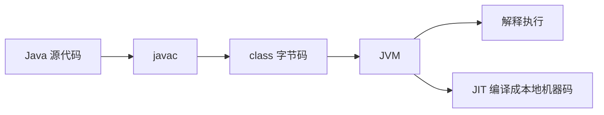

# 虚拟机、JIT 与运行时

经典 AOT 编译会在运行前生成本地机器码。另一类语言则把一部分翻译工作推迟到运行时，例如 Python、Java、C#、JavaScript。它们常见的共同点是：程序运行时有一个解释器、虚拟机或 JIT 编译器参与。

---

## 三种运行路线

| 路线 | 代表语言 | 常见流程 | 特点 |
|------|----------|----------|------|
| AOT 本地编译 | C、C++、Go、Rust | 源代码 → 机器码 → 运行 | 启动快，平台相关 |
| 字节码虚拟机 | Java、C# | 源代码 → 字节码 → VM → JIT/解释执行 | 跨平台能力强，运行时复杂 |
| 解释 / 动态 JIT | Python、JavaScript | 源代码 → 字节码或 IR → 解释器 / JIT | 动态性强，运行时决策多 |

这里的分类不是绝对边界。现代语言实现往往混合多种策略。

---

## 解释执行

解释器可以理解为一个运行中的程序，它读取源代码或字节码，然后逐条执行。

以 Python 为例，常见路径更接近：

```text
.py 源代码
  ↓
字节码
  ↓
Python 虚拟机解释执行
```

字节码不是 CPU 机器码，而是虚拟机定义的一套指令。CPU 真正执行的是解释器本身的机器码，解释器再根据字节码决定下一步动作。

解释执行的优势：

- 启动和开发反馈快。
- 跨平台成本低。
- 适合动态语言特性。

解释执行的劣势：

- 同一段热点逻辑可能被反复解释。
- 每条虚拟指令都需要解释器调度，额外开销更大。
- 很难达到本地机器码的长期峰值性能。

---

## 字节码与虚拟机

Java / C# 这类语言通常先编译成字节码，再交给虚拟机。



字节码的价值在于：

- 它比源代码更规整，已经经过前端语法语义检查。
- 它比机器码更抽象，不绑定具体 CPU。
- 它可以作为跨平台分发格式。

虚拟机则负责把字节码真正运行起来，并提供内存管理、线程模型、安全检查、动态加载等能力。

---

## JIT

JIT（Just-In-Time Compilation，即时编译）是在程序运行过程中，把热点代码编译成本地机器码并缓存起来。

典型流程：

```text
先解释执行
  ↓
收集运行时 profile
  ↓
发现热点函数或热点循环
  ↓
JIT 编译成本地机器码
  ↓
后续直接执行机器码
```

JIT 的核心不是「把所有代码都编译」，而是「把值得编译的热点代码编译」。

---

## 为什么不一启动就全部 JIT

如果程序启动时把全部字节码都编译成本地机器码，理论上后续执行会更快，但现实中会有明显代价：

- 启动时间变长：大型程序类和函数很多，全量编译会阻塞启动。
- 内存占用变大：机器码通常比字节码更占空间。
- 大量冷代码浪费编译成本：很多错误处理、边缘功能可能很少执行。
- 优化信息不足：刚启动时还没有真实运行 profile，优化可能不准确。

因此，解释器和 JIT 经常配合工作：

- 解释器让程序先快速启动。
- JIT 只投资真正频繁执行的代码。
- 运行时 profile 让优化更贴近真实负载。

---

## 热点探测

虚拟机通常会通过计数器发现热点：

- 函数调用次数。
- 循环回边次数。
- 执行总耗时。
- 分支命中概率。
- 类型分布。

如果一个函数被频繁调用，或者某个循环反复执行，虚拟机就可能触发 JIT 编译。

有些虚拟机还会做热度衰减：如果某段代码很久没有执行，热度会下降。这样可以避免只因为启动阶段短暂繁忙，就长期占用优化资源。

---

## JIT 能做什么特殊优化

JIT 的优势在于它能看到运行时 profile。相比静态编译器，它可能掌握更多真实信息。

### 去虚化

如果某个虚方法调用在运行时几乎总是落到同一个具体类型，JIT 可以把动态分派优化为直接调用，甚至进一步内联。

### 分支优化

如果某个分支在真实运行中 99% 都为真，JIT 可以调整代码布局，让高频路径更符合 CPU 缓存和分支预测。

### 类型特化

动态语言中，同一段代码可能处理不同类型。JIT 可以针对当前高频类型生成专门机器码。

### CPU 特性利用

JIT 在目标机器上运行，可以根据当前 CPU 支持的指令集生成更合适的机器码。

---

## 分层编译

JIT 自身也要消耗 CPU。优化太深可能得不偿失，因此现代虚拟机常采用分层编译。

| 层次 | 特点 | 目标 |
|------|------|------|
| 解释器 | 几乎无编译成本 | 快速启动，收集 profile |
| 快速 JIT | 编译快，优化少 | 尽快让热点代码变快 |
| 深度 JIT | 编译慢，优化强 | 针对极热代码追求峰值性能 |

这体现了一个基本权衡：

> JIT 不仅要优化程序，还要控制优化本身的成本。

---

## GC 与运行时延迟

很多 VM 语言自带垃圾回收器（GC）。GC 降低了手动内存管理负担，但会引入运行时开销和延迟问题。

最典型的问题是 Stop the World（STW）：

```text
业务线程运行
  ↓
GC 需要全局安全点
  ↓
暂停业务线程
  ↓
完成标记、整理或部分关键动作
  ↓
业务线程继续
```

在服务端系统中，STW 可能造成长尾延迟。比如大部分请求 10ms 返回，但少数请求刚好遇到 GC 暂停，可能变成 200ms。

现代低延迟 GC 通常会把更多工作并发化，尽量减少暂停时间。但它也会占用额外 CPU 资源，因此可能降低吞吐量。

---

## AOT 与 JIT 的性能直觉

短任务中，AOT 程序通常有优势：

- 不需要加载大型 VM。
- 不需要解释预热。
- 不需要运行时编译。

长时间运行的服务中，JIT 有机会追上甚至超过静态编译结果：

- 能根据真实热点做优化。
- 能根据类型分布和分支概率调整机器码。
- 能在运行中重新优化或撤销错误假设。

但这不是绝对结论。最终性能取决于语言实现、优化器质量、工作负载、GC、I/O、内存布局和运行环境。

