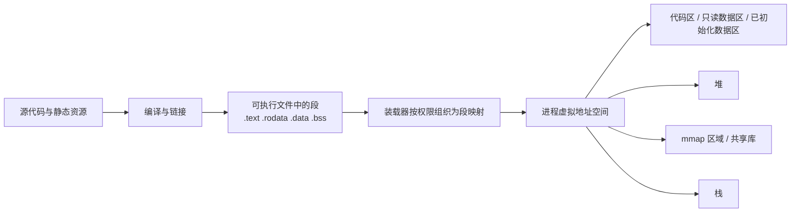
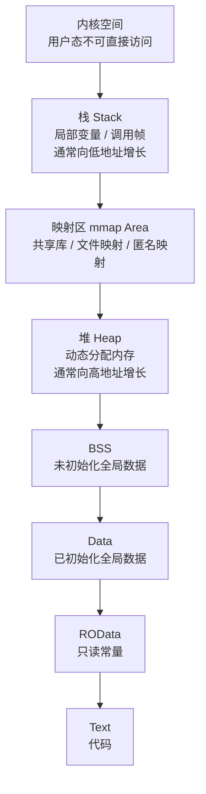
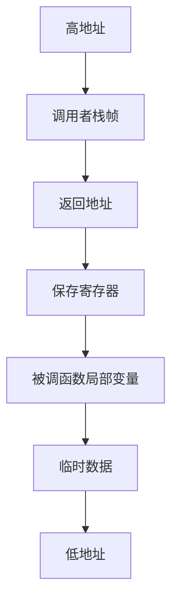
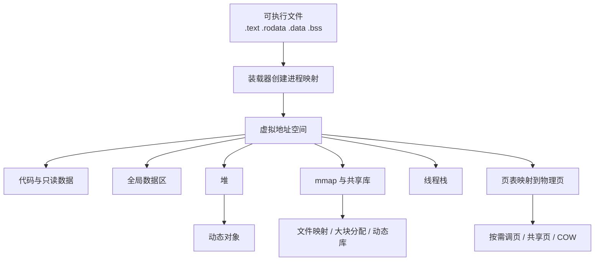

# 程序的内存布局

程序的「内存布局」本质上是在回答两个问题：

- 程序在**可执行文件阶段**，代码与数据分别被放在哪些段（section / segment）里。
- 程序在**运行阶段**，操作系统如何为进程建立虚拟地址空间，并把不同类型的数据映射到不同区域。

如果不区分这两个阶段，就很容易把 `.text`、`.data`、`BSS`、堆、栈、`mmap` 区域混在一起。本文默认以 **Linux + 64 位进程 + ELF** 为主线说明；不同平台的术语和实现细节会有差异，但整体思想一致。

如果你更关心「进程是如何从 `execve` 一路走到 `main` 的」，可以结合阅读 [`process_startup_to_main.md`](./process_startup_to_main.md)。本文更聚焦**地址空间最终长什么样**，而不是完整展开启动链路。

如果你想把“这张内存图”和“启动过程”一一对应起来，也可以直接看 [`process_startup_to_main.md`](./process_startup_to_main.md) 里的「启动链路与内存区域的对应关系」小节。

---

## 整体视角

当一个程序被加载到内存中运行时，操作系统并不会让代码和数据“随意堆放”，而是会为它建立一套结构清晰的**虚拟内存空间**。可以把这套空间想象成一栋从下到上门牌号连续的大楼，低地址在底部，高地址在顶部；不同“楼层”承载不同职责。

可以先建立一个总的认知框架：



这里有两个容易混淆但必须分开的概念：

- **文件中的 section**：偏向链接器视角，例如 `.text`、`.rodata`、`.data`、`.bss`。
- **内存中的 segment / region**：偏向装载与运行视角，例如代码映射、数据映射、堆、栈、动态库映射区。

换言之，链接器先决定「文件里怎么组织」，装载器再决定「运行时怎么映射」。

---

## 经典布局总览

如果先只看运行时的宏观分布，一个典型进程的虚拟地址空间通常可以概括为下表：

| 内存位置 | 区域名称 | 主要内容 | 特点 |
|---|---|---|---|
| **最高地址** | **内核空间（Kernel Space）** | 操作系统内核代码和数据 | 用户程序**不可直接访问** |
|  | **栈区（Stack）** | 局部变量、函数参数、返回地址 | 自动管理，通常**向低地址增长** |
|  | **内存映射区（Memory Mapping）** | 动态链接库、共享内存、文件映射、匿名映射 | 位于栈和堆之间，现代系统中非常重要 |
|  | **堆区（Heap）** | 动态分配对象，如 `malloc` / `new` 的结果 | 运行时扩展，通常**向高地址增长** |
|  | **BSS 区** | 未初始化或初始化为 0 的全局变量、静态变量 | 运行前清零，通常不直接占据可执行文件体积 |
|  | **数据区（Data）** | 已初始化的全局变量、静态变量 | 初始值随可执行文件一同保存 |
| **最低地址** | **代码区（Text / Code）** | 编译后的机器指令 | 通常只读、可执行 |

如果继续沿用“大楼”类比，那么：

- 底部几层更像**固定结构层**，在程序装载时就基本确定。
- 中间的堆和上方的栈则更像**动态活动层**，会随着程序运行不断变化。
- 栈和堆之间预留的大块区域，则给进程留下了后续扩展空间。

这也是为什么我们常说：代码区、数据区、BSS 区更偏“静态”；堆和栈更偏“动态”。

---

## 静态布局图与启动时序怎么配合看

阅读操作系统相关内容时，很多人会在两种图之间来回切换：

- 一种是“**内存布局图**”，回答地址空间里有哪些区域
- 一种是“**启动时序图**”，回答这些区域是按什么顺序被搭起来和用起来的

如果把它们并排来看，可以得到下面这张对照表：

| 视角 | 更关心的问题 | 更适合回答什么 |
|---|---|---|
| 静态布局图 | 地址空间最终长什么样 | 代码区、数据区、BSS、堆、栈、`mmap` 区域如何分布 |
| 启动时序图 | 这些区域何时开始参与 | 哪些区域先建立，哪些区域在 `main` 前就已活跃，哪些区域要到运行时才明显使用 |

可以把两者的关系理解为：

- **布局图**更像地图
- **时序图**更像施工过程

例如：

- 从布局图里，你会知道存在代码区、栈、`mmap` 区域、堆
- 从启动时序里，你会知道代码区和栈出现得更早，`mmap` 区域会在动态链接阶段活跃，而堆往往要到用户逻辑真正分配对象时才更明显参与

因此，这两类图并不是谁替代谁，而是各自回答不同问题：

> 布局图告诉你“最后长什么样”，时序图告诉你“是怎么一步步变成这样的”。

如果你想继续看这条“施工过程”，可以直接阅读 [`process_startup_to_main.md`](./process_startup_to_main.md) 中的「启动链路与内存区域的对应关系」和「内存区域参与时序图」。

---

## 可执行文件中的布局

在可执行文件阶段，程序通常被拆分为若干段：

| 段 | 典型内容 | 是否占据可执行文件体积 | 典型权限 |
|---|---|---|---|
| `.text` | 机器指令、函数代码 | 是 | `r-x` |
| `.rodata` | 字符串字面量、只读常量 | 是 | `r--` |
| `.data` | 已初始化的全局变量、静态变量 | 是 | `rw-` |
| `.bss` | 未初始化或初始化为 0 的全局变量、静态变量 | 通常不直接存储原始内容 | `rw-` |
| 符号表、重定位表等 | 链接与调试辅助信息 | 视构建模式而定 | 不直接作为业务数据访问 |

其中 `.bss` 很容易被误解。它并不是说「这块内存不存在」，而是说：

- 在可执行文件里，不需要真的把一大段 0 一个字节一个字节写进去。
- 装载进内存时，装载器只需要申请相应大小的页，并保证其初始内容为 0。

这也是为什么**大块未初始化全局数组**不会显著放大二进制体积，但会增加进程运行时占用的虚拟内存范围。

---

## 从 Section 到 Segment

在 ELF 这类可执行文件格式中，`section` 和 `segment` 不是一回事。

- **section** 更偏向链接器视角，回答「不同类型的内容在文件中如何分类组织」。
- **segment** 更偏向装载器视角，回答「哪些内容应该以什么权限被映射进内存」。

很多时候，多个 section 会被合并进同一个可装载 segment 中。例如：

| section | 常见内容 | 可能归入的 segment |
|---|---|---|
| `.text` | 指令代码 | 可执行加载段 |
| `.rodata` | 只读常量 | 只读加载段或与代码邻近映射 |
| `.data` | 已初始化可写数据 | 可写加载段 |
| `.bss` | 未初始化可写数据 | 可写加载段 |

可以把它理解为：

- `section` 解决的是**内容分类**问题。
- `segment` 解决的是**装载权限与映射边界**问题。

所以，当我们说「`.text` 段在内存里」时，很多时候是在做一种工程化简化表达。更精确的说法应是：`.text` 这类 section 的内容，会被装载器映射到某个具备 `r-x` 权限的内存区域中。

---

## 装载对内存布局意味着什么

从内存布局的视角看，“装载”最重要的意义并不是把文件字节整块搬进内存，而是**把可执行文件中的不同内容，转换成具备不同权限的虚拟内存映射**。

也就是说，装载阶段至少完成了三件与布局直接相关的事：

1. 识别哪些内容应该成为代码映射、只读映射、可写映射。
2. 建立用户栈以及后续运行所需的基础地址空间骨架。
3. 如果程序依赖共享库，为后续的动态库映射预留并补齐运行空间。

从这个角度看，装载解决的是：

> 文件里的 `.text`、`.rodata`、`.data`、`.bss`，最终如何变成进程地址空间里的不同区域？

如果要展开看 `execve`、动态链接器、初始栈、运行时初始化到 `main` 的完整链路，可以看 [`process_startup_to_main.md`](./process_startup_to_main.md)。

---

## 初始栈在布局中的位置

理解内存布局时，还有一个容易忽略的点：即使在 `main` 执行之前，用户栈也通常已经存在，而且不是空的。

初始栈里常见会放置：

- `argc` / `argv`
- `envp`
- `auxv`

因此，栈不仅服务于函数调用，也服务于**进程启动时的参数传递与上下文承载**。不过本文只点到它在布局中的位置；如果要继续追踪“这些内容是谁放进去的、何时放进去的”，同样建议看 [`process_startup_to_main.md`](./process_startup_to_main.md)。

---

## 进程运行时的虚拟地址空间

程序被启动后，操作系统并不是简单把整个文件原封不动塞进物理内存，而是先为进程创建一套**虚拟地址空间**。在这套地址空间里，不同区域承担不同职责。

一个典型的用户态进程布局可以抽象为：



需要注意三点：

- 图中只是**逻辑上的常见顺序**，不代表所有平台都严格一样。
- 现代系统通常启用 **ASLR**，不同区域的起始地址会随机化。
- 进程看到的是虚拟地址，而不是物理内存的直接线性展开。

从直觉上看，这套布局通常表现为：

- 低地址附近放置代码与静态数据
- 中间区域留给堆和 `mmap`
- 高地址附近放置栈

这样安排的核心目标，不是让图看起来规整，而是为了在程序运行过程中，为最活跃的两类需求留出足够灵活的增长空间。

---

## 代码区、只读区、数据区

### 代码区（Text）

代码区主要保存机器指令，通常具备如下特征：

- 权限通常是 `r-x`，即可读、可执行、不可写。
- 多个进程运行同一个程序时，这些代码页可以被内核共享。
- 如果代码页未被修改，其物理页往往可以被多个进程共同映射，降低内存占用。

将代码区设置为不可写，是现代系统重要的安全基础之一；它能降低代码注入、任意覆盖指令等攻击的成功概率。

如果程序在处理栈、堆或其他可写数据时，因为越界写、悬空指针或其他 bug 不小心碰到了代码页，那么操作系统通常会因为该页不具备写权限而立刻拒绝这次访问。常见结果就是：

- 触发访问违例
- 抛出 **Segmentation Fault**
- 进程被异常终止

从安全角度看，这种 `r-x` 权限设计非常关键。因为如果代码段既能写又能执行，那么攻击者一旦找到写入漏洞，就更容易篡改原本的机器指令，甚至把恶意代码塞进程序执行路径里。

### 只读数据区（ROData）

只读数据区存放不会在运行时修改的数据，例如：

- 字符串常量
- 只读查找表
- 编译期常量折叠后的静态内容

它通常被映射为 `r--`。如果程序尝试修改这部分内容，往往会触发保护异常。

### 已初始化数据区（Data）

已初始化的全局变量和静态变量会进入 `.data`，例如：

- `int g = 10`
- 带非零初始值的静态配置表

这部分区域通常具备 `rw-` 权限，并在进程启动时被映射到内存中。

### BSS 区

未初始化或初始化为 0 的全局变量、静态变量通常进入 `.bss`。例如：

- `int g;`
- `static char buf[1 << 20];`

其核心特点不是「特殊的访问方式」，而是**节省可执行文件体积**。运行时它与 `.data` 一样，都会表现为可读可写的数据区域。

### 为什么 `Data` 和 `BSS` 要分开

一个很自然的问题是：既然程序运行起来之后，`.data` 和 `.bss` 最终都会在内存里占据真实空间，为什么编译器还要在可执行文件阶段把它们分开处理？

核心原因就在于：**已初始化变量必须把初始值真的写进文件里，而未初始化或零初始化变量则没必要。**

例如：

- `int max_health = 100;`  
  编译器必须把 `100` 这个值写进可执行文件，因此它属于 `.data`
- `int player_score;`  
  它的初始语义等价于 0，编译器没必要在磁盘上真的存一长串 0，因此它更适合放进 `.bss`

这样分开的直接收益有两个：

- **减小可执行文件体积**：不用把大量 0 真正写进磁盘文件
- **让装载过程更高效**：装载器只需要知道“这里需要一块初始为 0 的可写区域”

从实现角度看，现代系统通常还会配合按需分页等机制来优化这类零初始化区域。一个常见思路是：

- 刚开始先把它映射为“逻辑上全为 0”的页
- 真正发生写入时，再按需分配独立物理页

具体实现会随操作系统和内核版本不同而变化，但总体目标是一致的：**把“默认是 0”的这件事，尽量用更省磁盘、更省物理内存的方式表达出来。**

所以，`.data` 和 `.bss` 的区别，关键不在于“运行时谁更高级”，而在于：

> 一个需要把初始值存进文件，一个只需要声明“启动时请给我一块清零后的空间”。

---

## 这栋“内存大楼”的关键楼层

如果把前面的内容再收拢成一张简短的“楼层总览”，可以这样理解：

- **顶层禁区**：内核空间，用户态程序不能直接访问
- **高层动态区**：栈区，负责函数调用、参数、局部变量和栈帧管理
- **中层自由区**：堆区，负责长期存活、跨函数共享或体积较大的动态对象
- **低层稳固区**：`.data` 与 `.bss`，负责已初始化和未初始化的全局/静态变量
- **底层基石**：代码区，存放机器指令，通常具备 `r-x` 权限

从这个角度看，整套布局并不是随意拼起来的，而是围绕几个目标设计出来的：

- 让**短生命周期数据**高效进出
- 让**长生命周期数据**稳定存活
- 让**代码与数据权限分离**
- 让**可执行文件体积和运行时内存使用都尽可能高效**

这也是为什么“程序的内存布局”虽然看起来像一张静态图，但背后其实同时体现了性能、生命周期管理和安全性三条主线。

---

## `Text`、`Data`、`BSS`、`Stack`、`Heap` 五区对照

如果把最常见的五类区域放到同一张表里，可以更快建立整体对比关系：

| 区域 | 典型内容 | 生命周期 | 是否自动管理 | 典型权限 / 特征 |
|---|---|---|---|---|
| `Text` | 机器指令、函数代码 | 通常与进程同寿命 | 由装载器和内核管理 | 常见为 `r-x`，可执行、不可写 |
| `Data` | 已初始化的全局变量、静态变量 | 通常与进程同寿命 | 由装载器和内核管理 | 常见为 `rw-`，初始值写在可执行文件中 |
| `BSS` | 未初始化或零初始化的全局变量、静态变量 | 通常与进程同寿命 | 由装载器和内核管理 | 常见为 `rw-`，运行时清零，通常不直接占据文件体积 |
| `Stack` | 函数参数、返回地址、局部变量、栈帧 | 与函数调用强相关 | 基本自动管理 | 后进先出，通常向低地址增长 |
| `Heap` | 动态分配对象、大块长期数据 | 由程序逻辑决定 | 需要显式释放或依赖 GC | 灵活但管理更复杂，通常向高地址增长 |

从这张表里，最值得优先记住的几件事是：

- `Text`、`Data`、`BSS` 更偏**静态区域**
- `Stack`、`Heap` 更偏**动态区域**
- `Stack` 追求的是**快速、短命、自动回收**
- `Heap` 追求的是**灵活、长寿命、跨函数共享**
- `Data` 和 `BSS` 的核心区别不在“运行时谁更重要”，而在于**初始值是否需要写进可执行文件**

如果再压成一句面试式表达，可以记成：

> `Text` 放代码，`Data` 放已初始化全局数据，`BSS` 放未初始化全局数据，`Stack` 负责函数调用现场，`Heap` 负责动态对象和长寿命数据。

---

## 一个变量分布示例

如果把不同类型的变量放在同一个小程序里，通常会落到不同区域中：

```c
const char *msg = "hello";
int global_init = 42;
int global_zero;
static int static_init = 7;
static int static_zero;

int main() {
    int local = 1;
    int *p = malloc(sizeof(int));
    *p = 99;
    return local + *p;
}
```

可以用下表建立直觉：

| 对象 | 更常见的落点 | 说明 |
|---|---|---|
| `"hello"` 字面量 | `.rodata` | 字符串内容本身通常只读 |
| `msg` | `.data` | 它是一个已初始化的全局指针 |
| `global_init` | `.data` | 已初始化全局变量 |
| `global_zero` | `.bss` | 未初始化全局变量 |
| `static_init` | `.data` | 已初始化静态变量 |
| `static_zero` | `.bss` | 未初始化静态变量 |
| `local` | 栈或寄存器 | 取决于优化与调用约定 |
| `p` 指针变量自身 | 栈或寄存器 | 它只是保存地址 |
| `*p` 指向的对象 | 堆 | 由 `malloc()` 动态申请 |

这里最容易混淆的是 `msg` 和 `"hello"`：

- `msg` 是一个全局指针变量，它自己需要占内存，通常位于可写数据区。
- `"hello"` 是字符串常量内容，通常位于只读数据区。

也就是说，一个变量保存的「地址值」和这个地址真正指向的「对象本体」，完全可能位于不同内存区域。

---

## 用地址打印把布局串起来

如果想把前面的抽象概念真正“落地”，一个非常直接的方法就是写一个小程序，把不同对象的地址打印出来。

```c
#include <stdio.h>
#include <stdlib.h>

int global_init = 42;
int global_zero;
const char *msg = "hello";

void foo() {
    int local = 1;
    int *heap_value = malloc(sizeof(int));
    *heap_value = 99;

    printf("function foo          : %p\n", (void *)foo);
    printf("string literal        : %p\n", (void *)"hello");
    printf("global_init           : %p\n", (void *)&global_init);
    printf("global_zero           : %p\n", (void *)&global_zero);
    printf("msg(pointer variable) : %p\n", (void *)&msg);
    printf("local                 : %p\n", (void *)&local);
    printf("heap object           : %p\n", (void *)heap_value);

    free(heap_value);
}

int main() {
    foo();
    return 0;
}
```

运行它时，通常会观察到如下现象：

- 函数地址和字符串字面量地址更靠近程序映射区。
- 全局变量与静态变量地址更靠近数据区。
- `malloc()` 返回的地址落在堆或匿名映射区域。
- 局部变量地址更靠近栈区。

不过要特别注意两点：

- **不要死记具体地址数值**，因为 ASLR 会让每次运行的地址不同。
- **更应该关注相对归属和权限语义**，而不是机械背诵某个固定地址区间。

也就是说，这类实验的目的不是验证“地址一定长什么样”，而是帮助建立“不同对象为什么会落在不同区域”的直觉。

---

## 堆与栈

堆和栈是程序运行时最常被讨论的两块区域，但它们的管理方式完全不同。

### 栈（Stack）

栈主要用于保存函数调用现场，典型内容包括：

- 函数参数
- 返回地址
- 保存寄存器
- 局部变量
- 栈帧元数据

栈的主要特征如下：

- 通常由编译器和调用约定协同管理。
- 生命周期与函数调用天然一致，分配和回收成本很低。
- 一般按照「后进先出」的模式使用。
- 典型情况下向**低地址**增长。

当函数递归过深，或单个调用帧上分配了过大的局部数组时，就可能触发**栈溢出**。

从运行过程看，栈之所以适合函数调用，一个核心原因就是它天然符合**后进先出（LIFO）**。例如：

- 函数 `A` 正在执行
- `A` 调用了函数 `B`
- `B` 执行完成后，需要回到 `A` 刚才暂停的位置继续执行

这时，`B` 的调用现场会被压在 `A` 的调用现场之上；当 `B` 返回时，属于 `B` 的那一层被整体弹出，栈顶自然重新回到 `A`。也正因为如此，程序才能“原路返回”到正确的位置继续往下执行。

### 堆（Heap）

堆主要用于动态内存分配，典型来源包括：

- `malloc/free`
- `new/delete`
- Go、Java 等语言运行时管理的对象分配

堆的主要特征如下：

- 生命周期不由调用栈直接决定。
- 需要分配器管理空闲块、碎片、复用与回收。
- 典型情况下向**高地址**增长。
- 灵活性更高，但分配、回收和碎片整理成本也更高。

从抽象上说，栈适合**短生命周期、结构稳定、大小相对可控**的数据；堆适合**跨函数、跨模块、大小动态变化**的数据。

如果一个函数内部只是临时计算，例如：

```c
int sum(int a, int b) {
    int temp = a + b;
    return temp;
}
```

那么 `a`、`b`、`temp` 这类数据往往很适合放在栈帧里，因为：

- 它们只在当前函数调用期间有效
- 函数结束后就不再需要
- 直接随着栈帧一起销毁最省事

但如果一个函数读取了一大块数据，而这份数据在函数返回后还要继续被其他模块使用，那么就不适合只放在栈上。因为栈帧一旦销毁，里面的局部变量也会一起失效。

这就是为什么：

- **短命、临时、只服务于当前调用的数据**更适合栈
- **需要跨函数存活、寿命不由当前调用决定的数据**更适合堆

---

## 为什么栈和堆要相向生长

理解虚拟内存布局时，一个很自然的问题是：为什么操作系统通常让**堆向上增长、栈向下增长**，而不是让它们都朝同一个方向排列？

核心原因就是你提到的这一点：**在中间保留出一大片可共享的扩展空间，避免过早把内存固定死。**

如果栈和堆都朝同一个方向增长，那么系统往往需要提前为它们划出比较死板的边界。例如：

- 预留太小，程序稍微递归深一点或多分配一点对象，就会很快失败。
- 预留太大，又会导致另一侧明明有空闲空间却无法有效利用。

而让它们位于两端、相向而生，则更像共享同一个缓冲池：

```text
[低地址] 代码 / 数据 / BSS / 堆  --->    空闲区域    <---  栈 [高地址]
```

这样设计有几个直接好处：

- **弹性更强**：程序到底更依赖堆还是更依赖栈，往往只有运行时才知道。
- **减少浪费**：不必在一开始就做过于僵硬的定额划分。
- **适应差异化程序行为**：有的程序递归深、调用链长，更吃栈；有的程序对象多、缓存大，更吃堆。

当然，这种灵活性并不意味着无限扩张。只要堆和栈不断增长，最终仍然可能出现三类问题：

- 栈增长过多，触发 **Stack Overflow**
- 堆申请过多，触发 **OOM** 或分配失败
- 两侧地址空间逼近甚至相撞，导致后续扩展无法继续

所以，“相向生长”的本质不是某种历史偶然，而是一种非常实用的地址空间管理策略：**把不确定性留给运行时，把剩余空间交给最活跃的两类需求动态竞争。**

---

## 栈帧是如何组织的

从调用过程来看，栈并不是一整块混乱的临时空间，而是由一个个**栈帧（stack frame）**组成。



当函数调用发生时，典型过程如下：

1. 调用者准备参数。
2. CPU 跳转到被调函数入口。
3. 被调函数建立自己的栈帧，保存必要寄存器。
4. 函数执行期间读写自己的局部变量与临时数据。
5. 返回时销毁当前栈帧，恢复现场。

这也是为什么：

- 栈上的对象通常不用显式释放。
- 函数一旦返回，其对应栈帧中的局部变量就不再可靠。
- 返回局部变量地址这类错误，在很多语言里都属于经典内存错误。

如果继续沿用“函数 A 调用函数 B”的视角，可以把 `B` 的栈帧理解成一个临时打包好的“专属包裹”。这个包裹里通常至少会包含：

- **返回地址**：告诉程序 `B` 结束后应该回到 `A` 的哪一行附近继续执行
- **函数参数**：例如 `B(a, b)` 中传给 `B` 的输入
- **局部变量**：例如 `int temp = a + b;` 里的 `temp`
- **保存寄存器 / 栈帧元数据**：保证调用前后的执行现场能被正确恢复

之所以要把这些内容都放进 `B` 自己的栈帧里，是为了让 `B` 在执行过程中拥有一块相对独立的工作空间。这样：

- `B` 能安全使用自己的参数和临时变量
- `B` 执行完毕后，这块空间可以整体销毁
- 程序重新露出下面的 `A` 栈帧，并根据返回地址回到正确位置

这也是栈帧设计最优雅的一点：它不只是“把数据压进去”，而是把一次函数调用所需的最小执行上下文整体封装起来。

---

## 为什么大对象和长寿命数据常放在堆上

栈最大的优点是自动分配、自动回收，但这也意味着它非常“不恋战”：函数一结束，相关栈帧就会被销毁。

因此，如果一个函数内部生成的是下面这类数据：

- 体积很大
- 需要在函数返回后继续被使用
- 生命周期由业务逻辑决定，而不是由当前调用决定

那么它通常就更适合放在堆上。

例如，一个函数读取了一份大型配置、图片、玩家存档或查询结果，而调用者在后续很多步骤里都还要继续使用它，那么如果只把它放在函数自己的局部变量里，函数一返回，这份数据就随着栈帧一起失效了。

堆之所以适合这种场景，核心就在于：

- 它不随着单次函数调用结束而自动释放
- 程序可以把对象的生命周期拉长到多个函数甚至整个进程阶段
- 多个模块可以通过指针或引用共同访问同一块长期存在的数据

所以，可以把堆理解成“共享长期仓库”，而栈更像“函数执行时的临时工作台”。

---

## 保护页（Guard Page）为什么重要

在真实系统中，栈空间通常不会无限连续地安全扩张。为了更早发现越界访问，操作系统往往会在栈边界附近设置**保护页（guard page）**。

它的作用可以理解为一层“缓冲报警带”：

- 正常访问栈空间时，一切照常进行。
- 一旦栈继续向非法方向增长，触碰到保护页，就会立刻触发异常。

这类机制的价值在于：

- 更早暴露栈溢出问题
- 避免静默覆盖到相邻映射区
- 让错误更容易被定位，而不是拖延到后续某个随机位置才爆炸

类似地，一些分配器或运行时在管理堆对象、线程栈或特殊映射时，也会用额外的边界保护手段来降低越界写的破坏范围。

---

## `mmap` 区域与共享库

很多文章只画出「代码区、数据区、堆、栈」四块区域，但在现代系统中，`mmap` 区域往往同样关键。

它主要承载以下内容：

- 动态链接库，如 `libc.so`
- 文件映射
- 匿名映射
- 大块内存分配
- 线程栈

之所以重要，是因为现代进程并不只依赖一个「线性增长的堆」。很多分配器在申请大块内存时，会直接使用 `mmap()`，而不是继续扩展传统 `brk` 堆。

这带来几个直接影响：

- 进程地址空间会出现很多离散映射区，而不是只有一整块连续堆。
- 动态库的代码和数据也会作为映射区进入进程地址空间。
- 文件映射可以让磁盘文件内容按页映射到虚拟内存中，实现按需加载。

---

## 动态链接与重定位

当程序依赖共享库时，进程地址空间里不仅仅有“主程序自己”的代码和数据，还会额外出现一批动态库映射。

这意味着：

- `libc`、动态链接器、其他共享库都会被映射进当前进程
- 这些库通常也各自拥有代码段、只读数据段、可写数据段
- 函数调用与全局符号访问，往往还要经过**重定位（relocation）**和符号解析

从内存布局角度看，动态链接最重要的影响有两个：

- **地址空间中会出现更多映射区**
- **程序运行前后，某些地址引用需要被修正到当前实际加载位置**

这也是为什么现代进程的内存图景通常比课本里的“代码区 + 数据区 + 堆 + 栈”复杂得多。课本图更像是入门骨架，而真实进程里往往还叠加了动态链接器、共享库、匿名映射、线程栈等额外结构。

---

## `brk` 与 `mmap` 的分工

在 Linux 中，用户常把「堆」简单理解为 `malloc()` 背后的唯一来源，但实际分配器往往会同时使用 `brk` 和 `mmap` 两套机制。

- **`brk` / `sbrk`**：调整传统进程堆顶，适合连续扩展一段可写区域。
- **`mmap`**：建立新的独立映射，更适合大块分配、匿名映射、文件映射。

很多现代内存分配器会采用类似策略：

- 小对象优先从已经维护好的 arena 或堆块中切分。
- 较大对象直接走 `mmap()`，减少对传统堆连续性的依赖。

因此，从应用视角看似一次普通的 `malloc()`，在内核视角里，背后未必都是「把堆顶往上推一点」。

如果程序不断申请堆内存，却忘记在合适时机释放，就会出现另一个经典问题：**内存泄漏（Memory Leak）**。

它的典型路径通常是：

1. 程序循环申请堆对象
2. 对象已经不再有业务价值
3. 但程序没有执行对应的释放逻辑
4. 这部分内存既不能被复用，也不会自动回到可用状态
5. 随着时间推移，可用内存越来越少，最终触发分配失败或 **OOM**

因此，内存泄漏不是“内存突然丢了”，而是：

> 某些已经没人真正需要的堆对象，仍然被系统视为已占用，导致可用内存持续缩水。

这也是为什么现代很多语言会引入**垃圾回收（GC）**机制，由运行时自动识别并回收那些已经不可达、无人再使用的堆对象，以降低手动管理内存时出错的概率。

---

## 从二进制到运行时映射的观察链路

如果希望把“编译结果”和“进程地址空间”连起来看，可以按照下面这条路径去观察：

1. 先看 **section**
2. 再看 **segment**
3. 最后看进程启动后的 **虚拟内存映射**

一个常见观察流程如下：

```bash
gcc -O0 -g sample.c -o sample
readelf -S sample
readelf -l sample
./sample
cat /proc/<pid>/maps
```

这几步分别回答不同问题：

- `readelf -S sample`：可执行文件里有哪些 section，例如 `.text`、`.rodata`、`.data`、`.bss`
- `readelf -l sample`：这些内容最终如何被组合进可装载 segment
- `/proc/<pid>/maps`：程序运行后，内核到底创建了哪些虚拟内存映射

如果把它们串起来理解，就会发现：

- 文件里的 `.text`、`.rodata`、`.data`、`.bss` 是**构建阶段的组织结果**
- 运行时的 `[heap]`、`[stack]`、共享库映射、匿名映射，是**装载和执行阶段的空间组织结果**

这也是为什么很多初学者会感觉“书上的段”和“系统里看到的映射”好像对不上。它们其实不是互相矛盾，而是站在不同观察层面。

---

## 从虚拟内存到物理内存

程序看到的是虚拟地址，例如 `0x7fff...` 这样的地址值；CPU 真正访问物理内存前，还要经过**地址转换**。

这一过程通常依赖：

- 页表（Page Table）
- MMU（内存管理单元）
- TLB（地址转换缓存）

其工作机制可以概括为：

1. CPU 发出虚拟地址访问请求。
2. MMU 根据页表把虚拟页号转换为物理页号。
3. 如果转换结果命中 TLB，则访问更快。
4. 如果页尚未装入内存，可能触发缺页异常，再由操作系统完成调页。

因此，「程序占用了多少虚拟地址空间」与「实际立刻消耗了多少物理内存」并不完全等价。典型例子包括：

- 申请了一大片虚拟内存，但尚未真正触碰，对应物理页未必立刻分配。
- 映射了大文件，但只访问其中少数页，物理内存只需装入被访问的部分。
- 多个进程映射同一份只读代码页时，可以共享同一批物理页。

---

## 缺页异常与按需分配

虚拟内存的一个关键思想是：**先建立地址空间，再按需兑现物理页**。

这意味着很多区域在刚建立映射时，只是逻辑上「可访问」，但对应物理页可能尚未真正准备好。只有在首次读写时，系统才可能触发缺页异常并完成后续动作，例如：

- 分配一张新的匿名页
- 从可执行文件或共享库中载入对应页
- 从磁盘文件中调入文件页
- 检查权限是否合法，非法时直接抛出异常

所以，程序的内存使用通常至少要区分三层口径：

- **虚拟地址空间大小**
- **已映射页数**
- **实际驻留物理内存大小**

很多性能分析问题，最后都卡在这三者没有分清。

---

## 线程视角下的内存布局

在多线程程序中，需要把「进程共享」与「线程私有」区分开来。

通常来说：

- **进程内共享**：代码区、全局变量区、堆、已加载共享库
- **线程私有**：寄存器上下文、栈、线程局部存储（TLS）

这意味着：

- 一个线程在堆上分配的对象，其他线程可以访问，只要拿到了指针并满足同步约束。
- 一个线程栈上的局部变量，其他线程原则上不应直接依赖。

所以，多线程问题往往不是出在「看见不同内存布局」，而是出在**同一块共享内存被并发访问**时的同步与可见性控制。

---

## 如何实际观察进程内存布局

如果只停留在示意图层面，内存布局很容易显得抽象。Linux 提供了很直接的观察入口。

### 观察 `/proc/<pid>/maps`

`/proc/<pid>/maps` 会列出进程当前的虚拟内存映射，例如：

```text
00400000-00452000 r-xp ... /path/to/program
00652000-00653000 r--p ... /path/to/program
00653000-00654000 rw-p ... /path/to/program
00e3d000-0105e000 rw-p ... [heap]
7f2c1b000000-7f2c1b021000 rw-p ... 
7ffd8c1d7000-7ffd8c1f8000 rw-p ... [stack]
```

从中通常可以直接看出：

- 主程序本体的多个映射段
- `[heap]`
- `[stack]`
- 动态链接库
- 其他匿名映射区

### 观察 `/proc/<pid>/smaps`

相比 `maps`，`smaps` 会进一步给出每个映射区更细的统计信息，例如：

- `Rss`
- `Pss`
- `Private_Clean`
- `Private_Dirty`
- `Shared_Clean`
- `Shared_Dirty`

它更适合分析「看起来映射了很多，实际到底占了多少物理内存」这类问题。

### 结合工具理解

常见观察方式包括：

- `pmap <pid>`：快速查看进程映射概览
- `cat /proc/<pid>/maps`：查看映射详情
- `cat /proc/<pid>/smaps`：查看驻留与共享细节
- `readelf -S <binary>`：查看 section
- `readelf -l <binary>`：查看 segment

这几类工具组合起来，基本就能把「文件布局」和「运行时布局」串起来看清楚。

---

## 常见故障与内存布局的关系

很多常见的程序崩溃，本质上都能在内存布局里找到原因。

### 段错误（Segmentation Fault）

段错误通常意味着程序访问了一块**自己无权访问**或**根本不存在**的虚拟地址，例如：

- 解引用空指针
- 访问已经释放的堆对象
- 写入只读区域
- 数组越界后踩到非法地址

它并不是说“某个段坏了”，而是说当前访问违反了虚拟内存映射的权限或边界。

### 栈溢出（Stack Overflow）

栈溢出往往由以下场景触发：

- 递归层数过深
- 栈上分配了过大的局部数组
- 某些运行时或线程栈配额本身较小

其本质是：当前线程的栈空间已经超出可用边界，继续向下增长时触碰到了保护页或非法区域。

### OOM 与分配失败

当程序不断申请堆内存或建立大量映射时，可能出现：

- 用户态分配接口返回失败
- 进程被 OOM Killer 终止
- 系统进入严重内存压力状态

它们和布局的关系在于：堆、匿名映射、页缓存、共享页等都在竞争有限的物理内存和虚拟映射资源。

### 非法写代码区或只读区

如果程序尝试修改代码页或只读常量区，通常会因为页权限不允许而直接异常。这种保护机制正是现代系统里 `r-x`、`r--`、`rw-` 这类权限划分的意义所在。

---

## 常见机制与布局的关系

### ASLR

ASLR（Address Space Layout Randomization，地址空间布局随机化）会让栈、堆、共享库、程序映射基址等在每次启动时发生变化。

它的目标是：

- 增加攻击者预测关键地址的难度
- 降低基于固定地址覆盖或跳转的攻击成功率

因此，在现代系统里，文档中的地址示意图更应理解为**相对布局关系**，而不是固定数值。

### W^X 与页权限

现代系统通常遵循类似 **W^X（Write XOR Execute）** 的安全思想，即一页内存最好不要同时具备“可写”和“可执行”两种高风险权限。

因此，典型权限分布通常会接近：

- 代码页：`r-x`
- 只读常量页：`r--`
- 普通可写数据页：`rw-`

这样做的目的，是尽量降低“把数据写进去后再当代码执行”的攻击面。也正因为如此，代码段通常不可写，而字符串常量区也通常不可写。

### Copy-on-Write

在 `fork()` 之后，父子进程最初可以共享同一批物理页；只有某一方尝试写入时，内核才复制对应页。这就是 Copy-on-Write。

它与内存布局的关系在于：

- 虚拟地址空间看起来已经被完整复制
- 但物理页并没有立刻全部复制
- 真正的复制行为被延迟到写入发生时

这也是 `fork()` 在很多场景下比「立刻深拷贝整个进程内存」高效得多的原因。

### 共享内存

共享内存本质上是把**同一组物理页**映射到多个进程的虚拟地址空间中。它常用于高性能 IPC，因为它避免了多次用户态与内核态之间的数据搬运。

### 线程局部存储（TLS）

除了“进程共享”和“线程私有”的粗粒度划分，很多系统还提供 **TLS（Thread Local Storage）** 机制，用来为每个线程保存独立副本的数据。

它适合放置这类内容：

- 每线程独立的上下文对象
- 错误码
- 线程本地缓存

从布局角度看，TLS 说明了一点：并不是所有“全局可见名字”的数据都一定只有一份共享实体。有些变量在语义上看起来像全局入口，但在实际运行时，会按线程维度持有独立实例。

---

## 不同语言视角下的差异

前文的整体描述，最适合用来理解 **C / C++ 这类更直接暴露内存模型的语言**。但到了 Go、Java 这类带运行时的语言时，整体框架仍然成立，只是中间多了一层运行时管理。

### C / C++

在 C / C++ 中，程序员通常能比较直接地感受到这些区域的存在：

- 全局变量、静态变量落在数据区或 BSS
- 局部变量通常落在栈上
- 动态对象通常来自堆
- 指针让跨区域访问变得非常直接，也更容易出错

所以，C / C++ 的内存布局知识通常和段错误、悬空指针、越界写、手动释放等问题联系最紧。

### Go

Go 仍然运行在进程的虚拟地址空间中，但它把很多细节收进了 runtime：

- goroutine 并不直接等于一个固定的大线程栈，而是使用**可增长的栈**
- 对象分配主要进入 Go runtime 管理的堆
- 编译器会做**逃逸分析**，决定对象更适合放在栈上还是堆上
- 垃圾回收器负责回收不再使用的堆对象

因此，在 Go 里，“局部变量一定在栈上”就更不成立了。一个看起来写在函数内部的变量，如果发生逃逸，依然会被放到堆中。

### Java

Java 从语言层面进一步隐藏了底层布局：

- 对象主要由 JVM 管理
- 栈帧、堆、方法区等概念更多通过 JVM 规范体现
- 程序员通常不会直接操作裸指针

但从操作系统视角看，JVM 本身仍然只是一个进程，它依然拥有代码映射、堆、栈、共享库、匿名映射这些基础区域。

也就是说：

- **语言运行时改变的是“我们如何使用内存”**
- **操作系统虚拟地址空间改变的是“内存最终如何被组织和保护”**

这两层并不冲突，而是上下叠加的关系。

---

## 面试里可以怎么回答

如果在面试或口头讲解里，被问到「程序的内存布局是什么」，一个比较稳妥的回答方式是：

1. 先说明程序运行时拥有的是**虚拟地址空间**，而不是裸物理内存。
2. 再按低地址到高地址概括常见区域：代码区、只读数据区、数据区、BSS、堆、`mmap` 区、栈、内核空间。
3. 强调其中代码区、数据区、BSS 更偏静态；堆和栈更偏动态。
4. 补充堆通常向上长、栈通常向下长，是为了共享中间空闲空间、提高扩展弹性。
5. 最后点出现代系统里的几个关键修正项：ASLR、共享库映射、按需分页、COW。

如果想答得再完整一点，可以顺手加上一句：

> 可执行文件里的 `.text`、`.data`、`.bss` 是链接和装载视角；真正运行时，内核会基于这些内容建立进程的虚拟内存映射，例如代码段映射、`[heap]`、`[stack]` 和共享库区域。

这样回答的好处是：

- 有总览
- 有动态与静态的区分
- 有运行时视角
- 有现代系统下的修正意识

通常已经足够覆盖大多数基础场景。

---

## 容易混淆的几个问题

### `.bss` 和堆有什么区别？

- `.bss` 是**装载时就确定大小**的全局/静态数据区。
- 堆是**运行时动态扩展**的分配区域。

前者的生命周期通常与进程一致；后者的对象生命周期由分配与释放逻辑决定。

### 字符串常量一定在栈上吗？

不一定。字符串字面量通常位于只读数据区；真正位于栈上的，往往只是指向它的局部变量或运行时构造出的描述符。

### 局部变量一定在栈上吗？

不一定。编译器优化后，局部变量可能：

- 放在寄存器里
- 被优化掉
- 因逃逸而转移到堆上

因此，「局部变量在栈上」更适合作为入门近似，而不是绝对规则。

### 函数一定在 `.text`，常量一定在 `.rodata` 吗？

作为入门理解，这样记通常没问题；但从工程实现上说，编译器、链接器、目标文件格式、优化级别都可能让具体归属更复杂。

真正稳定的判断方式不是死记段名，而是先问两个问题：

- 它在文件阶段属于什么类别？
- 它在运行阶段会以什么权限被映射？

### 堆一定是一整块连续大区域吗？

不一定。逻辑上常把堆画成一块连续区域，但在现代系统和现代分配器实现里，大块对象、匿名映射、线程缓存等机制会让实际地址分布更复杂。

### 栈向下增长、堆向上增长是绝对规则吗？

不是。这是非常常见、非常有帮助的主流实现近似，但并不是硬件和操作系统层面的绝对铁律。文档里这样描述，是为了帮助建立主流系统上的直觉。

---

## 一张总结图

最后可以把整个过程压缩成下面这张图：



可以把程序的内存布局理解为三层：

- **文件组织层**：链接器如何组织 `.text`、`.data`、`.bss` 等段。
- **虚拟地址层**：内核如何给进程划分代码区、堆、栈、映射区。
- **物理映射层**：页表如何把虚拟页映射到物理页，并叠加缺页、共享、COW、权限控制等机制。

真正理解这三层之后，很多问题都会自然变清晰，例如：

- 为什么全局数组和堆对象的生命周期不同？
- 为什么 `fork()` 看起来复制了进程，却不一定立刻复制全部物理内存？
- 为什么同一个程序的地址在每次运行时都可能不同？

---

## Ref

- 《Operating Systems: Three Easy Pieces》
- 《Computer Systems: A Programmer's Perspective》
- `man 2 mmap`
- `man 2 brk`
- `man 5 proc`
