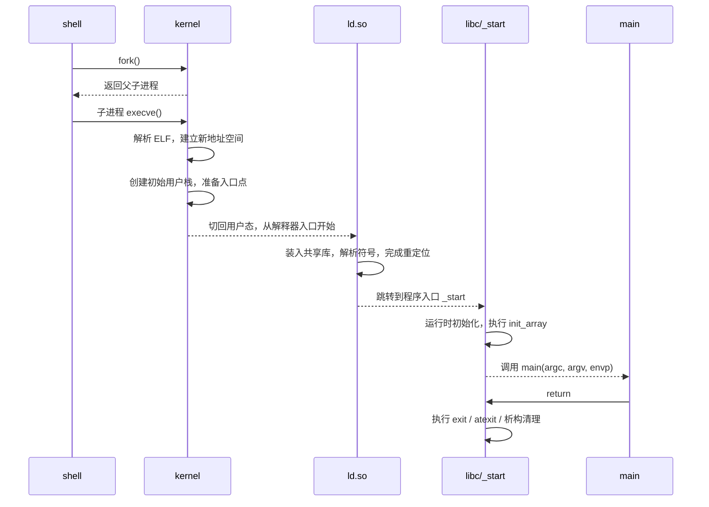
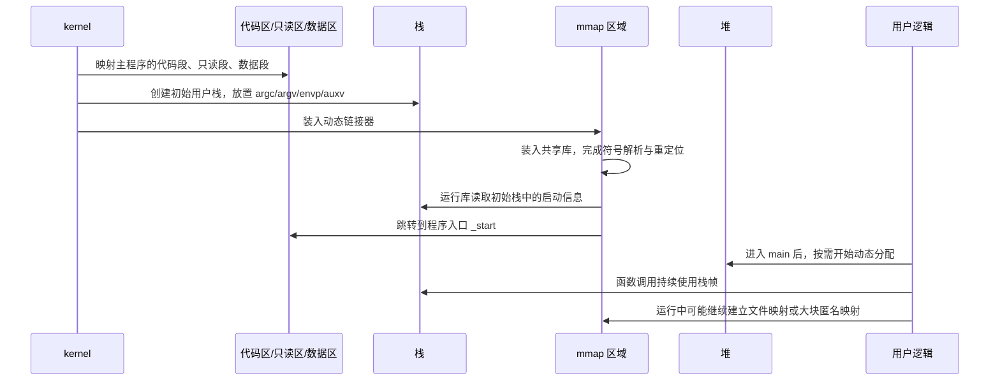
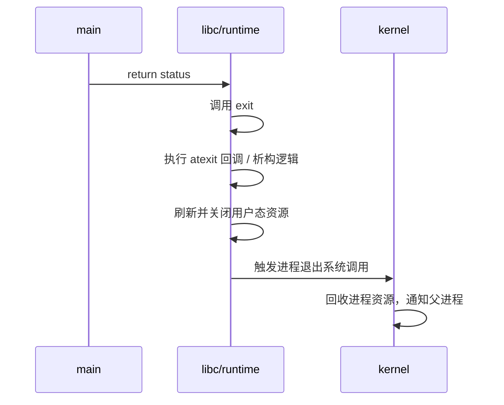
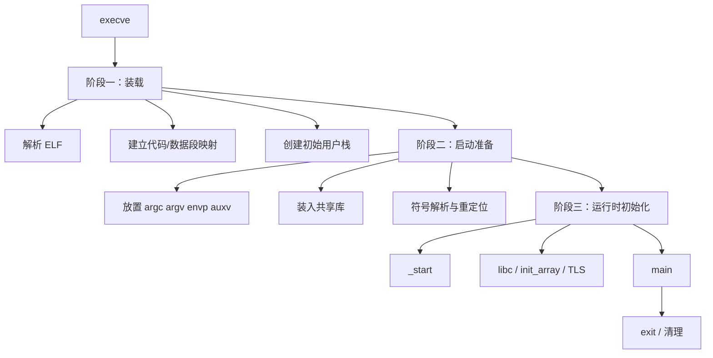

# 从进程启动到 `main`

当我们说「程序启动了」时，真正发生的事情并不是 CPU 直接跳到 `main()`，而是会经历一条更长的链路。

如果从操作系统与运行时的视角来看，这条链路通常可以拆成三段：

1. **装载（load）**：把可执行文件及其依赖组织进新的进程虚拟地址空间。
2. **启动准备（startup / bootstrap）**：准备初始栈、动态链接、重定位、入口上下文。
3. **运行时初始化并进入 `main`**：运行库完成初始化后，才真正调用用户编写的 `main`。

本文默认以 **Linux + ELF + C/C++ 动态链接程序** 为主线说明。静态链接程序、Go 程序、JVM 程序在细节上会有所不同，但大体分层思路是一致的。

如果你更想先理解「代码区、数据区、BSS、堆、栈、`mmap` 区域最终如何分布」，建议先读 [`memory_layout.md`](./memory_layout.md)。本文更聚焦**这套地址空间是如何一步步被搭建出来，并最终把控制权交到 `main` 手里**。

---

## 整体流程

可以先用一张总览图建立整体理解：


这条路径里，`main` 并不是起点，而更像是经过层层准备之后，程序员获得控制权的第一个“正式入口”。

---

## 一条更细的调用链

如果把日常最常见的启动场景也算进来，这条路径通常还可以继续向前和向后展开：

```text
shell
 -> fork
 -> 子进程调用 execve
 -> 内核装载 ELF
 -> 动态链接器 ld.so
 -> _start
 -> __libc_start_main
 -> main
 -> exit
```

这里有两个很容易被忽略的点：

- 我们平时在终端里运行一个程序时，通常并不是 shell 直接“在自己体内”跑它，而是 shell 先创建子进程，再由子进程执行 `execve`
- `main` 的前后其实都还有一层运行库逻辑，所以它只是用户代码入口，不是进程生命周期的绝对起点和终点

因此，理解这条更细的链路，有助于把“谁在调用谁”这件事真正捋顺。

---

## 启动时序图

如果把不同参与者放到同一条时间线上，从 shell 到 `main` 的链路可以更直观地表示为：



这张图里最值得注意的是两点：

- **内核并不会直接把控制权交给 `main`**
- **动态链接器和运行库都位于 `main` 之前**

所以，从时序上看，`main` 前面已经发生了相当多的准备工作。

---

## 启动链路与内存区域的对应关系

如果把这篇和 [`memory_layout.md`](./memory_layout.md) 结合起来看，可以把“启动过程”映射回“地址空间里的具体区域”。

| 启动阶段 | 主要动作 | 更直接对应的内存区域 |
|---|---|---|
| 装载主程序 | 建立主二进制的可执行、只读、可写映射 | 代码区、只读数据区、数据区、BSS |
| 创建初始用户栈 | 放置 `argc`、`argv`、`envp`、`auxv` | 栈区 |
| 装入动态链接器 | 让解释器本身进入地址空间 | `mmap` 区域中的动态库/解释器映射 |
| 装入共享库并重定位 | 解析外部符号、补齐依赖 | `mmap` 区域中的共享库映射、GOT/PLT 相关数据 |
| 运行时初始化 | 执行 `.init_array`、TLS、标准库准备 | 栈区、数据区、TLS、共享库映射区 |
| 进入 `main` | 开始用户主逻辑 | 栈、堆、全局区、`mmap` 区域都可能逐步参与 |

可以把它压成一句话：

- **装载阶段**主要在搭好代码区、数据区和初始栈
- **动态链接阶段**主要在补齐 `mmap` 区域中的解释器与共享库
- **运行时初始化之后**，程序才开始同时使用栈、堆、全局区等完整运行时空间

这也是为什么从地址空间视角看，程序并不是“先有一张静态内存图，然后才开始执行”，而是：

> 地址空间骨架先被搭起来，再在启动过程中被逐步补齐，最后才进入用户主逻辑。

---

## 内存区域参与时序图

如果进一步把“时间顺序”和“内存区域”叠在一起，可以得到一张更直观的图：



从这张图里可以读出几个很关键的节奏：

- **代码区、只读区、数据区**最早被搭出来，它们属于主程序骨架的一部分
- **栈**也很早出现，因为还没到 `main` 就已经要承载参数和启动上下文
- **`mmap` 区域**在动态链接程序里会很早活跃起来，因为动态链接器和共享库都依赖它
- **堆**通常不是最早的主角，它往往要等到用户逻辑真正开始分配对象时才明显参与

这能帮助建立一个更细的直觉：

> 并不是所有内存区域都在同一时刻“同时上线”，而是随着启动流程推进逐步变得活跃。

---

## 阶段一：装载

### `execve` 触发了什么

在 Linux 中，程序启动通常由 `execve` 系统调用触发。它的语义不是“在当前进程里简单跑个函数”，而是：

- 保留当前进程的基本身份，例如 `PID`
- 丢弃旧的用户态地址空间
- 用目标可执行文件替换当前进程镜像

所以，更准确地说，`execve` 做的是**进程映像替换**。

这也意味着一个常见纠正点：

- `fork()` 更像“复制出一个新进程”
- `execve()` 更像“把当前进程替换成另一个程序映像”

很多启动链路其实都是 `fork + execve` 配合完成的。

### 装载阶段的核心任务

内核在这一阶段通常会完成这些工作：

- 读取 ELF 头和 Program Header
- 识别哪些 `PT_LOAD` segment 需要装入
- 建立代码段、只读段、数据段等映射
- 创建新的用户栈
- 初始化新的内存描述结构

这里最关键的不是“把文件整块拷贝进内存”，而是**建立带权限的虚拟内存映射**。因此：

- 代码页通常会被映射为 `r-x`
- 只读数据页通常会被映射为 `r--`
- 可写数据页通常会被映射为 `rw-`

### 动态链接程序的特殊之处

如果 ELF 文件是动态链接的，那么内核还会注意到它声明的解释器，例如：

```text
/lib64/ld-linux-x86-64.so.2
```

这意味着真正最先被调起执行的，往往不是主程序自己的 `_start`，而是**动态链接器**。也就是说：

- 内核先把主程序装入地址空间
- 再把动态链接器也装入地址空间
- 然后把控制权先交给动态链接器

因此，从“进程启动到 `main`”的链路上，动态链接器本身就是一个非常重要的参与者。

---

## 内核态如何切回用户态入口

理解这条链路时，还有一个经常被省略但非常关键的步骤：`execve` 完成装载后，内核并不是“调用一个普通函数”进入用户程序，而是需要**切换回用户态，并把 CPU 的起始执行现场布置好**。

从抽象上看，内核至少要准备两类东西：

- **指令入口**：用户态恢复后，CPU 应该从哪个地址开始执行
- **栈入口**：用户态恢复后，栈顶指针应该指向哪里

在常见的 ELF 启动场景中，这通常意味着：

- 如果是静态链接程序，入口更接近主程序自己的入口点
- 如果是动态链接程序，入口往往会先落到动态链接器

也就是说，`execve` 之后真正发生的，不是“内核直接调用 `main`”，而是：

1. 内核重建新的用户态执行上下文
2. 设好用户态入口地址和初始栈
3. 通过体系结构相关的返回路径切回用户态
4. 用户态从入口点开始继续执行

这一步非常重要，因为它解释了一个常见误区：

> 内核并不会像普通库函数那样一层层 call 到 `main`，而是先把用户态现场搭好，再把 CPU 的执行权切回去。

所以，从“控制流”的视角看，`main` 前面经历的是一次**特权级切换 + 执行现场切换**，而不只是普通函数调用链。

---

## 阶段二：启动准备

装载完成后，距离 `main` 仍然还有一段路。因为此时虽然地址空间已经初步建立，但程序还缺少真正可运行的上下文。

### 初始用户栈

在进入用户态之前，内核会先把一部分启动信息布置到初始栈中，常见包括：

- `argc`
- `argv`
- `envp`
- 辅助向量 `auxv`

这也是为什么 `main(int argc, char **argv)` 一开始就能直接拿到参数。因为这些信息并不是运行时临时变出来的，而是进程启动前就已经被放进了初始栈。

可以把初始栈粗略理解为：

```text
argc
argv[0]
argv[1]
...
NULL
envp[0]
envp[1]
...
NULL
auxv
```

其中 `auxv`（auxiliary vector，辅助向量）常常比 `argc`、`argv` 更容易被忽略，但它对启动过程很重要。它通常用于向运行时和动态链接器传递一些由内核提供的关键信息，例如：

- 页大小
- 程序入口相关信息
- 平台与硬件能力信息
- 某些内核准备好的辅助地址

可以把它理解成：

- `argv` / `envp` 更像是“用户传给程序的话”
- `auxv` 更像是“内核传给运行时的启动说明书”

所以，动态链接器和运行时之所以能在还没进入 `main` 时就掌握不少环境信息，`auxv` 在其中起了很大作用。

### 动态链接器在做什么

如果程序依赖共享库，那么动态链接器此时会接手后续准备工作，典型包括：

- 装入依赖的 `.so`
- 解析符号依赖
- 完成重定位
- 初始化 GOT / PLT 等与动态调用相关的结构
- 准备 TLS 等运行所需的基础设施

这一步的目标，是把“文件里还带有未决引用关系的程序”变成“当前进程地址空间里可以正常跳转和访问符号的程序”。

这里还可以补一个常见区分：

- **立即绑定**：启动阶段就把相关符号尽量解析好，启动更重，但后续调用更直接
- **延迟绑定**：第一次真正调用某个外部符号时再解析，启动更轻，但首次调用会多一步解析成本

这也是为什么有些程序“启动很快，但第一次调用某类库函数会稍慢”，其背后可能就和绑定策略有关。

### 为什么这一阶段不能省略

如果跳过这一阶段，程序会出现很多基础能力缺失的问题，例如：

- 还不知道外部函数的真实地址
- 全局符号引用还没被修正
- 共享库还没被装进来
- 启动参数和环境还没准备好

所以，启动准备本质上是在回答一个问题：

> 已经有了地址空间，但怎样把它变成一个真正“可以运行用户逻辑”的进程？

---

## 阶段三：运行时初始化并进入 `main`

当装载和启动准备都完成后，控制权会逐步转交给语言运行库和程序入口。

### `_start` 不是 `main`

对 C / C++ 程序来说，ELF 入口通常并不是 `main`，而是 `_start`。`_start` 一般由运行库或启动对象文件提供，它负责：

- 整理启动参数
- 调用 C 运行时初始化逻辑
- 最终再去调用 `main`

因此，更准确的链路通常是：

```text
execve
 -> 内核装载
 -> 动态链接器
 -> _start
 -> C 运行时初始化
 -> main
```

如果进一步贴近 glibc 这类常见实现，很多时候还能把中间过程再细化成：

```text
动态链接器
 -> 程序入口 _start
 -> __libc_start_main
 -> main
```

其中：

- `_start` 更像一个很薄的汇编级入口
- `__libc_start_main` 更像把启动参数、初始化流程、`main` 和退出逻辑串起来的总调度者

所以，从“谁真正调用了 `main`”这个角度看，很多 Linux C 程序里，直接责任方其实更接近 `__libc_start_main`，而不是内核本身。

### C 运行时通常会做什么

在进入 `main` 之前，运行时通常还会处理：

- 标准库初始化
- TLS 初始化
- `.init_array` / 全局构造函数执行
- 进程级运行环境准备

对于 C++ 来说，这一步尤其重要，因为全局对象构造函数往往必须先于 `main` 运行。

如果按相对顺序理解，这一段通常近似为：

1. 进入 `_start`
2. 把初始栈中的参数整理出来
3. 调用运行库主初始化入口
4. 执行必要的 runtime / libc 初始化
5. 执行 `.init_array` 等启动构造逻辑
6. 调用 `main`

因此，`main` 前面的工作虽然对用户不可见，但并不轻量。

### `main` 结束后也不是立刻结束

即使 `main` 返回了，程序也不是立刻凭空消失。通常还会继续经过退出路径，例如：

- 调用 `exit`
- 执行 `atexit` 注册的清理函数
- 执行全局析构逻辑
- 关闭进程并回收资源

也就是说，`main` 更像是“用户主逻辑入口”，而不是整个进程生命周期的完整边界。

---

## 从 `main` 返回到进程退出

如果把“进入 `main`”看作用户主逻辑的开场，那么“离开 `main`”之后也还有一条相对固定的收尾路径。

一个常见的抽象链路是：

```text
main return
 -> exit
 -> atexit 回调 / 析构逻辑
 -> 刷新并关闭标准 I/O
 -> 进程退出
```

这里最关键的一点是：

- `return` 离开 `main`
- 不等于“整个进程的所有事情立刻结束”

运行库通常还要负责把退出流程组织完整，尽量让资源释放、缓冲刷新、析构逻辑都按约定发生。

### 退出时序图



从这张图可以看出，`main` 返回之后，用户态运行库和内核仍然都还有工作要做。

### `exit` 和 `_exit` 的区别

为了把退出路径说完整，还需要区分两个经常一起出现的名字：

- **`exit`**：会执行用户态清理逻辑，例如 `atexit` 回调、标准 I/O 刷新等
- **`_exit`**：更接近直接结束进程，不经过那一层完整的用户态清理流程

这也是为什么在某些 `fork` 后的子进程分支里，大家会特别强调用 `_exit` 而不是 `exit`，以避免把父进程继承下来的用户态缓冲与清理逻辑重复执行一遍。

### 哪些情况可能绕过“优雅退出”

并不是所有程序结束都会完整走完这条漂亮的退出链路。例如：

- 收到不可恢复信号而异常终止
- 被 `SIGKILL` 直接杀掉
- 发生严重崩溃
- 被 OOM Killer 终止

在这些场景下，很多用户态清理逻辑可能根本来不及执行。因此：

- 内核级资源最终仍会被回收
- 但用户态“本来想做的善后工作”未必能完成

这也是为什么“进程退出时一定会执行所有清理代码”并不是严格成立的说法。

---

## 启动路径与退出路径对照

如果把整篇内容再压缩一层，可以把“进来”和“出去”放在同一张表里看：

| 阶段 | 启动路径 | 退出路径 |
|---|---|---|
| 触发点 | `execve` | `main return` / `exit` / 异常终止 |
| 内核职责 | 建立新进程映像、准备地址空间、初始栈、入口点 | 回收进程资源、维护退出状态、通知父进程 |
| 运行库职责 | `_start`、`__libc_start_main`、初始化 runtime | `exit`、`atexit`、析构逻辑、标准 I/O 刷新 |
| 动态链接器职责 | 装入共享库、解析符号、完成重定位 | 一般不再是退出路径主角 |
| 用户代码位置 | 最终进入 `main` | 从 `main` 返回后离开主逻辑 |
| 是否一定完整执行 | 不一定，可能在更早阶段失败 | 不一定，异常终止可能绕过用户态清理 |

这张表最想强调的一点是：

- 启动路径的终点是 `main`
- 退出路径的起点往往也是 `main`

所以，`main` 更像进程生命周期中“用户主逻辑的中段”，而不是整个进程故事的全部。

---

## 关键术语表

为了避免阅读过程中在多个概念之间来回切换，可以把文中高频术语先收拢成一张小表：

| 术语 | 含义 | 在本文中的作用 |
|---|---|---|
| `execve` | 用新程序映像替换当前进程的系统调用 | 启动链路的操作系统入口 |
| `fork` | 创建子进程的系统调用 | shell 启动外部程序时的常见前置步骤 |
| ELF | Linux 常见可执行文件格式 | 装载器解析的对象 |
| Program Header | ELF 中描述可装载 segment 的元信息 | 决定哪些内容需要被映射进地址空间 |
| `ld.so` / 动态链接器 | 负责装入共享库、解析符号、完成重定位 | 动态链接程序进入 `main` 前的重要参与者 |
| `_start` | 程序真正的入口桩 | 接住控制权并转入运行库 |
| `__libc_start_main` | glibc 中负责组织启动流程的关键入口 | 串起初始化、`main` 与退出逻辑 |
| `main` | 用户代码主入口 | 用户主逻辑开始执行的位置 |
| `argv` / `envp` | 命令行参数与环境变量 | 由初始栈传递给程序 |
| `auxv` | 内核放入初始栈的辅助向量 | 给运行时和动态链接器提供启动辅助信息 |
| GOT | Global Offset Table，全局偏移表 | 动态链接下辅助全局符号地址解析 |
| PLT | Procedure Linkage Table，过程链接表 | 动态链接下辅助函数调用跳转 |
| 重定位 | 把符号引用修正到当前实际地址的过程 | 让程序和共享库能正确互相访问 |
| TLS | Thread Local Storage，线程局部存储 | 为每个线程维护独立副本数据 |
| `atexit` | 注册进程正常退出时的回调 | 属于用户态退出清理逻辑的一部分 |
| `exit` | 带用户态清理逻辑的退出接口 | `main` 返回后的常见收尾路径 |
| `_exit` | 更接近直接结束进程的退出接口 | 跳过大量用户态清理逻辑 |

如果只想抓主线，可以优先记住这几个层次：

- **操作系统层**：`fork`、`execve`
- **文件与装载层**：ELF、Program Header
- **动态链接层**：`ld.so`、重定位、PLT/GOT
- **运行库层**：`_start`、`__libc_start_main`
- **用户代码层**：`main`
- **退出层**：`exit`、`_exit`、`atexit`

这样再回头看全文时，层次会清楚很多。

---

## 常见面试问法

如果把这篇内容放到面试或口头表达场景里，最常见的问题通常集中在下面几类。

### 问：程序是不是从 `main` 开始执行的？

一个比较稳妥的回答方式是：

> 从用户代码视角可以近似这么说，但从操作系统和运行库视角并不准确。真正更靠前的入口通常是 ELF 入口点，例如 `_start`。在动态链接程序里，`main` 之前往往还会经过动态链接器、运行库初始化、全局构造逻辑等步骤。

回答时最好顺手带出两个关键词：

- `_start`
- `__libc_start_main`

这样能体现你知道 `main` 前面还有运行库接力。

### 问：`execve` 做了什么？

可以回答：

> `execve` 的本质不是创建一个全新 PID，而是用新的程序映像替换当前进程的用户态地址空间。它会触发 ELF 装载、建立新的虚拟地址空间、准备初始栈，并把控制权最终导向新的用户态入口。

这里最容易加分的一点是主动纠正：

- `fork` 更偏向创建新进程
- `execve` 更偏向替换进程映像

### 问：动态链接程序为什么不能直接进 `main`？

可以回答：

> 因为它在进入 `main` 之前，还需要动态链接器装入共享库、解析符号、完成重定位，并由运行库完成初始化。只有这部分准备完成之后，程序里的外部函数调用和全局符号访问才真正可用。

这里可以顺手提一下：

- `ld.so`
- 重定位
- PLT / GOT

### 问：`main` 返回之后发生了什么？

可以回答：

> `main` 返回之后，通常不会立刻结束。运行库一般还会继续执行 `exit` 路径，包括 `atexit` 回调、析构逻辑、标准 I/O 刷新等，最后再由内核完成真正的进程资源回收。

如果面试官继续追问，可以再补：

- `exit` 和 `_exit` 不同
- 异常终止未必会走完这些用户态清理逻辑

### 问：如何证明 `main` 不是最早入口？

一个偏工程化的回答是：

> 可以用 `readelf -h` / `readelf -l` 看 ELF 入口和 `INTERP` 段，用 `gdb starti` 从第一条用户态指令开始调试，也可以在 `main` 处断点后用 `bt` 看回溯，通常都能看到 `main` 上面还有运行库相关帧。

这类回答的价值在于：它不只是“知道概念”，而是说明你知道怎么验证。

### 问：怎么用一句话概括从启动到 `main` 的过程？

可以直接用下面这句：

> `execve` 先让内核建立新的进程执行现场；如果是动态链接程序，还要经过动态链接器装库和重定位；随后运行库完成初始化，最后才调用用户写的 `main`。

如果要再补完整一点，也可以继续加一句：

> 而 `main` 返回之后，运行库还会负责收尾，再由内核完成最终回收。

---

## 常见混淆概念对比

阅读这条启动链路时，最容易混淆的通常不是单个术语本身，而是几个很像的概念之间的边界。下面这张表适合在复习时快速扫一遍。

| 概念 A | 概念 B | 核心区别 |
|---|---|---|
| `fork` | `execve` | `fork` 更偏向创建子进程；`execve` 更偏向用新程序映像替换当前进程 |
| `_start` | `main` | `_start` 是程序更早的入口桩；`main` 是用户主逻辑入口 |
| `__libc_start_main` | `main` | 前者负责组织启动与退出流程；后者负责执行业务逻辑 |
| 静态链接 | 动态链接 | 静态链接把大量依赖提前打进二进制；动态链接在启动阶段还要装共享库并做重定位 |
| `argv/envp` | `auxv` | 前者更像用户传给程序的参数和环境；后者更像内核传给运行时的启动辅助信息 |
| `exit` | `_exit` | `exit` 会执行用户态清理逻辑；`_exit` 更接近直接结束进程 |
| 正常退出 | 异常终止 | 正常退出更可能走完用户态清理；异常终止可能直接绕过这部分流程 |
| ELF 入口点 | C 函数入口 | ELF 入口点是装载后最早的用户态执行位置；C 函数入口只是语言层面的函数边界 |

如果只想抓最关键的三组，可以优先记：

- `fork` vs `execve`
- `_start` vs `main`
- `exit` vs `_exit`

这三组基本覆盖了“如何进来、谁先执行、如何出去”三个最核心的问题。

---

## 最小启动样例解析

如果想把前面的概念压到一个具体例子上，最简单的方法就是写一个极小的 C 程序，然后沿着它从 ELF 入口一路看到 `main`。

### 示例程序

```c
#include <stdio.h>

int main(int argc, char **argv) {
    printf("hello\n");
    return 0;
}
```

这个程序虽然极短，但它仍然会经历：

- `execve`
- ELF 装载
- 动态链接器参与
- `_start`
- `__libc_start_main`
- `main`
- `exit`

也就是说，程序短不等于启动链路短。用户代码只有几行，不代表 `main` 前后没有运行库和内核工作。

### 第一步：看 ELF 入口和解释器

```bash
gcc -O0 -g hello.c -o hello
readelf -h hello
readelf -l hello
```

这里重点关注两类信息：

- `Entry point address`
- `INTERP` 段

如果看到了 `INTERP`，通常说明这是一个动态链接程序，启动时会先经过动态链接器，而不是直接从主程序自己的逻辑开始执行。

### 第二步：从第一条用户态指令开始

```bash
gdb ./hello
(gdb) starti
```

`starti` 的意义在于：它会停在**第一条用户态指令附近**，而不是像普通 `start` 那样直接把你送到 `main`。

这一步通常可以帮助确认：

- 程序真正更早的入口不是 `main`
- 当前停下来的位置可能还在动态链接器或 `_start` 附近

### 第三步：在 `main` 处看调用栈

```bash
(gdb) break main
(gdb) continue
(gdb) bt
```

这时通常可以看到：

- `main` 不是最顶层唯一入口
- 它上面还叠着运行库相关帧

换句话说，这一步是在用调试器直观地验证：

> `main` 是被运行库调用的，而不是被内核直接调用的。

### 第四步：观察系统调用与文件装载

```bash
strace -f -e execve,openat ./hello
```

这里通常能帮助看到：

- `execve` 何时发生
- 启动时打开了哪些共享库文件
- 哪些动作发生在 `main` 之前

这一步特别适合把“动态链接器会装库”这个抽象概念，变成可以看到的具体文件访问。

### 用这个样例能验证什么

这个最小程序虽然简单，但已经足够验证很多关键结论：

- 程序不是直接从 `main` 开始
- 动态链接程序在 `main` 前有额外准备阶段
- `main` 之上仍然有运行库调用链
- 启动路径和代码行数多少不是一回事

所以，当我们讨论“从进程启动到 `main`”时，真正关注的不是示例代码复杂不复杂，而是**操作系统、动态链接器和运行库如何接力**。

---

## `_start`、`__libc_start_main`、`main` 的关系

这三个名字经常被混在一起，但它们的职责并不相同：

| 角色 | 更接近哪一层 | 主要职责 |
|---|---|---|
| `_start` | 程序入口桩 | 接住内核或动态链接器交来的控制权，转入运行库 |
| `__libc_start_main` | C 运行库 | 完成启动调度、调用初始化逻辑、再调用 `main` |
| `main` | 用户代码 | 执行业务主逻辑 |

可以把它们理解为：

- `_start` 负责“接棒”
- `__libc_start_main` 负责“组织比赛”
- `main` 负责“真正开跑”

如果只记一句话，可以记成：

> 内核把控制权交给入口点，入口点把流程交给运行库，运行库准备好一切之后才调用 `main`。

如果把退出路径也一起考虑进去，那么还可以再补一句：

> `main` 返回后，运行库通常还会继续接管收尾，再把进程真正送出用户态生命周期。

---

## 为什么要拆成这三段

把“启动到 `main`”分成这三段，有两个好处。

第一，它能帮助区分不同层面的责任：

- **装载**负责建立地址空间骨架
- **启动准备**负责把骨架补齐到可运行状态
- **运行时初始化**负责把控制权安全交给用户代码

第二，它能解释很多常见现象：

- 为什么 `main` 一开始就能拿到命令行参数
- 为什么动态链接程序还没进 `main` 就已经装入了很多共享库
- 为什么 C++ 全局对象能在 `main` 前构造
- 为什么排查程序启动慢时，问题不一定在 `main`
- 为什么 `main` 返回后，程序仍然可能继续执行一小段退出逻辑

---

## 静态链接与动态链接的差异

为了避免把这条链路理解得过于僵硬，还需要补一个修正点：并不是所有程序都会经历同样复杂的动态链接阶段。

### 静态链接程序

如果程序是静态链接的，那么：

- 很多依赖代码已经被提前打进主二进制
- 启动时不需要再额外装入那么多共享库
- 动态链接器参与会少很多，甚至可以没有独立的动态装载步骤

这种情况下，链路会更短一些。

### 动态链接程序

如果程序是动态链接的，那么：

- 共享库需要在启动阶段装入
- 符号解析和重定位会更复杂
- 地址空间中会出现更多映射区

这也是为什么现代 Linux 用户态进程通常会带着 `ld-linux`、`libc.so` 等多块额外映射一起出现。

---

## 静态链接与动态链接的时序对比

虽然前面的主线默认以动态链接程序为例，但如果只看“从启动到 `main`”的相对顺序，静态链接和动态链接仍然有一个非常明显的区别：

### 动态链接程序

```text
execve
 -> 内核装载主程序
 -> 内核装载动态链接器
 -> 动态链接器装载共享库并重定位
 -> _start
 -> 运行时初始化
 -> main
```

### 静态链接程序

```text
execve
 -> 内核装载主程序
 -> _start
 -> 运行时初始化
 -> main
```

两者最大的区别在于：

- 动态链接程序在 `_start` 之前，多了一层**动态链接器参与的装载与解析**
- 静态链接程序则把大量依赖关系提前折叠进了主二进制，因此启动路径更短、更直接

但两者也有共同点：

- 都需要内核建立新的地址空间
- 都需要准备初始栈
- 都不会直接从 `execve` 瞬间跳到 `main`

所以，无论是静态链接还是动态链接，`main` 都只是启动流程后半段才会出现的用户逻辑入口。

---

## 和内存布局的关系

这三段流程和“程序的内存布局”并不是两个独立话题，反而是前后连续的。

- 在**装载阶段**，内存布局的基础骨架被建立起来。
- 在**启动准备阶段**，初始栈、共享库映射、TLS、重定位等细节被补齐。
- 在**运行时初始化阶段**，这套布局才真正开始承载程序自己的逻辑。

也就是说，内存布局回答的是：

> 进程的地址空间长什么样？

而“从启动到 `main`”回答的是：

> 这套地址空间是如何一步步被搭建好，并最终交到用户代码手里的？

把两者连起来看，进程启动过程就会完整很多。

---

## 如何实际观察这条链路

如果只看概念，很容易觉得这条路径抽象。实际上，可以借助一些非常直接的工具来观察。

### 看 ELF 入口与解释器

```bash
readelf -h ./a.out
readelf -l ./a.out
```

重点可以看：

- ELF 的入口地址（Entry point）
- 是否存在 `INTERP` 段
- `PT_LOAD`、`PT_DYNAMIC` 等 Program Header

如果看到了 `INTERP`，通常就意味着这是一个动态链接程序，启动时会涉及动态链接器。

### 看依赖了哪些共享库

```bash
ldd ./a.out
```

它可以帮助快速建立“启动时大概会有哪些共享库参与进来”的直觉。不过它更适合做理解辅助，不应被误当作完整等价于真实运行时全过程。

### 看系统调用入口

```bash
strace -f -e execve ./a.out
```

这类命令可以帮助看到：

- shell 或父进程何时调用 `execve`
- 目标程序何时真正开始执行

如果要继续追踪动态库装载、文件访问等，也可以扩大跟踪范围。

如果想更贴近“切回用户态入口”这一步，也可以关注：

- 入口地址最终落在主程序还是动态链接器
- 初始栈顶在 `starti` 时是什么样子
- `_start` 读取参数时，最初依赖的是哪些寄存器和栈布局

### 看第一条用户态指令

在调试器里，可以直接从入口点开始观察，而不是从 `main` 开始：

```bash
gdb ./a.out
(gdb) starti
```

这样就能看到程序在 `_start` 附近的状态，而不是直接跳到 `main`。这对于理解“`main` 之前到底发生了什么”非常有帮助。

### 看 `main` 之前的调用栈

如果想更具体地观察“是谁把控制权交给了 `main`”，可以在 `main` 处下断点后查看回溯：

```bash
gdb ./a.out
(gdb) break main
(gdb) run
(gdb) bt
```

在常见的 Linux + glibc 环境下，通常能看到 `main` 之上还存在运行库相关帧。这能帮助建立一个非常重要的认知：

> `main` 是被运行库调用的，而不是被内核直接调用的。

当然，具体栈帧名字会受编译选项、优化级别、调试符号和运行库实现影响，不必机械要求完全一致。

### 看启动时真正发生了哪些文件装载

如果想更贴近动态链接过程，可以继续观察程序启动时打开了哪些库文件，例如：

```bash
strace -f -e execve,openat ./a.out
```

这样通常可以更直观地看到：

- `execve` 何时发生
- 启动期间装入了哪些共享库
- 哪些文件访问属于 `main` 前的准备工作

这类观察方式对于排查“为什么程序还没进 `main` 就已经很慢”特别有帮助。

---

## 常见误区

### `main` 就是程序入口吗？

从用户代码视角可以近似这么说，但从操作系统和运行库视角并不准确。真正更靠前的入口通常是 ELF 入口点，例如 `_start`。

### `execve` 会新建一个进程吗？

不准确。`execve` 的核心是**替换当前进程映像**，而不是单独“再创建一个全新的进程身份”。新进程这件事更接近 `fork()` 在做。

### 动态链接器是不是可有可无？

对于动态链接程序来说，不是。它直接决定了共享库能否被正确装入、符号能否被正确解析、程序能否顺利进入后续初始化阶段。

### 内核是不是直接调用了 `_start` 或 `main`？

更准确地说，不是普通意义上的“函数调用”。内核做的是准备新的用户态执行现场，然后切回用户态，让 CPU 从指定入口地址继续执行。

### `main` 返回就表示一切都结束了吗？

不完全是。`main` 返回之后，通常还会继续走退出路径，执行清理逻辑、析构逻辑和资源回收。

### 进程退出时一定会执行所有清理逻辑吗？

不一定。只有走到正常的用户态退出路径时，`atexit`、标准 I/O 刷新、析构逻辑等才更有机会按预期执行。异常终止、被 `SIGKILL` 杀掉、严重崩溃等场景，都可能绕过这部分流程。

### 只要看到 `_start`，是不是就一定还没经过动态链接器？

不一定。对于动态链接程序来说，你看到的 `_start` 往往已经是在动态链接器完成一部分准备之后，才真正抵达主程序入口的结果。

---

## 一张总结图



可以把从进程启动到 `main` 的路径理解为：

- **先有地址空间**
- **再把运行所需的上下文补齐**
- **最后才把控制权交给用户逻辑**

`main` 不是启动的起点，而是启动流程准备完成后的结果。

如果把退出也一起算进去，那么整条主线可以再压成一句话：

> `execve` 建立新的进程执行现场，运行库在 `main` 前把环境准备好，而 `main` 返回后，运行库又继续接手收尾，最后再由内核完成进程级回收。

如果只做面试式复述，也可以压成更短的一句：

> 程序不会直接从内核跳进 `main`，而是先经过装载、动态链接和运行时初始化；同样，`main` 返回后也不会立刻结束，而是还要经过运行库清理和内核回收。

---

## Ref

- `man 2 execve`
- `man 8 ld.so`
- `man 5 proc`
- 《Computer Systems: A Programmer's Perspective》
- 《Operating Systems: Three Easy Pieces》
