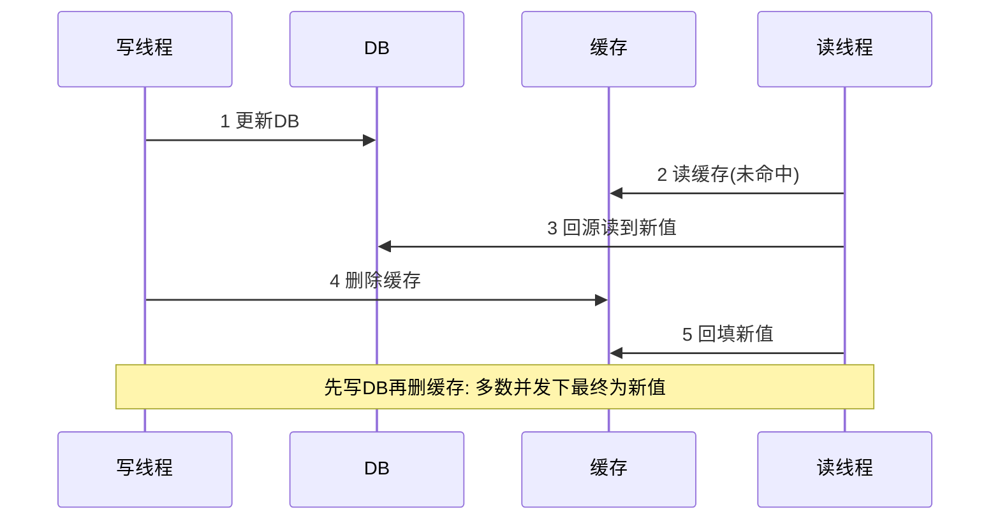

# 缓存一致性（Cache Consistency）

> **摘要**：缓存把热数据放到高速介质换取读性能，但只要「数据库」与「缓存」是两份副本，就必然存在一致性问题。本文建立一条主线：**为什么会不一致 → 三种读写模式 → Cache Aside 的更新顺序博弈 → 一致性增强手段 → 三大缓存故障（击穿/穿透/雪崩） → 多级缓存 → 治理指标与面试问答**，目标是读完能针对不同一致性诉求给出可落地的缓存方案。

> **前置阅读**：缓存一致性本质是一种「弱化的[分布式事务](./distributed_transaction.md)」，同样依赖[幂等机制](./idempotence.md)与[消息可靠性](./message_reliability.md)做兜底，三者构成「一致性与数据可靠性」P0 三件套。

---

## 一、不一致的根源

缓存与 DB 是两份数据副本，任何「更新 DB」与「更新/失效缓存」都不是一个原子操作。只要两步之间存在时间窗口、并发或失败，就可能读到旧值：

- **并发窗口**：读线程读到旧值并回填缓存，恰好晚于写线程的删缓存动作。
- **步骤失败**：DB 更新成功但删缓存失败，缓存长期为脏。
- **主从延迟**：写主库后立刻从从库回源，读到未同步的旧值再写入缓存。

核心认知：**缓存一致性追求的不是「永不脏」，而是「脏窗口足够短且可收敛」**。要强一致就不该用旁路缓存，而应读写都穿透缓存组件（性能代价大）。

---

## 二、三种读写模式

| 模式 | 读路径 | 写路径 | 一致性 | 适用 |
| :--- | :--- | :--- | :--- | :--- |
| Cache Aside（旁路） | 先读缓存，未命中回源 DB 并回填 | 更新 DB，再删缓存 | 最终一致 | 读多写少的通用场景（最常用） |
| Read/Write Through（穿透） | 应用只读缓存，缓存自己回源 | 应用只写缓存，缓存同步写 DB | 较强 | 缓存组件托管数据、需简化应用 |
| Write Behind（写回） | 读缓存 | 只写缓存，异步批量刷 DB | 弱、有丢数据风险 | 高写入吞吐、可容忍丢失（计数器） |

绝大多数业务用 **Cache Aside**，因此其更新顺序是重点。

---

## 三、Cache Aside 的更新顺序博弈

写操作有四种组合，逐一分析：

<CacheAsideRaceExplorer />

- **先删缓存，再写 DB**：删缓存后、写 DB 完成前，若有读请求，会把旧值回填缓存 → 写完 DB 后缓存仍是旧值，脏且不自愈。**不推荐**。
- **先写 DB，再删缓存**：主流选择。仅在「读线程在写线程写 DB 之前读到旧值、且回填晚于删缓存」这一极窄并发下才脏，概率低。**推荐**。
- **更新缓存（而非删除）**：并发写下两个更新可能乱序覆盖，且缓存值需重新计算，浪费。一般选「删」而非「更新」，让下次读触发回填（懒加载）。
- **延迟双删**：先删缓存 → 写 DB → 延迟一小段（覆盖读回填窗口）再删一次缓存，清除窗口内被回填的旧值。用于主从延迟明显或对脏窗口敏感的场景。



### 删缓存失败怎么办

「写 DB 成功、删缓存失败」会留脏。两种可靠删除手段：

- **重试队列**：删缓存失败则投递到 MQ，消费端重试删除（依赖[消息可靠性](./message_reliability.md)）。
- **binlog 订阅（推荐）**：用 Canal/Debezium 订阅 DB binlog，由订阅端统一删缓存，与业务写解耦，天然覆盖所有写入口。

```go
// Cache Aside 读：未命中回源并回填，用单飞抑制击穿
func GetUser(ctx context.Context, id int64) (*User, error) {
	if u, ok := cache.Get(ctx, key(id)); ok {
		return u, nil // 命中(含空值缓存)
	}
	// singleflight 合并同 key 并发回源，防击穿
	v, err, _ := sf.Do(key(id), func() (any, error) {
		u, err := db.LoadUser(ctx, id)
		if err == ErrNotFound {
			cache.SetNull(ctx, key(id), 60*time.Second) // 空值缓存防穿透
			return nil, ErrNotFound
		}
		if err != nil {
			return nil, err
		}
		cache.Set(ctx, key(id), u, ttlJitter(10*time.Minute)) // TTL 加抖动防雪崩
		return u, nil
	})
	if err != nil {
		return nil, err
	}
	return v.(*User), nil
}
```

---

## 四、三大缓存故障

| 故障 | 成因 | 现象 | 治理 |
| :--- | :--- | :--- | :--- |
| 缓存击穿 | 单个**热 key 过期**瞬间大量请求打到 DB | 单点 DB 被打爆 | 互斥锁/`singleflight` 合并回源、热 key 逻辑过期不真删、热 key 永不过期后台刷新 |
| 缓存穿透 | 查询**不存在的数据**，缓存永不命中 | 恶意/异常流量直击 DB | 空值缓存（短 TTL）、布隆过滤器前置拦截、参数校验 |
| 缓存雪崩 | **大量 key 同时过期**或缓存整体宕机 | DB 瞬时压力峰值 | TTL 加随机抖动、多级缓存、限流降级、缓存高可用（集群+持久化） |

记忆锚点：**击穿是「一个热点」，穿透是「查空」，雪崩是「一片同时失效」**。三者的追问几乎必考。

---

## 五、多级缓存与主从延迟

- **多级缓存**：本地缓存（进程内，如 Caffeine/内存 map）+ 分布式缓存（Redis）。本地缓存扛热点、降 RT，但多实例间有一致性差，需靠短 TTL 或广播失效（发布订阅通知各实例清本地）收敛。
- **主从延迟联动**：写主库后若立即从从库回源，会把旧值写进缓存。对策：写后短期强制读主回填、延迟双删覆盖同步窗口、或由 binlog 订阅（基于主库）统一失效。

---

## 六、一致性目标与方案选择

| 一致性诉求 | 方案 |
| :--- | :--- |
| 允许秒级脏（多数读场景） | Cache Aside 先写 DB 再删缓存 + TTL 兜底 |
| 脏窗口敏感 | 延迟双删 / binlog 订阅删缓存 |
| 近强一致 | 读写穿透缓存组件，放弃旁路（牺牲性能） |
| 高写吞吐可容忍丢失 | Write Behind + 落盘兜底 |

---

## 七、治理指标

- 命中率、回源率（回源率飙升预示 key 设计或雪崩问题）；
- 脏读率（对账采样比对缓存与 DB）；
- 热 key 分布与单 key QPS（识别击穿风险）；
- 缓存组件可用性、平均/尾延迟、内存淘汰率。

---

## 八、面试高频问答

- **为什么是「删缓存」而不是「更新缓存」？** 避免并发写乱序覆盖，且更新值需重算，懒加载更省。
- **先删缓存还是先写 DB？** 先写 DB 再删缓存；对脏窗口敏感加延迟双删或 binlog 订阅兜底。
- **删缓存失败如何保证最终一致？** 重试队列或 binlog 订阅统一删除。
- **击穿/穿透/雪崩区别与对策？** 见第四节表格。
- **本地缓存多实例不一致怎么办？** 短 TTL + 发布订阅广播失效。

---

## 九、引用关系

- 同层依赖：[分布式事务](./distributed_transaction.md)、[幂等机制](./idempotence.md)、[消息可靠性](./message_reliability.md)。
- 中间件实现：Redis 专题（`middleware/redis/`）。
- 场景落地：电商、排行榜等高读放大场景（规划中）。
