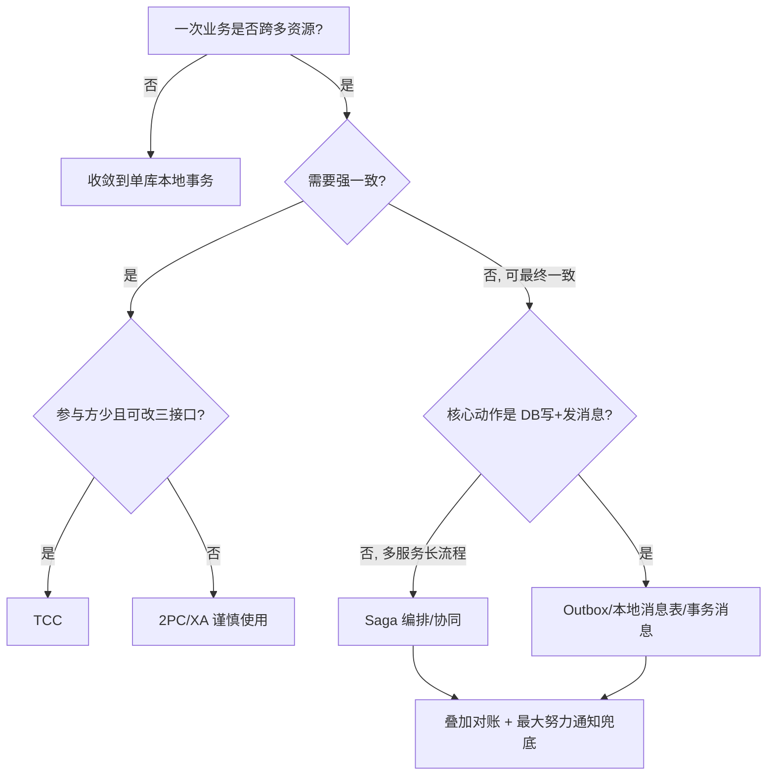
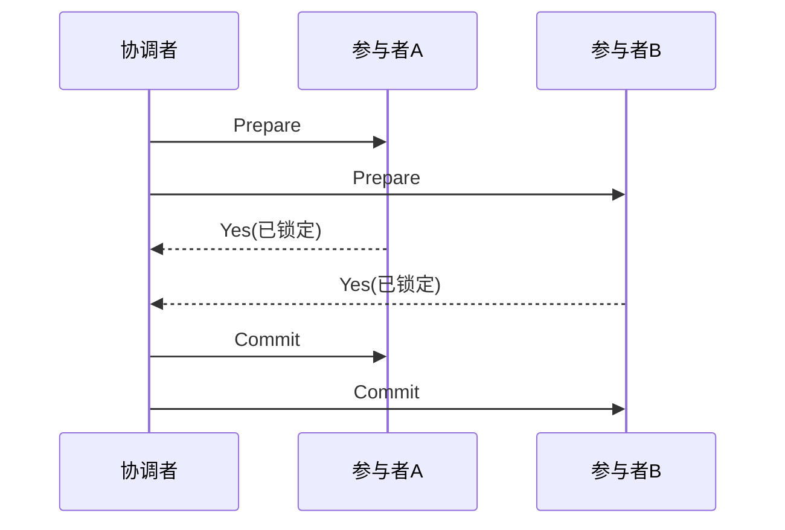
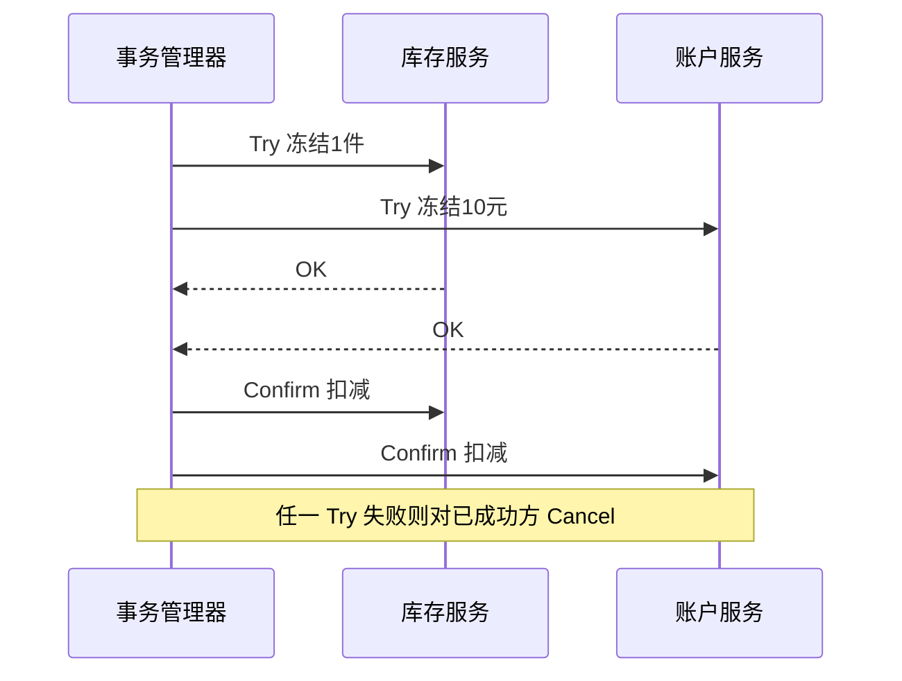
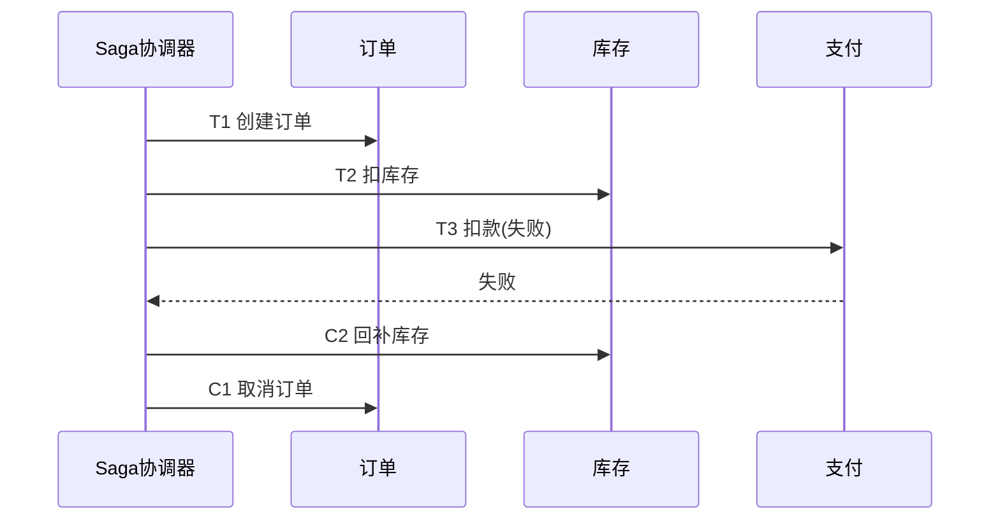
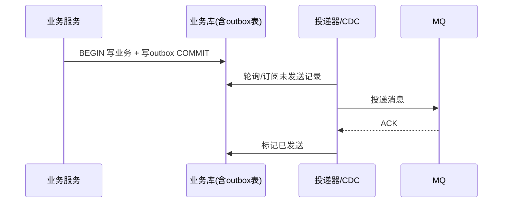
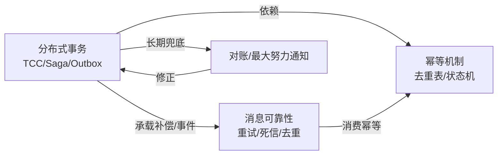

# 分布式事务（Distributed Transaction）

> **摘要**：单机数据库用 ACID 事务保证「一组写要么全成功要么全失败」。一旦这组写跨越多个服务、多个数据库或数据库与消息队列，本地事务边界被打破，就需要分布式事务方案在「强一致」与「可用性/性能」之间做工程取舍。本文建立一条主线：**问题本质 → 一致性目标分级 → 评价维度 → 方案全景与选型 → 每种方案的机制/时序/补偿 → 与幂等和消息可靠性的协同 → 场景落地、故障与治理**，目标是读完能在生产中完成选型与落地。

> **前置阅读**：[幂等机制](./idempotence.md)是所有分布式事务方案的地基；[消息可靠性](./message_reliability.md)是异步补偿链路的载体；本文与[缓存一致性](./cache_consistency.md)共同构成「一致性与数据可靠性」P0 三件套。

---

## 一、问题本质：为什么本地事务不够用

ACID 事务依赖单个数据库的日志与锁在**同一事务边界**内保证原子性与隔离性。分布式场景下，一次业务操作可能同时涉及：

- 多个数据库实例（分库分表、多数据源）；
- 多个服务（订单、库存、账户、营销各自持有数据）；
- 数据库 + 消息队列 + 缓存等异构存储。

这些资源没有统一的事务协调者与统一日志，任何一步都可能因网络分区、超时、宕机而处于「不确定」状态。核心矛盾由 CAP 决定：在网络分区不可避免（$P$ 恒成立）的前提下，要么牺牲强一致性（$C$）换可用性（$A$），要么牺牲可用性保强一致。**绝大多数互联网业务选择 AP + 最终一致 + 业务补偿**，而非强一致的两阶段锁。

一句话判断是否需要分布式事务：**当「一次业务语义上的原子操作」被拆到了两个及以上无法共享本地事务的资源时**。若能通过表设计把写收敛到单库单事务，优先消除分布式事务，这是成本最低的方案。

---

## 二、一致性目标分级

选型前必须先明确业务能接受的一致性等级，等级越强成本越高。

| 等级 | 含义 | 用户可感知的现象 | 典型场景 |
| :--- | :--- | :--- | :--- |
| 强一致 | 任意时刻读到的都是最新已提交值 | 无中间态 | 账户余额扣减、库存防超卖 |
| 最终一致 | 允许短暂不一致，收敛后一致 | 短暂「处理中」 | 订单状态同步、积分发放 |
| 因果/会话一致 | 保证「自己看到自己写」等偏序 | 自己刷新可见，他人稍延迟 | 用户资料更新 |
| 业务一致（可对账） | 允许瞬时偏差，但可通过对账兜底纠正 | T+1 修正 | 营销发券、支付清结算 |

关键结论：**大多数场景真正需要的是「最终一致 + 可对账」，而非「强一致」。** 选型的第一步是先与业务确认能接受的一致性等级，再据此选方案——等级定错会导致要么过度设计（用强一致堆成本），要么欠设计（用弱一致引发资损）。

---

## 评价维度（选型的尺子）

后文所有方案用这几个维度衡量：

| 维度 | 含义 |
| :--- | :--- |
| 一致性强度 | 强一致 / 最终一致 / 可对账 |
| 隔离性 | 中间态是否对外可见（是否可能脏读） |
| 性能/阻塞 | 是否持锁、吞吐高低 |
| 业务侵入 | 是否要改造业务接口（如 TCC 三接口） |
| 恢复方式 | 失败后靠回滚 / 补偿 / 重试 / 对账 |
| 复杂度与运维 | 协调者、事务日志、回查任务的成本 |

---

## 三、方案全景与选型决策

主流方案按「一致性强度」与「侵入性」排布：

| 方案 | 一致性 | 阻塞/性能 | 业务侵入 | 适用 | 不适用 |
| :--- | :--- | :--- | :--- | :--- | :--- |
| 2PC / XA | 强一致 | 同步阻塞、锁资源久 | 低（DB 支持） | 内部同构 DB、低并发 | 高并发、跨异构存储、长事务 |
| 3PC | 强一致（缓解阻塞） | 仍阻塞、消息更多 | 低 | 学术/少见 | 生产极少用 |
| AT（Seata 自动补偿） | 最终一致（准强） | 短锁（全局锁） | 低（无需改接口） | 单体改造、DB 操作可反解析 | 复杂 SQL、高冲突热点 |
| TCC | 强/准强一致 | 无长锁、并发好 | 高（三接口） | 资金、库存等强一致核心链路 | 改造成本敏感、参与方多 |
| Saga | 最终一致 | 无锁、吞吐高 | 中（补偿接口） | 长流程、多服务编排 | 需要读隔离/防脏读的场景 |
| 本地消息表 / Outbox | 最终一致 | 高吞吐 | 中 | DB 写 + 发消息原子性 | 需要即时一致 |
| 事务消息（RocketMQ） | 最终一致 | 高吞吐 | 中 | 发消息与本地事务绑定 | 依赖特定 MQ 能力 |
| 最大努力通知 | 弱最终一致 | 最高 | 低 | 对账兜底、通知类 | 强一致资金链路 |

选型决策树（概览）：



---

## 四、方案机制详解

### 4.1 2PC / XA

由事务协调者（TC）驱动两阶段：**Prepare**（各参与者预留资源并锁定、写 undo/redo）→ **Commit/Rollback**。



- 优点：强一致、对业务基本透明（数据库/JTA 支持）。
- 致命缺陷：
	- **同步阻塞**：Prepare 到 Commit 之间持锁，长时间占用资源，吞吐低。
	- **协调者单点**：TC 在 Commit 前宕机，参与者长期不确定（悬挂）。
	- **数据不一致窗口**：部分 Commit 消息丢失时状态分裂。
- 结论：互联网高并发场景基本弃用，仅在内部同构、低并发、强一致要求的中间件（如某些分库 XA）中出现。

### 4.2 TCC（Try-Confirm-Cancel）

把每个参与者的操作拆成三个幂等接口，用「业务层的两阶段」替代「数据库层的两阶段」：

- **Try**：预留资源（冻结库存、冻结额度），不真正扣减。
- **Confirm**：确认提交，真正扣减，只使用 Try 预留的资源。
- **Cancel**：释放 Try 预留的资源。



TCC 三大工程难点：

- **空回滚**：Try 未执行（如网络超时未达）却先收到 Cancel。解决：Cancel 时校验事务记录是否存在 Try，无 Try 直接空回滚并记录。
- **幂等**：Confirm/Cancel 可能重试多次，必须幂等（依赖[幂等机制](./idempotence.md)的去重表/状态机）。
- **悬挂**：Cancel 先于 Try 到达并完成，随后迟到的 Try 又预留了资源且永不 Confirm。解决：Try 时校验该事务是否已被 Cancel，若已终结则拒绝 Try。

适用：资金、库存等强一致核心链路且参与方可控。代价是每个服务要写三套接口，改造成本高。

### 4.2+ AT 模式（Seata 自动补偿）

TCC 要手写三接口，改造重。**AT 模式**（Seata）在框架层自动生成补偿，业务几乎无侵入：

- **一阶段**：拦截业务 SQL，执行前后分别记录数据的**前镜像/后镜像（undo log）**，本地事务提交业务 + undo log，并注册全局事务、拿一把**全局锁**（锁住被改行）。
- **二阶段提交**：全局成功则异步删除 undo log（快）。
- **二阶段回滚**：全局失败则用 undo log 的前镜像**自动反向恢复**数据（回滚前校验后镜像与当前值是否一致，防止别的事务已改）。

优点：无需改业务接口、准强一致（全局锁避免脏写）。局限：全局锁在高冲突热点上是瓶颈、复杂 SQL 难以可靠反解析、隔离级别默认读未提交（可用 `SELECT FOR UPDATE` 走全局锁提升）。适合「单体拆分初期、DB 操作规整」的场景，是 TCC 的低成本替代。

### 4.3 Saga

把长事务拆成一串本地事务 $T_1, T_2, \dots, T_n$，每个 $T_i$ 配一个补偿 $C_i$。正向执行到某步失败，则反向依次执行已完成步骤的补偿。

<SagaCompensationExplorer />

- **编排式（Orchestration）**：中央协调器驱动每一步与补偿，链路清晰、易观测，协调器是核心。
- **协同式（Choreography）**：各服务通过事件互相触发，去中心化、耦合低，但链路分散、难追踪、易形成事件风暴。



Saga 关键约束：

- **无隔离性**：中间态对外可见，可能脏读。需用「语义锁」（如订单置为 `处理中` 状态而非直接可见）或业务层可见性控制来缓解。
- **补偿必须幂等且可交换**：补偿可能重试；`C_i` 要能处理「正向未真正生效」的情况（与 TCC 空回滚同源）。
- **不可补偿动作**：如已发短信、已出库，需放在链路末尾或改为「可对冲」设计（发反向通知、退货流程）。

### 4.4 本地消息表 / Outbox

解决最常见的子问题：**「写业务库」与「发消息」的原子性**。直接先写库再发 MQ，会因发 MQ 失败或进程崩溃导致消息丢失；先发 MQ 再写库则可能消息发了库没写成。

做法：在**同一个本地事务**里写业务表 + 写一张 `outbox` 消息表，事务提交即保证二者同时成功。再由独立投递器轮询（或用 CDC/binlog 订阅）把 outbox 记录投递到 MQ，投递成功后标记已发送。



- 保证「至少一次」投递，消费端必须幂等去重（见[消息可靠性](./message_reliability.md)）。
- CDC（如 Debezium 订阅 binlog）方式对业务无侵入、无需轮询延迟，是现代主流。
- 事务消息（RocketMQ half message + 回查）是把 outbox 能力内建到 MQ 的等价方案。

```go
// Outbox: 业务写与消息写在同一本地事务
func PlaceOrder(ctx context.Context, db *sql.DB, o Order) error {
	tx, err := db.BeginTx(ctx, nil)
	if err != nil {
		return err
	}
	defer tx.Rollback()

	if _, err = tx.ExecContext(ctx,
		`INSERT INTO orders(id, user_id, amount, status) VALUES(?,?,?, 'CREATED')`,
		o.ID, o.UserID, o.Amount); err != nil {
		return err
	}
	// 关键：消息落在同一事务，msg_id 复用业务幂等键
	if _, err = tx.ExecContext(ctx,
		`INSERT INTO outbox(msg_id, topic, payload, status) VALUES(?, 'order.created', ?, 'PENDING')`,
		o.ID, o.Payload()); err != nil {
		return err
	}
	return tx.Commit() // 提交即保证「业务 + 待发消息」原子
}
```

### 4.5 最大努力通知

发起方多次重试通知接收方，接收方也可主动回查。适用于对一致性要求最低、但需要兜底的通知/回调（如支付结果通知商户）。**它不是独立的强一致方案，而是所有异步方案的兜底层**：正常靠 Saga/Outbox 收敛，长期不一致靠对账 + 最大努力通知修正。

---

## 五、融汇贯通：三种机制如何协同

分布式事务不是孤立技术点，它与幂等、消息可靠性构成闭环：



- **幂等是地基**：Confirm/Cancel/补偿/消息消费都可能重复执行，没有幂等则一切补偿都不安全。
- **消息可靠性是载体**：Saga 事件、Outbox 投递都通过 MQ 的「至少一次 + 消费去重」实现最终一致。
- **对账是最后防线**：任何异步方案都存在窗口不一致，必须有 T+1/准实时对账发现并修正差异，这也是「业务一致（可对账）」等级的落地。

---

## 六、典型场景落地对比

| 场景 | 一致性要求 | 推荐方案 | 关键理由 |
| :--- | :--- | :--- | :--- |
| 支付扣款 + 记账 | 强一致、资损零容忍 | TCC + 对账 | 冻结/确认语义清晰，叠加清结算对账兜底 |
| 下单（订单/库存/营销） | 最终一致 | Saga 编排 + Outbox | 长流程多服务，补偿可控，事件驱动 |
| 发券后异步触达 | 弱最终一致 | Outbox + 最大努力通知 | 触达可重试，允许延迟 |
| 订单状态同步下游 | 最终一致 | Outbox/CDC | 只需可靠投递，无需回滚 |

具体业务链路的完整设计参见[营销系统](../scenarios/marketing/marketing_system.md)与支付、电商专题（规划中）。

---

## 七、工程治理与验收

- **事务链路追踪**：为每笔全局事务分配 `global_txn_id`，贯穿各参与者日志，便于定位悬挂/空回滚。
- **补偿与回查任务**：定时扫描处于中间态（`TRYING`/`PENDING`）超时的事务，触发回查或补偿。
- **对账系统**：多方数据源按业务键比对，输出差异并驱动自动/人工修正。
- **关键指标**：
	- 事务成功率、补偿触发率、补偿成功率；
	- 悬挂/空回滚发生数、平均收敛时长；
	- 对账差异条数与修正时效、资损金额。
- **故障演练**：注入「Confirm 超时」「投递器宕机」「MQ 积压」，验证最终收敛与不重复扣减。

---

## 八、故障模式与处理

| 故障 | 成因 | 对策 |
| :--- | :--- | :--- |
| 协调者宕机悬挂 | 2PC/TCC 协调者在提交前挂 | 协调者高可用 + 事务日志持久化 + 恢复回查 |
| 空回滚 | Try 未到却先 Cancel | Cancel 校验 Try 记录，无则空回滚并记录 |
| 悬挂 | Cancel 早于 Try | Try 校验是否已被 Cancel，已终结则拒绝 |
| 重复补偿/提交 | 超时重试 | 所有接口幂等（去重表/状态机） |
| 消息丢失 | 写库与发消息非原子 | Outbox/事务消息保证至少一次 |
| 长期不一致 | 异步窗口/补偿失败 | 定时回查 + 对账 + 最大努力通知兜底 |
| Saga 脏读 | 中间态可见 | 语义锁 + 状态机，展示「处理中」 |

---

## 九、工业实践

- **Seata**：一体化分布式事务框架，支持 **AT（自动补偿）/ TCC / Saga / XA** 四种模式，是国内微服务常用选择。
- **DTM**：跨语言分布式事务框架，支持 Saga/TCC/二阶段消息/Outbox。
- **RocketMQ 事务消息**：把「本地事务 + 发消息」的原子性内建到 MQ（half message + 回查）。
- **Debezium/Canal**：订阅 binlog 实现 Outbox/CDC 的无侵入投递。

---

## 十、常见误区与澄清

- **误区：分布式事务优先上强一致（2PC）。** 2PC 同步阻塞、协调者单点、状态易分裂，互联网高并发基本弃用；多数场景用最终一致 + 对账。
- **误区：能用锁/事务就不必幂等。** Confirm/Cancel/补偿/消费都会重试，幂等是所有方案的地基，缺了它补偿本身就不安全。
- **误区：Outbox 保证不重复。** 它保证不丢（至少一次），消费端必须幂等去重才不重复。
- **误区：最终一致就不用兜底。** 任何异步方案都有不一致窗口，必须有对账 + 回查/最大努力通知修正。
- **误区：Saga 和 DB 事务一样有隔离性。** Saga 无隔离，中间态可见，需语义锁 + 状态机避免脏读。
- **澄清：优先消除分布式事务。** 能通过表设计收敛到单库单事务的，不要拆成分布式事务，这是成本最低的方案。

---

## 十一、引用关系

- 上游方法论：[设计可扩展分布式系统的方法论](../设计可扩展分布式系统的方法论.md)（CAP、ACID vs BASE）。
- 同层依赖：[幂等机制](./idempotence.md)、[消息可靠性](./message_reliability.md)、[缓存一致性](./cache_consistency.md)。
- 场景落地：[营销系统](../scenarios/marketing/marketing_system.md)、支付/电商专题（规划中）。
