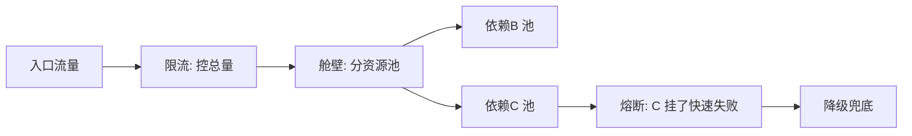

# 隔离与舱壁模式

> **摘要**：舱壁（Bulkhead）源自船舶——船体分成多个密封隔舱，一个进水不会淹没全船。系统里同理：把资源（线程、连接、实例）按依赖或业务隔离开，一个依赖被打满不会拖垮其他，把「局部故障」挡在「局部」。本文讲为什么需要隔离、几种隔离粒度与实现。

> **关联**：隔离与[熔断](./circuit_breaker.md)、[超时重试](./timeout_and_retry.md)共同阻断[故障级联](../../components/cross_component/cross_component.md)。

---

## 一、为什么需要隔离

典型故障：服务 A 同时依赖 B（核心）和 C（非核心）。若共用一个线程池，C 变慢会把线程全占满，导致对 B 的调用也没线程可用——**非核心依赖拖垮了核心功能**。隔离就是防止这种「一损俱损」。

---

## 二、隔离粒度

| 隔离方式 | 做法 | 隔离强度 | 代价 |
| :--- | :--- | :--- | :--- |
| 线程池隔离 | 每个依赖分配独立线程池 | 强（含超时中断） | 线程上下文切换开销 |
| 信号量隔离 | 每个依赖限并发数（计数） | 中（无法中断） | 轻量，但不能超时打断 |
| 连接池隔离 | 独立 DB/HTTP 连接池 | 强 | 连接资源占用 |
| 实例/集群隔离 | 核心与非核心分开部署 | 最强 | 成本高 |

Hystrix 用线程池隔离，Resilience4j/Sentinel 常用信号量隔离（更轻量）。

---

## 三、业务维度隔离

除了按依赖，还可按业务重要性隔离资源：

- **核心与非核心分离**：下单链路与推荐/统计链路用不同资源池/集群，非核心故障不影响交易。
- **租户/渠道隔离**：大客户与小客户、不同渠道分池，避免一个租户的突发流量影响他人（吵闹邻居）。
- **快慢分离**：快请求与慢请求分池，慢请求不阻塞快请求。

这也是[跨组件协同](../../components/cross_component/cross_component.md)里「不让单点故障级联成全局故障」的核心手段之一——可用其中的故障传播组件直观感受隔离的止血效果。

---

## 四、隔离 + 熔断 + 限流的配合

三者是稳定性组合拳，层次不同：

- **限流**：控制入口总量，不让系统过载。
- **隔离**：把资源分舱，局部故障不扩散。
- **熔断**：依赖持续失败时快速失败，不再浪费资源等待。

---

## 五、面试高频问答

- **什么是舱壁模式？** 把资源按依赖/业务隔离成多个池，一个被打满不影响其他。
- **线程池隔离和信号量隔离区别？** 线程池能超时中断、隔离强但有切换开销；信号量轻量但不能打断执行。
- **非核心依赖拖垮核心怎么解？** 资源池隔离 + 熔断非核心 + 降级。
- **隔离、限流、熔断怎么配合？** 限流控总量、隔离分资源、熔断快速失败，三层协同。
- **怎么防吵闹邻居？** 按租户/渠道隔离资源池。

---

## 六、引用关系

- 协同：[熔断](./circuit_breaker.md)、[限流](./rate_limiting.md)、[降级](./degradation.md)、[超时重试](./timeout_and_retry.md)
- 跨层：[跨组件协同](../../components/cross_component/cross_component.md)（故障级联与隔离）
