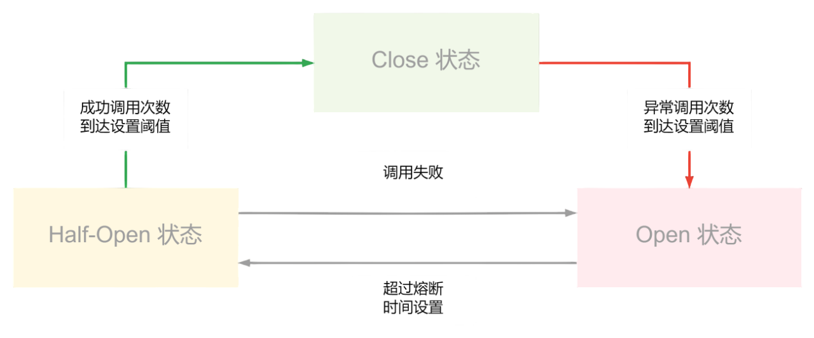

# 熔断（Circuit Breaker）

> **摘要**：熔断器像电路保险丝，通过**快速失败 + 自动试探恢复**避免局部故障拖垮整个系统。核心是一个三态状态机，配合失败统计窗口、半开探测、熔断粒度与参数整定，并与限流、降级、隔离组成立体防护。本文覆盖状态机与统计窗口、慢调用熔断、粒度、参数整定、与降级/隔离的协同、故障模式、选型与常见误区。

> **前置阅读**：熔断是阻断[故障级联](../../components/cross_component/cross_component.md)的核心手段之一，与[降级](./degradation.md)（触发后返回兜底）、[隔离舱壁](./bulkhead_isolation.md)（资源隔离）、[超时与重试](./timeout_and_retry.md)（避免长等待）协同。

---

## 1. 目标

- **快速失败**：依赖不可用时立即返回，不再无谓等待，释放线程/连接。
- **故障隔离**：不把请求打给已知故障的依赖，阻断级联。
- **自动恢复**：半开试探，无需人工介入即可恢复。

---

## 2. 状态机与统计窗口

熔断器通过**三态状态机**监控调用健康：

- **关闭（Closed）**：默认放行，统计成功/失败。
- **打开（Open）**：失败超阈值则开启，后续请求**直接快速失败**（走[降级](./degradation.md)兜底），避免资源耗尽。
- **半开（Half-Open）**：熔断时间到后放少量探测请求，成功则关闭恢复，失败则重新打开。

**统计窗口是关键但常被忽略的一环**：

- **滑动窗口**：基于「时间滑窗」（如最近 10s）或「计数滑窗」（如最近 100 次）统计失败率，比固定窗口更平滑、无边界突变。
- **最小请求数阈值**：窗口内请求数太少时不触发熔断——否则「2 次里挂 1 次 = 50%」会误熔断。必须先满足最小样本（如 20 次）再判失败率。
- **失败的定义**：不仅是异常，**慢调用**（RT 超阈值）也应计入——依赖「不报错但很慢」同样会拖垮上游（Sentinel 的「慢调用比例」熔断策略）。

---

## 3. 关键参数与整定

| 参数 | 含义 | 整定建议 |
| :--- | :--- | :--- |
| 失败率阈值 | 触发熔断的失败/慢调用比例 | 常 50%，核心链路更低 |
| 最小请求数 | 触发判定的最小样本 | 避免小样本误熔断（如 ≥20） |
| 统计窗口 | 失败率的统计范围 | 时间/计数滑窗，秒级 |
| 熔断时长 | Open 保持时间 | 给依赖恢复时间，如 5~10s |
| 半开探测量 | 半开放行的请求数 | 少量，避免探测流量二次打爆 |
| 单请求超时 | 慢调用阈值 | 与依赖 SLA 匹配 |

参数要结合依赖的实际 RT 与容量整定，并可通过[配置中心](../../components/config_center/config_center.md)动态调整。

---

## 4. 半开的细节与熔断粒度

- **半开并发控制**：半开时只放**有限个**探测请求，避免大量请求一起探测把刚要恢复的依赖再次打爆；探测未回结果前不再放新的。
- **熔断粒度**：熔断的 key 决定隔离精度——可按**依赖服务**、**接口/方法**、甚至**实例**熔断。粒度太粗会「一个坏接口熔断整个服务」，太细则统计样本不足。通常按「服务 + 接口」。

---

## 5. 与限流、降级、隔离的协同

四者层次不同、组合使用（立体防护）：

- **[限流](./rate_limiting.md)**：控入口总量，防过载（主动）。
- **[熔断](./circuit_breaker.md)**：依赖故障时快速失败（被动、针对下游）。
- **[降级](./degradation.md)**：熔断/过载时返回兜底值，保住主链路。
- **[隔离舱壁](./bulkhead_isolation.md)**：资源分池，故障不扩散。

熔断触发后必须有**降级 fallback**（返回默认值/缓存/友好提示），否则快速失败只是把错误更快地抛给用户。

---

## 6. 应用场景

微服务间调用、数据库/缓存访问、第三方 API（支付/短信）依赖、以及任何「下游可能变慢或不可用」的调用点。

---

## 7. 故障模式与处理

| 故障 | 成因 | 对策 |
| :--- | :--- | :--- |
| 误熔断 | 小样本高失败率 | 设最小请求数阈值 |
| 恢复抖动 | 半开放量过大再次打爆 | 半开限流探测 + 逐步放量 |
| 慢依赖未熔断 | 只统计异常不统计慢调用 | 慢调用比例纳入熔断 |
| 熔断粒度过粗 | 一个坏接口拖垮整个服务熔断 | 按服务+接口细分 key |
| 熔断但无兜底 | 缺 fallback | 熔断必配降级返回兜底 |

---

## 8. 选型

- **Resilience4j**（Java 主流，函数式、轻量，Hystrix 官方推荐替代）。
- **Sentinel**（阿里，熔断 + 限流 + 慢调用 + 热点，控制台完善）。
- **Hystrix**（Netflix，已停止维护，了解其线程池隔离思想即可）。
- Service Mesh（Envoy/Istio）可在 Sidecar 层做熔断，业务无侵入。

---

## 9. 常见误区与澄清

- **误区：失败率一超就熔断。** 需先满足最小请求数，否则小样本误熔断。
- **误区：只熔断报错的调用。** 慢调用同样拖垮上游，要按慢调用比例熔断。
- **误区：熔断即可，不用降级。** 熔断只是快速失败，必须配 fallback 兜底。
- **误区：半开随便放量。** 半开要限量探测，否则刚恢复又被打爆。
- **误区：熔断能替代限流。** 熔断针对下游故障，限流控入口总量，二者互补。

---

## 10. 引用关系

- 协同：[限流](./rate_limiting.md)、[降级](./degradation.md)、[隔离舱壁](./bulkhead_isolation.md)、[超时与重试](./timeout_and_retry.md)
- 跨层：[跨组件协同](../../components/cross_component/cross_component.md)（故障级联与隔离）、[配置中心](../../components/config_center/config_center.md)（参数热更新）
