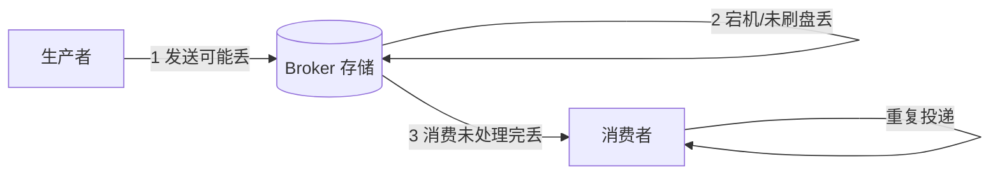
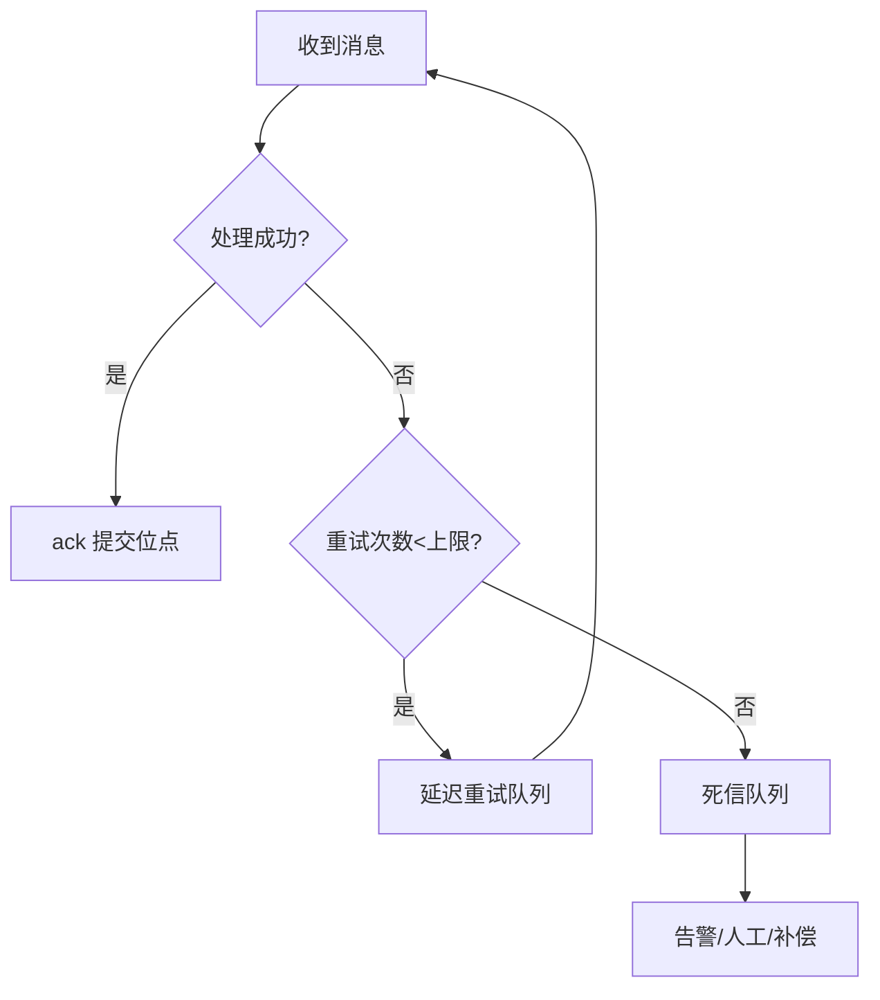

# 消息可靠性（Message Reliability）

> **摘要**：消息队列用于解耦、削峰、异步化，但一条消息要经历「生产 → Broker 存储 → 消费」三段旅程，每一段都可能丢失或重复。本文建立一条主线：**三种投递语义 → 生产端不丢 → 存储端不丢 → 消费端不丢不重 → 顺序性 → 积压治理 → 可观测与面试问答**，目标是读完能设计出「不丢、不重、可追溯」的消息链路。

> **前置阅读**：消息可靠性是[分布式事务](./distributed_transaction.md)异步方案（Saga/Outbox）的载体，「不重」直接依赖[幂等机制](./idempotence.md)。三者构成「一致性与数据可靠性」P0 三件套。

---

## 一、三种投递语义

| 语义 | 含义 | 代价 | 工程现实 |
| :--- | :--- | :--- | :--- |
| At most once | 至多一次，可能丢 | 无重试 | 可容忍丢失的日志/埋点 |
| At least once | 至少一次，可能重 | 重试 + 消费幂等 | **主流选择** |
| Exactly once | 恰好一次 | 端到端事务/去重开销大 | 特定场景（如 Kafka EOS 内部），跨系统一般用「at least once + 幂等」等价实现 |

核心结论：**工程上几乎都用「At least once + 消费端幂等」来等价实现 Exactly once**。真正端到端的 exactly once 成本高且边界脆弱。

<DeliverySemanticsExplorer />

---

## 二、全链路三段与丢失点



每段各自的可靠性手段如下。

---

## 三、生产端不丢

- **发送确认（ack/confirm）**：同步等待 Broker 确认写入成功再返回；失败重试。异步发送需带回调处理失败。
- **重试 + 退避**：网络抖动时指数退避重试；重试必然带来重复，故下游需幂等。
- **本地消息表 / 事务消息**：解决「业务写库」与「发消息」的原子性——这正是[分布式事务](./distributed_transaction.md)的 Outbox 方案。核心：不允许「库写了消息没发」或「消息发了库没写」。

```go
// 生产端：同步确认 + 有限退避重试
func Publish(ctx context.Context, mq MQ, msg Message) error {
	const maxRetry = 3
	var err error
	for i := 0; i < maxRetry; i++ {
		if err = mq.SendSync(ctx, msg); err == nil {
			return nil // Broker 已确认持久化
		}
		time.Sleep(backoff(i)) // 100ms, 200ms, 400ms...
	}
	// 兜底：落 outbox 由投递器继续重试，避免丢失
	return saveToOutbox(ctx, msg, err)
}
```

---

## 四、存储端不丢

- **持久化**：消息落盘而非仅在内存。
- **刷盘策略**：同步刷盘（写入即落盘，可靠但慢）vs 异步刷盘（先入 pagecache 后台刷，快但宕机可能丢）。金融链路用同步刷盘。
- **多副本**：消息复制到多个 Broker/ISR，主挂了从可接管。可靠性取决于「确认副本数」：等待多数副本确认才算成功，才能容忍单点宕机。
- Kafka 对应 `acks=all` + `min.insync.replicas`，RocketMQ 对应同步双写。

---

## 五、消费端不丢不重

- **不丢：处理完成后再 ack**。必须「先处理业务、成功后手动 ack」，绝不能「先 ack 再处理」（一旦处理失败消息就永久丢失）。
- **不重：消费幂等**。At least once 下重复不可避免，消费端用去重表/唯一约束/状态机保证重复消费无副作用（详见[幂等机制](./idempotence.md)）。
- **死信队列（DLQ）**：消息重试达到上限仍失败，转入死信队列人工/异步处理，避免毒消息（poison message）无限重试阻塞正常消费。
- **重试退避**：立即重试→延迟重试（延迟级别 5s/30s/…）→进入 DLQ，避免下游抖动时雪上加霜。



---

## 六、顺序性

- **全局顺序**：单分区/单队列串行，吞吐低，少用。
- **分区有序（推荐）**：按业务键（如 `order_id`）哈希到固定分区，保证同一实体的消息有序，不同实体并行。
- 破坏顺序的坑：消费端多线程并发处理同一分区、失败重试跨消息乱序。对策：同 key 串行处理、重试保持位点不前移。

---

## 七、积压治理

消息积压（consumer lag 飙升）应急预案：

- **定位**：区分是生产突增、消费变慢，还是消费卡死（毒消息/依赖故障）。
- **扩容消费**：增加消费者实例/线程，但受分区数上限约束（分区数决定并发上限，必要时先扩分区）。
- **临时旁路**：无法快速消费时，先把消息快速转存（如落库/转投备用 topic）解除积压，再离线回放。
- **降级**：跳过非关键消息、关闭非核心生产者。
- **根因**：毒消息进 DLQ，依赖故障触发[熔断降级](./high_availability/circuit_breaker.md)。

---

## 八、可观测指标

- 生产：发送成功率、发送 RT、重试率；
- 存储：堆积量、副本同步延迟、刷盘耗时；
- 消费：消费成功率、消费延迟（lag）、重复消费率、DLQ 数量；
- 端到端：从产生到消费完成的时延分位（P99）。

---

## 九、面试高频问答

- **如何保证消息不丢？** 生产端确认+重试、存储端持久化+多副本+同步刷盘、消费端处理后 ack，三段都要。
- **如何保证不重复？** At least once + 消费端幂等，用去重表/唯一键/状态机。
- **Exactly once 真的能实现吗？** 端到端成本高；工程上用「at least once + 幂等」等价实现。
- **消息积压了怎么办？** 定位根因→扩分区/扩消费→临时旁路转存→离线回放。
- **如何保证顺序？** 按业务键分区有序 + 同 key 串行消费。
- **毒消息怎么处理？** 重试上限后进 DLQ，避免阻塞正常消费。

---

## 十、引用关系

- 同层依赖：[分布式事务](./distributed_transaction.md)（Outbox/事务消息）、[幂等机制](./idempotence.md)、[熔断](./high_availability/circuit_breaker.md)。
- 中间件实现：Kafka/RocketMQ 专题（`middleware/`）。
- 场景落地：[营销系统](../scenarios/marketing/marketing_system.md)触达链路、IM 消息投递（规划中）。
