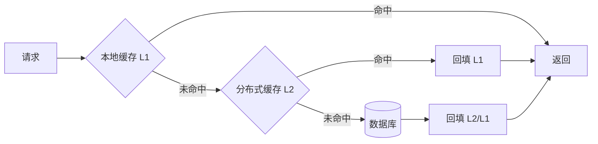

# 缓存组件（Cache Component）

> **摘要**：缓存用高速介质存放热数据，以空间换时间、降低后端压力。缓存组件要解决「放什么、放哪里、放多久、满了淘汰谁、和数据库怎么保持一致」。数据一致性已在通用机制层[缓存一致性](../../base/cache_consistency.md)详述，本文聚焦**组件视角**：缓存收益模型、读写模式、淘汰策略、过期机制、多级缓存与热点治理。

> **关联**：一致性风险与三大故障见[缓存一致性](../../base/cache_consistency.md)；分片扩容见[一致性哈希](../consistent_hash/consistent_hash.md)。

---

## 一、缓存的收益模型

缓存是否值得，取决于命中率。设命中率 $h$、缓存平均耗时 $t_c$、回源耗时 $t_b$，则平均延迟：

$$T = h \cdot t_c + (1-h) \cdot (t_c + t_b)$$

命中率对收益是非线性的：$h$ 从 90% 提到 99%，回源比例从 10% 降到 1%，后端压力降一个数量级。**提升命中率的第一杠杆是 key 设计与淘汰策略，而非单纯扩容。**

适用前提：读多写少、数据有热点、可容忍一定时效性。写多读少或强一致场景缓存收益低甚至有害。

---

## 二、读写模式

详见[缓存一致性](../../base/cache_consistency.md)第二节，一句话概括：

- **Cache Aside**（旁路，最常用）：读未命中回源回填；写更新 DB 后删缓存。
- **Read/Write Through**：应用只与缓存交互，缓存代理读写 DB。
- **Write Behind**：只写缓存，异步回写 DB，高吞吐但有丢失风险。

---

## 三、淘汰策略

缓存容量有限，满了要淘汰。三种基础策略的命中率差异，用下面的组件直接对比（注意热点 key A 是否被误逐）：

<CacheEvictionExplorer />

| 策略 | 淘汰依据 | 优点 | 缺点 |
| :--- | :--- | :--- | :--- |
| LRU | 最近最少使用 | 留住近期热点、实现简单 | 突发扫描会冲刷热点（缓存污染） |
| LFU | 使用频率最低 | 留住长期高频 | 对新热点反应慢、需维护计数 |
| FIFO | 进入顺序 | 最简单 | 不看访问，命中率通常最低 |

工程增强：Redis 的 `allkeys-lru`/`allkeys-lfu`、Caffeine 的 **W-TinyLFU**（结合频率草图 + 窗口 LRU，兼顾突发与长期热点），是目前本地缓存的高命中率之选。

---

## 四、过期机制

- **TTL 过期**：给 key 设存活时间，兜底一致性（即使删缓存失败，TTL 到了也会回源刷新）。
- **主动 vs 惰性删除**：Redis 采用「惰性删除（访问时判过期）+ 定期抽样删除」组合，避免一次性扫描全量 key。
- **TTL 加抖动**：批量 key 的 TTL 加随机值，避免同一时刻集中过期引发[雪崩](../../base/cache_consistency.md)。

---

## 五、多级缓存

- **L1 本地缓存**（进程内，如 Caffeine）：纳秒/微秒级，扛超热点、降网络往返；缺点是多实例间不一致，需短 TTL 或广播失效。
- **L2 分布式缓存**（Redis）：跨实例共享、容量大。
- 多级缓存把「大部分请求挡在 L1、少量落 L2、极少回源」，是高读放大场景的标准架构。

---

## 六、热点 key 治理

- **识别**：监控单 key QPS，或用 LFU/热点探测统计。
- **打散**：热点 key 加随机后缀分成多个副本，分摊到不同分片。
- **本地化**：把超热点提升到 L1 本地缓存，避免集中打到单个 Redis 分片。
- **逻辑过期**：热点 key 不设物理过期，后台异步刷新，避免过期瞬间[击穿](../../base/cache_consistency.md)。

---

## 七、面试高频问答

- **命中率为什么关键？** 回源比例随命中率非线性下降，直接决定后端压力。
- **LRU 和 LFU 怎么选？** 近期热点为主用 LRU；长期稳定高频用 LFU；生产多用 W-TinyLFU 兼顾。
- **LRU 有什么坑？** 大范围扫描会冲刷热点造成缓存污染。
- **为什么 TTL 要加抖动？** 防止集中过期引发雪崩。
- **本地缓存和分布式缓存怎么配合？** 多级缓存：L1 抗超热点、L2 共享，L1 用短 TTL/广播失效收敛一致性。
- **热点 key 怎么办？** 探测 + 打散 + 本地化 + 逻辑过期。

---

## 八、引用关系

- 边界与知识点索引：[`TOPICS.md`](./TOPICS.md)
- Golang demo：[`src/`](./src/TOPICS.md)
- 依赖机制：[缓存一致性](../../base/cache_consistency.md)、[一致性哈希](../consistent_hash/consistent_hash.md)
- 中间件实现：Redis 专题（`middleware/redis/`）
