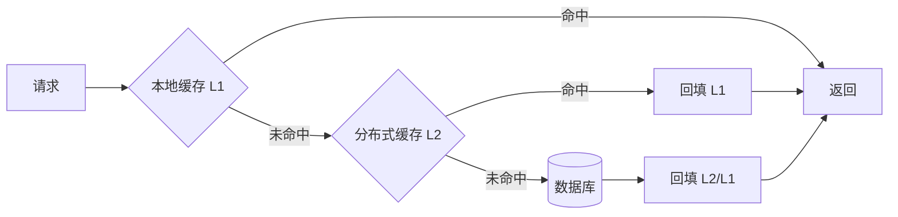

# 缓存组件（Cache Component）

> **摘要**：缓存以空间换时间、降低后端压力。缓存组件要解决「放什么、放哪、放多久、满了淘汰谁、怎么保持一致、热点怎么扛」。数据一致性详见[缓存一致性](../../base/cache_consistency.md)，本文聚焦**组件视角**：收益模型、淘汰算法（含 LRU/LFU/W-TinyLFU 实现与取舍）、过期与内存管理（含大 key/热 key）、多级缓存、三大故障对策、热点治理、序列化与网络性能。

> **关联**：一致性风险与击穿/穿透/雪崩见[缓存一致性](../../base/cache_consistency.md)；分片扩容见[一致性哈希](../consistent_hash/consistent_hash.md)；实现见 Redis 专题（`middleware/redis/`）。

---

## 1. 收益模型与适用前提

缓存是否值得取决于命中率。设命中率 $h$、缓存耗时 $t_c$、回源耗时 $t_b$，平均延迟：

$$T = h \cdot t_c + (1-h)\,(t_c + t_b)$$

后端负载 $\propto (1-h)$：命中率 90%→99%，回源比例 10%→1%，后端压力降一个数量级——**命中率的收益是非线性的**。因此提升命中率的第一杠杆是 key 设计与淘汰策略，而非单纯堆内存。

适用前提：**读多写少、有热点、可容忍一定时效**。写多读少或强一致场景缓存收益低甚至有害（一致性成本 > 读收益）。

---

## 2. 评价维度

| 维度 | 含义 |
| :--- | :--- |
| 命中率 | 淘汰算法在真实负载下的留存质量 |
| 延迟 | 访问与回源耗时 |
| 内存效率 | 元数据开销、碎片、编码 |
| 抗污染 | 突发扫描是否冲刷热点 |
| 一致性 | 与数据源的时效与收敛 |
| 热点/故障应对 | 击穿/穿透/雪崩/热 key 的能力 |

---

## 3. 读写模式

详见[缓存一致性](../../base/cache_consistency.md)，一句话概括：**Cache Aside**（旁路，最常用：读未命中回源回填、写更新 DB 后删缓存）、**Read/Write Through**（应用只与缓存交互、缓存代理读写 DB）、**Write Behind**（只写缓存异步回写 DB，高吞吐但有丢失风险）。

---

## 4. 淘汰算法

容量有限，满了要淘汰。用下面的组件对比 LRU/LFU/FIFO 在同一序列的命中率（注意热点 key 是否被误逐）：

<CacheEvictionExplorer />

### 4.1 LRU（最近最少使用）

哈希表 + 双向链表实现 $O(1)$：命中移到表头，淘汰表尾。

```text
LRU-GET(key)
    if key in map then MOVE-TO-FRONT(node); return node.value
    return MISS
LRU-PUT(key, value)
    if key in map then update; MOVE-TO-FRONT; return
    node ← PUSH-FRONT(key, value)
    if size > capacity then EVICT(list.tail)   // 淘汰最久未用
```

缺点：**扫描抗性差**——一次全表扫描（如批量任务遍历）会把大量一次性 key 灌入、冲刷掉真正的热点（缓存污染）。

### 4.2 LFU（最不经常使用）

按访问频率淘汰，用 `freq→key 集合` + 记录 min-freq 实现 $O(1)$。留住长期高频，但**对突发新热点反应慢**（新 key 频率低易被逐），且需为每个 key 维护计数（内存 + 计数需老化，否则历史高频永不退场）。

### 4.3 W-TinyLFU（现代高命中率之选）

Caffeine 采用：用 **Count-Min Sketch**（频率草图，极小内存估计访问频率）+ **窗口 LRU**（新进 key 先进小窗口，扛突发）+ 主空间（分段 LRU）。准入时比较「新 key 的估计频率」与「将被淘汰 key 的频率」，只有更热才准入——既抗扫描污染又留长期热点，命中率显著优于 LRU/LFU。频率草图定期减半实现**老化**。

### 4.4 对比

| 算法 | 淘汰依据 | 抗扫描污染 | 突发适应 | 成本 |
| :--- | :--- | :--- | :--- | :--- |
| FIFO | 进入顺序 | 差 | 差 | 最低 |
| LRU | 最近使用 | 差 | 好 | 低 |
| LFU | 频率 | 好 | 差 | 中(计数+老化) |
| W-TinyLFU | 频率草图+窗口 | 好 | 好 | 中 |

Redis 提供 `allkeys-lru`/`allkeys-lfu`/`volatile-*`/`allkeys-random` 等 `maxmemory-policy`；本地缓存首选 Caffeine（W-TinyLFU）。

---

## 5. 过期与内存管理

- **TTL 过期**：给 key 设存活时间，兜底一致性（即使删缓存失败，TTL 到了也回源刷新）。**TTL 加随机抖动**避免批量 key 同刻过期引发[雪崩](../../base/cache_consistency.md)。
- **删除策略**：Redis 用「惰性删除（访问时判过期）+ 定期抽样删除」组合，避免一次性扫描全量 key 的停顿。
- **maxmemory 淘汰**：内存达上限时按 `maxmemory-policy` 淘汰；要监控淘汰率，淘汰率高说明容量不足或有大 key。
- **大 key / 大 value**：单个大 key（大 Hash/Set 或大 value）会导致操作阻塞、网络拥塞、迁移困难、删除时卡顿。对策：拆分、`UNLINK` 异步删除、大 value 压缩。
- **内存碎片**：频繁增删导致碎片，关注碎片率，必要时启用主动碎片整理。

---

## 6. 多级缓存



- **L1 本地缓存**（进程内，如 Caffeine）：纳秒/微秒级，扛超热点、降网络往返；缺点是多实例间不一致，需短 TTL 或广播失效。
- **L2 分布式缓存**（Redis）：跨实例共享、容量大。
- 多级缓存把「大部分请求挡在 L1、少量落 L2、极少回源」，是高读放大场景的标准架构。
- **一致性**：L1 是各实例私有副本，写后多实例的 L1 不会自动一致，需**短 TTL** 或**发布订阅广播失效**（一处更新广播各实例清 L1）收敛。

---

## 7. 三大缓存故障（对策速览）

详见[缓存一致性](../../base/cache_consistency.md)，组件侧对策：

| 故障 | 现象 | 对策 |
| :--- | :--- | :--- |
| 击穿 | 单热 key 过期瞬间大量请求打到 DB | `singleflight`/互斥合并回源、热 key 逻辑过期后台刷新、永不过期 |
| 穿透 | 查不存在的数据缓存不命中直击 DB | 空值缓存（短 TTL）+ 布隆过滤器前置拦截 |
| 雪崩 | 大量 key 同刻过期或缓存宕机 | TTL 加抖动、多级缓存、限流降级、缓存高可用 |

---

## 8. 热点 key 治理

- **识别**：监控单 key QPS，或用 LFU/热点探测统计。
- **打散**：热点 key 加随机后缀分成多个副本，分摊到不同分片。
- **本地化**：把超热点提升到 L1 本地缓存，避免集中打到单个 Redis 分片。
- **逻辑过期**：热点 key 不设物理过期，后台异步刷新，避免过期瞬间[击穿](../../base/cache_consistency.md)。
- **读副本**：热 key 建多副本分散到不同分片/节点，读随机选一个，摊薄单点 QPS。

---

## 9. 性能：序列化与网络

- **序列化开销**：value 的序列化/反序列化常是缓存访问的隐藏成本，选高效编码（如 protobuf）而非臃肿 JSON；大 value 压缩。
- **减少往返**：批量用 `MGET`/pipeline 合并请求，避免 N 次单点往返（N+1 问题）。
- **连接池**：复用连接，避免频繁建连；控制并发连接数。
- **就近**：客户端本地缓存（L1）消除网络往返是最大的性能杠杆。

---

## 10. 故障模式与处理

| 故障 | 成因 | 对策 |
| :--- | :--- | :--- |
| 命中率骤降 | 淘汰算法被扫描污染 | W-TinyLFU/分区缓存隔离批量扫描 |
| 大 key 阻塞 | 单 key 过大 | 拆分、异步删除、压缩 |
| 热 key 打爆分片 | 单 key 超高 QPS | 本地化 + 打散 + 读副本 |
| 集中过期雪崩 | TTL 同刻到期 | TTL 抖动、多级缓存 |
| L1 多实例不一致 | 本地副本各自为政 | 短 TTL + 广播失效 |

---

## 11. 工程实现

教学级实现见 [`src/`](./src/TOPICS.md)：`lru.go`（哈希表 + 双向链表 $O(1)$）与 `lfu.go`（频率淘汰），`main.go` 用同一访问序列对比两者命中率。`go run .` 可见热点 key 场景下 LFU 与 LRU 的命中率差异。

---

## 12. 测试与验证

- **命中率**：用真实/合成负载（含热点与扫描）对比不同算法命中率。
- **淘汰正确性**：断言超容量时淘汰的是预期 key（LRU 淘汰最久未用、LFU 淘汰最低频）。
- **并发**：多协程读写下无数据竞争、计数正确。
- **故障演练**：注入缓存宕机，验证限流降级与回源保护生效。

---

## 13. 选型

- **本地缓存**：Caffeine（W-TinyLFU，高命中）、Guava Cache、Go 的 ristretto/内存 map。
- **分布式缓存**：Redis（数据结构丰富、持久化、集群）、Memcached（纯 KV、多线程、极简）。
- 组合：L1 本地 + L2 Redis 是高读放大场景标配。

---

## 14. 常见误区与澄清

- **误区：缓存越大命中率越高。** 命中率主要由淘汰算法与 key 设计决定，扫描污染下再大也白搭。
- **误区：LRU 是最优淘汰。** LRU 抗扫描差，现代高命中用 W-TinyLFU。
- **误区：什么都往缓存塞。** 写多读少/强一致场景缓存收益低甚至有害。
- **误区：大 key 无所谓。** 大 key 阻塞、拖慢迁移与删除，必须拆分。
- **误区：本地缓存天然一致。** L1 各实例私有，需短 TTL/广播失效收敛。

---

## 15. 引用关系

- 边界与知识点索引：[`TOPICS.md`](./TOPICS.md)
- Go 实现：[`src/`](./src/TOPICS.md)
- 依赖机制：[缓存一致性](../../base/cache_consistency.md)、[一致性哈希](../consistent_hash/consistent_hash.md)
- 中间件实现：Redis 专题（`middleware/redis/`）
