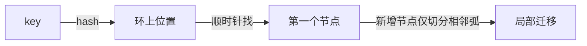

# 一致性哈希（Consistent Hashing）

> **摘要**：当数据/请求要分散到 $N$ 个节点时，最朴素的做法是 `hash(key) mod N`。它在节点数不变时很好，但一旦扩缩容，$N$ 改变会导致几乎全部 key 重新映射，缓存大面积失效、分片大规模迁移。一致性哈希把节点和 key 映射到同一个环上，使**增删一个节点只影响相邻区间的 key**，迁移量从「几乎全部」降到约 $1/N$。本文按「取模的迁移灾难 → 哈希环模型 → 数据倾斜与虚拟节点 → 迁移范围 → 加权与应用 → 工程实现 → 面试问答」推进。

> **关联**：一致性哈希是[缓存一致性](../../base/cache_consistency.md)分片、[分片与扩容迁移](../../base/sharding_and_migration.md)、负载均衡与消息分区的共同底座。

---

## 一、取模分片的迁移灾难

`node = hash(key) mod N` 的问题不在正确性，而在**弹性**：从 $N$ 台扩到 $N+1$ 台时，key 的归属由 `mod N` 变成 `mod (N+1)`，绝大多数 key 的目标节点都会改变。

- 若用于缓存分片：几乎所有缓存 key 瞬间「找错节点」→ 大面积未命中 → 请求击穿到 DB，可能引发雪崩。
- 若用于数据分片：几乎所有数据都要迁移，扩容变成一次高风险大搬迁。

可迁移比例约为 $\frac{N}{N+1}$（接近 100%）。我们真正想要的是：**扩缩容时迁移量最小、且只影响局部**。

---

## 二、哈希环模型

把哈希空间（如 $0 \sim 2^{32}-1$）首尾相接成一个环：

- 每个**节点**用 `hash(节点标识)` 落到环上一个点；
- 每个**key** 用 `hash(key)` 落到环上一个点；
- key 归属于**顺时针方向遇到的第一个节点**。

这样，新增节点只会「接管」它与前驱节点之间那段区间的 key，其余 key 归属不变；删除节点时，它的 key 只会顺移给后继节点。**变更影响被限制在环上一段弧内**，迁移量约 $1/N$。



---

## 三、数据倾斜与虚拟节点

朴素哈希环有个现实问题：**节点少时分布不均**。3 个节点随机落环，很可能把环切成一大两小，负载严重倾斜；某节点宕机后其全部负载压给单一后继，形成雪崩式转移。

解法是**虚拟节点（virtual node）**：每个物理节点在环上放置 $V$ 个副本（`hash(节点#0)`、`hash(节点#1)`…），把它打散成 $V$ 段小弧交错分布。$V$ 越大，各物理节点占据的总弧长越接近均匀；某节点下线时，其负载被分摊给多个后继而非一个。

下面的交互组件可以直接感受这一点——把「每节点虚拟节点」从 1 调大，负载差会明显收敛；勾选移除节点，迁移比例趋近理想的 $1/N$：

<ConsistentHashRing />

工程经验：虚拟节点数常取 **100～200**（甚至更多）以获得足够均匀的分布；代价是环上排序结构更大、查找常数变高。

---

## 四、迁移范围与加权

- **增删节点的迁移范围**：只有「变更节点相邻弧」内的 key 受影响，期望迁移比例 $\approx 1/N$，与总数据量无关，这是扩缩容平滑的关键。
- **加权一致性哈希**：异构机器（配置不同）可按权重分配虚拟节点数——性能强的节点放更多虚拟节点，占据更大总弧长，从而承担更多流量。

---

## 五、典型应用

| 场景 | 用途 |
| :--- | :--- |
| 分布式缓存（Memcached/Redis 客户端分片） | 扩缩容时最小化缓存失效，避免雪崩 |
| 数据分片路由 | 扩容时只迁移局部数据 |
| 负载均衡 / 会话保持 | 同一 key（用户/会话）稳定路由到同一后端 |
| 消息分区 | 按 key 稳定分区，配合[消息可靠性](../../base/message_reliability.md)的分区有序 |

> 对比：Redis Cluster 用的是**哈希槽（16384 slot）**而非经典一致性哈希——槽是「固定数量的中间层」，扩缩容迁移的是槽而非重算环，工程上更可控。两者思想相通：都引入中间层解耦 key 与物理节点。

---

## 六、工程实现

教学级 Go 实现见 [`src/`](./src/TOPICS.md)，核心是「有序环 + 二分查找后继」：

```go
// 环：排序的虚拟节点哈希值 -> 物理节点；查询用二分找顺时针后继
func (r *Ring) Get(key string) string {
	if len(r.sortedHashes) == 0 {
		return ""
	}
	h := r.hash(key)
	// 第一个 >= h 的虚拟节点；越界则环回到 0
	i := sort.Search(len(r.sortedHashes), func(i int) bool {
		return r.sortedHashes[i] >= h
	})
	if i == len(r.sortedHashes) {
		i = 0
	}
	return r.ringMap[r.sortedHashes[i]]
}
```

运行：在 `src/` 目录执行 `go run .`，可观察不同虚拟节点数下的分布均匀度与增删节点的迁移比例。

---

## 七、面试高频问答

- **为什么不直接用取模？** 取模在节点数变化时几乎全量重映射，缓存大面积失效、数据大规模迁移。
- **一致性哈希如何减少迁移？** key 归属顺时针后继节点，增删节点只影响相邻弧，迁移量 $\approx 1/N$。
- **为什么要虚拟节点？** 解决节点少时的数据倾斜，并在节点下线时把负载分摊给多个后继。
- **虚拟节点越多越好吗？** 分布更均匀，但环结构更大、查找常数更高，通常 100～200。
- **异构机器怎么办？** 加权：按性能分配不同数量的虚拟节点。
- **和 Redis Cluster 哈希槽的关系？** 都用中间层解耦 key 与节点；槽数量固定、迁移以槽为单位，更易运维。

---

## 八、引用关系

- 边界与知识点索引：[`TOPICS.md`](./TOPICS.md)
- 依赖底座：[缓存一致性](../../base/cache_consistency.md)、[分片与扩容迁移](../../base/sharding_and_migration.md)、[消息可靠性](../../base/message_reliability.md)
- 上游方法论：[设计可扩展分布式系统的方法论](../../设计可扩展分布式系统的方法论.md)（缓存扩展章节）
