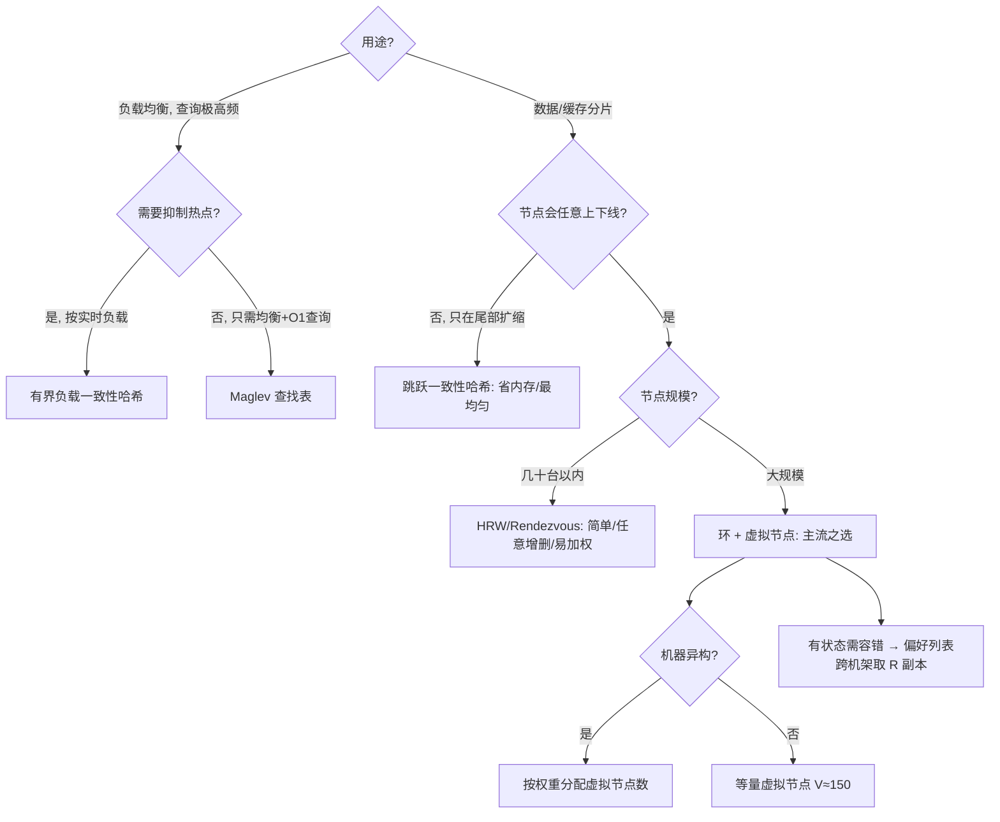

# 一致性哈希（Consistent Hashing）

> **摘要**：一致性哈希要解决一个基础但关键的问题——**如何把海量 key 稳定地映射到一组会动态增减的节点上，并在增减时把数据迁移量降到最小**。它是缓存分片、数据分片、负载均衡、消息分区的共同底座。本文建立一套**评价维度框架**，用它系统对比取模、哈希环、虚拟节点、跳跃一致性哈希、HRW、Maglev 六种路由算法，并进一步覆盖生产落地必须处理的问题：副本放置与拓扑感知、有界负载、成员视图一致性、数据迁移执行与故障处理、性能与并发、测试与选型。

> **前置阅读**：本文是[分片与扩容迁移](../../base/sharding_and_migration.md)的算法内核、[缓存一致性](../../base/cache_consistency.md)的分片基础；迁移期的数据一致性依赖[分布式事务](../../base/distributed_transaction.md)与对账。

---

## 1. 问题定义：分布式路由的核心矛盾

把 key 分散到 $N$ 个节点，最朴素的是**取模**：$\text{node} = \text{hash}(key) \bmod N$。它在 $N$ 固定时分布均匀、查询 $O(1)$，看似完美。问题出在**弹性**：一旦扩缩容，$N$ 变化会让 key 的归属整体重排。

从 $N$ 台扩到 $N+1$ 台，key $k$ 保持归属当且仅当 $\text{hash}(k)\bmod N = \text{hash}(k)\bmod (N+1)$，其概率极低，期望迁移比例约：

$$\frac{N}{N+1} \approx 100\%$$

这个「几乎全量重映射」的后果是灾难性的：

- **缓存分片**：几乎所有缓存 key 瞬间「找错节点」→ 全量未命中 → 请求击穿到 DB → [缓存雪崩](../../base/cache_consistency.md)。
- **数据分片**：几乎所有数据都要跨节点搬迁，扩容变成一次高风险、长耗时的大迁移。

我们真正需要的路由算法，应当在「节点集合变化」时**只影响极少量 key**。为了不陷入「就事论事」，先建立一套评价维度。

---

## 2. 评价维度：用同一把尺子衡量所有方案

后文所有算法都用这 7 个维度衡量，它也是判断一个路由方案能否落地的检查清单：

| 维度 | 含义 | 为什么重要 |
| :--- | :--- | :--- |
| 均衡性 Balance | key 在各节点分布是否均匀 | 决定是否有热点节点、资源是否被浪费 |
| 单调性 Monotonicity | 加节点时，key 只会从旧节点迁到新节点，不会在旧节点间乱窜 | 保证扩容迁移「有序可控」，不放大迁移 |
| 最小扰动 Minimal Disruption | 增删节点时迁移的 key 比例 | 直接决定扩缩容成本与风险 |
| 平滑性 Spread/Smoothness | 同一 key 在不同客户端视角是否一致 | 分布式客户端各自算路由时不能打架 |
| 查询复杂度 | 单次路由计算的时间 | 高 QPS 下的在线开销 |
| 空间复杂度 | 路由结构占用的内存 | 节点/虚拟节点多时的内存成本 |
| 权重与任意增删 | 是否支持异构权重、任意节点上下线 | 生产环境机器异构、节点随时故障 |

理想算法：**均衡、单调、迁移量 $\approx 1/N$、查询与内存低、支持权重与任意增删**。现实中没有全维度最优，需按场景取舍——这正是选型的本质。除算法本身外，生产环境还要额外解决第 5–7 与第 10 节讨论的副本、负载上界、成员一致性与迁移执行问题。

---

## 3. 方案全景与算法详解

### 3.1 方案零：取模哈希（基线）

```text
MOD-HASH-GET(key, N)
    return HASH(key) mod N
```

- 均衡性：好；查询：$O(1)$；空间：$O(1)$。
- 致命缺陷：**最小扰动极差**（$\approx N/(N+1)$），**不单调**（取模值整体重排）。
- 结论：仅适合节点数永不变化的场景，是所有后续方案要改进的靶子。

### 3.2 方案一：一致性哈希环（Consistent Hashing Ring）

把哈希空间 $[0, 2^{32})$ 首尾相接成环：节点和 key 都用哈希落到环上，**key 归属顺时针方向遇到的第一个节点**。

```text
RING-GET(ring, key)
    h ← HASH(key)
    // 在升序的节点哈希数组中二分，找第一个 ≥ h 的位置
    i ← BINARY-SEARCH-FIRST-GE(ring.sorted, h)
    if i > LENGTH(ring.sorted) then
        i ← 1                       // 越过环尾，回到环首
    end if
    return ring.owner[ring.sorted[i]]
```

**为什么迁移量小**：新增节点 $X$ 只会「接管」它与前驱节点之间那段弧内的 key，其余 key 归属完全不变；删除节点时其 key 只顺移给后继。变更被限制在环上一段弧内。

- 单调性：满足（加节点只从后继处「抢」走一段，不影响其他）。
- 查询：$O(\log M)$（$M$ 为环上节点数，二分）；空间：$O(M)$。
- 遗留问题：**节点少时严重倾斜**——$N$ 个点随机落环会把环切成大小悬殊的弧；且某节点下线，其整段弧全压给单一后继，可能引发**级联过载**。

### 3.3 方案二：虚拟节点（Ketama）

让每个物理节点在环上放置 $V$ 个**虚拟节点**（`hash(node#0)`…`hash(node#V-1)`），把一个物理节点打散成 $V$ 段小弧交错分布。

```text
RING-BUILD(nodes, V)
    ring ← empty sorted map   // 虚拟节点哈希 → 物理节点
    for each node in nodes do
        for v ← 0 to V-1 do
            h ← HASH(node + "#" + v)
            ring[h] ← node
        end for
    end for
    return SORT-BY-KEY(ring)
```

**均衡性的量化**：把每个物理节点的负载看作 $V$ 个独立随机弧长之和，由大数定律，负载的**相对标准差随 $V$ 增大而下降**，近似：

$$\text{CV} \approx \frac{1}{\sqrt{V}}$$

即 $V=100$ 时相对波动约 $10\%$，$V=200$ 时约 $7\%$。这解释了工程经验值 **$V \in [100, 200]$**：再大收益递减，而环结构（$N\times V$ 条目）与查询常数、构建/增删成本却线性上升。下面的交互组件可直接验证「$V$ 越大越均衡、加节点迁移 $\approx 1/(N+1)$」：

<ConsistentHashRing />

### 3.4 方案三：跳跃一致性哈希（Jump Consistent Hash）

Google 2014 年提出，用一段极简计算取代整个环结构：

```text
JUMP-CONSISTENT-HASH(key, num_buckets)
    b ← -1
    j ← 0
    while j < num_buckets do
        b ← j
        key ← key × 2862933555777941757 + 1        // LCG 推进
        j ← ⌊(b + 1) × (2^31 / ((key >> 33) + 1))⌋
    end while
    return b
```

- 均衡性：**极好**（近乎完美均匀）；查询：$O(\ln n)$；空间：**$O(1)$**（不存任何结构）；最小扰动：**最优**。
- 关键局限：桶编号必须是**连续的 $[0, n)$**，因此只支持在**末尾**增删桶，**不支持任意节点上下线**。适合「桶数只增减在尾部、且桶与物理机可自行映射」的分片（如分片数扩容），不适合「任意一台机器随时宕机」的缓存集群。

### 3.5 方案四：HRW / Rendezvous（最高随机权重）

对每个 $(key, node)$ 组合算一个权重，取权重最大的节点：

```text
HRW-GET(key, nodes)
    best ← NIL
    best_w ← -∞
    for each node in nodes do
        w ← HASH(key + "@" + node)
        if w > best_w then
            best_w ← w
            best ← node
        end if
    end for
    return best
```

- 均衡性：好；最小扰动：**天然单调**（删节点时，只有「原本归属它」的 key 会改选次大权重节点，其余不变）；支持任意增删与加权（权重可乘进哈希）。
- 局限：查询 $O(N)$——节点很多时不划算；可用「分层 HRW」缓解。
- 适合**节点数不大**（几十台）但要求任意增删 + 均衡 + 实现简单的场景，代码比环更简单。

### 3.6 方案五：Maglev 哈希（查找表法）

Google Maglev（2016）为负载均衡设计，用一张**固定大小的查找表**把「一致性 + 均衡 + $O(1)$ 查询」结合起来。

- **构建**：选一个质数表长 $M$（如 65537，远大于节点数）。每个后端根据自身哈希生成一个覆盖全表槽位的**排列（偏好序列）**；随后各后端轮流「认领」自己偏好序列里第一个尚空的槽位，直到填满整张表。
- **查询**：$\text{backend} = \text{table}[\text{hash}(key) \bmod M]$，纯查表 $O(1)$。
- **取舍**：均衡性接近完美（各后端占据的槽数几乎相等）、查询 $O(1)$、成员变化时被重映射的槽比例很小（受 $M$ 控制）；代价是成员变化要**重建整表**（$O(M \cdot N)$）、占 $O(M)$ 内存，且最小扰动略逊于环。适合后端数量适中、查询极高频的**负载均衡器**（Envoy 的 `maglev` 即此）。

```text
MAGLEV-BUILD(backends, M)
    for each backend b do
        b.perm ← PERMUTATION-SEQUENCE(b, M)   // 由 offset/skip 两个哈希生成
        b.next ← 0
    end for
    table ← array[0..M-1] filled with NIL
    filled ← 0
    while filled < M do
        for each backend b do
            c ← b.perm[b.next]
            while table[c] ≠ NIL do            // 该槽已被占，看偏好序列下一个
                b.next ← b.next + 1
                c ← b.perm[b.next]
            end while
            table[c] ← b
            b.next ← b.next + 1
            filled ← filled + 1
            if filled == M then break
        end for
    end while
    return table
```

### 3.7 方案六：加权一致性哈希

生产机器往往异构（配置不同）。两种加权：

- **环 + 虚拟节点加权**：性能强的节点分配更多虚拟节点（$V_i \propto w_i$），占据更大总弧长。
- **HRW 加权**：把权重并入权重函数，如 $w = -\dfrac{w_i}{\ln(\text{hash}(key,node)/\text{MAX})}$（Rendezvous 的加权变体）。

### 3.8 选型对比

| 方案 | 均衡性 | 单调性 | 最小扰动 | 查询 | 空间 | 任意增删 | 典型场景 |
| :--- | :--- | :--- | :--- | :--- | :--- | :--- | :--- |
| 取模 | 好 | 否 | 差 $\approx 1$ | $O(1)$ | $O(1)$ | 否 | 节点固定 |
| 哈希环 | 差(需vnode) | 是 | $\approx 1/N$ | $O(\log M)$ | $O(M)$ | 是 | 通用分片 |
| 环+虚拟节点 | 好 | 是 | $\approx 1/N$ | $O(\log(NV))$ | $O(NV)$ | 是 | 缓存/数据分片（主流） |
| 跳跃一致性哈希 | 极好 | 是 | 最优 | $O(\ln n)$ | $O(1)$ | 仅尾部 | 分片数扩容、无需任意下线 |
| HRW | 好 | 是 | $\approx 1/N$ | $O(N)$ | $O(N)$ | 是 | 节点数不大、要任意增删 |
| Maglev | 极好 | 近似 | 小(受 M 控) | $O(1)$ | $O(M)$ | 是(需重建表) | 高频查询的负载均衡 |

---

## 4. 关键机制的量化分析

### 4.1 迁移比例为什么是 $1/N$

环上共有 $N$ 个物理节点（各 $V$ 个虚拟节点），key 均匀分布在环上。新增第 $N+1$ 个节点、投放 $V$ 个虚拟节点后，这些新虚拟节点「切走」的弧长期望占全环的 $\frac{V}{(N+1)V} = \frac{1}{N+1}$，即期望只有 $\frac{1}{N+1}$ 的 key 迁移，且**都从旧节点迁往新节点**（单调性）。与总数据量无关——这正是扩缩容平滑的根本原因。

### 4.2 均衡性与虚拟节点数

见 3.3：相对标准差 $\approx 1/\sqrt{V}$。选择 $V$ 是「均衡收益」与「内存 + 查询常数」的权衡，交互组件可实测这条曲线。

### 4.3 无状态路由 vs 有状态迁移

一致性哈希只解决「**key → node** 的映射」。若节点是无状态的（如网关按用户路由），映射变了即可，无需搬数据；若节点有状态（缓存/分片存储），映射变化意味着**真实数据迁移**，必须配合双写、影子读、灰度切流（见[分片与扩容迁移](../../base/sharding_and_migration.md)第五节）。**算法只保证「要迁移的少」，不负责「怎么安全迁移」**。

---

## 5. 副本放置与拓扑感知

有状态存储（Dynamo、Cassandra）用一致性哈希不仅定位主节点，还要放置 $R$ 个副本以容错。做法是从 key 落点沿环**顺时针收集前 $R$ 个不同的物理节点**，形成「偏好列表（preference list）」：

```text
PREFERENCE-LIST(ring, key, R)
    start ← FIRST-GE-INDEX(ring.sorted, HASH(key))
    result ← empty list
    seen ← empty set
    i ← 0
    while LENGTH(result) < R and i < LENGTH(ring.sorted) do
        node ← ring.owner[ring.sorted[(start + i) mod LENGTH(ring.sorted)]]
        if node ∉ seen then
            ADD node to seen and result       // 跳过同一物理节点的其余虚拟节点
        end if
        i ← i + 1
    end while
    return result
```

关键点：

- **跳过同物理节点的虚拟节点**：$R$ 个副本必须落在 $R$ 台**不同物理机**上，否则一台宕机丢多副本，容错失效。
- **拓扑/故障域感知**：副本还应跨机架/可用区（AZ），避免同一机架断电导致多副本同时失联。收集副本时跳过「已选机架/AZ」的候选（Cassandra 的 `NetworkTopologyStrategy` 即按机房分配副本）。
- **与虚拟节点的配合**：有了虚拟节点，顺时针的后继天然分散在不同物理节点上，偏好列表更均匀。

`src/` 的 `Ring.GetN` 演示了偏好列表，`go run .` 可看到每个 key 的 3 副本落在不同节点。

---

## 6. 有界负载一致性哈希（Consistent Hashing with Bounded Loads）

经典一致性哈希只保证「key 空间」均衡，无法应对**访问热点**或**动态负载倾斜**：某节点恰好被分到多个热点、或请求耗时不均时，仍会过载。Google 2017 年的「有界负载」扩展给出解法——**给每个节点设一个容量上界**，超了就顺移到下一个未满节点：

$$\text{capacity} = \left\lceil (1+\varepsilon) \cdot \frac{\text{总负载}}{N} \right\rceil$$

```text
BOUNDED-LOAD-GET(ring, key, load, cap)
    start ← FIRST-GE-INDEX(ring.sorted, HASH(key))
    i ← 0
    while i < LENGTH(ring.sorted) do
        node ← ring.owner[ring.sorted[(start + i) mod LENGTH(ring.sorted)]]
        if load[node] < cap then           // 未满则落在此，否则顺移
            load[node] ← load[node] + 1
            return node
        end if
        i ← i + 1
    end while
    return NIL                              // 全满（理论上 ε>0 时不会发生）
```

- 效果：任意节点负载不超过均值的 $(1+\varepsilon)$ 倍，同时相对普通一致性哈希只增加很小的迁移。
- 适用：**负载均衡器**（按 in-flight 请求数计负载），HAProxy、Vimeo、Envoy 等采用类似思想。$\varepsilon$ 越小越均衡但溢出转移越多，是均衡与稳定的权衡。
- 注意：它需要**实时负载计数**，是有状态的均衡决策，更适合请求路由而非纯静态 key 分片。

---

## 7. 成员管理与视图一致性

一致性哈希的正确性建立在「所有客户端看到**同一份节点列表**并用**同一套算法**」之上。分布式环境里这并非天然成立：

- **成员来源**：节点列表由[服务注册](../service_registry/service_registry.md)/配置中心下发，或节点间 gossip（Cassandra）同步。必须有唯一权威来源。
- **视图一致性**：扩缩容瞬间，不同客户端拿到的节点列表可能短暂不一致 → 同一 key 被不同客户端路由到不同节点（有状态时会读到错节点）。缓解：成员变更**版本化**（带 epoch/version），短切换窗口，或由协调者驱动的两阶段切换；有状态存储可在窗口内做双读兜底。
- **节点标识要稳定**：环上位置由 `hash(节点标识)` 决定。若用 `IP:port` 作标识，机器 IP 漂移会让它在环上换位置，引发不必要的大迁移；应使用**稳定的逻辑 ID**（如 `node-1`）作标识。
- **算法与参数一致**：多语言客户端必须用**相同哈希函数、相同虚拟节点数、相同虚拟节点命名规则**，否则各自算出的环不同。这是 polyglot 环境的隐蔽坑。

---

## 8. 性能与并发

- **查询**：环方案用「有序数组 + 二分」$O(\log(NV))$，缓存友好；也可用跳表/红黑树支持高频增删。Jump 无结构、纯计算，最省内存。
- **构建与增删**：一次性构建需排序 $O(NV\log(NV))$；增量加删节点可插入有序结构避免全排。
- **并发（读多写少）**：路由查询是超高频读、节点增删是低频写。用**读写锁**会让写阻塞读；更好的做法是 **Copy-On-Write**——写时构建新快照，用原子指针替换，读永不加锁：

```text
RING-UPDATE-COW(ring_ptr, mutate)
    old ← ATOMIC-LOAD(ring_ptr)
    new ← DEEP-COPY(old)
    mutate(new)                     // 在副本上加/删节点并重排
    ATOMIC-STORE(ring_ptr, new)     // 一次原子替换，读侧无感
```

- **哈希函数选择**：需分布均匀且快——CRC32（快、分布尚可）、MurmurHash3 / xxHash（更均匀、常用于生产 Ketama）。避免用弱哈希导致环上分布偏斜。

---

## 9. 工程实现

教学级实现见 [`src/`](./src/TOPICS.md)，包含三种算法可直接对比：

- `ring.go`：一致性哈希环 + 虚拟节点（`Add`/`Remove`/`Get`，有序数组 + 二分）。
- `ring.go` 的 `GetN`：偏好列表（副本放置，跳过同物理节点）。
- `jump.go`：跳跃一致性哈希。
- `hrw.go`：HRW / Rendezvous。
- `main.go`：对三者做**负载相对标准差**与**扩容迁移比例**的对比实验，并演示 3 副本的偏好列表。

核心查询（环）：

```go
// 有序环 + 二分找顺时针后继；越界则环回
func (r *Ring) Get(key string) string {
	if len(r.sortedHashes) == 0 {
		return ""
	}
	h := r.hash(key)
	i := sort.Search(len(r.sortedHashes), func(i int) bool {
		return r.sortedHashes[i] >= h
	})
	if i == len(r.sortedHashes) {
		i = 0
	}
	return r.ringMap[r.sortedHashes[i]]
}
```

`go run .` 的预期观察：虚拟节点从 1→200，环方案的负载相对标准差从数十 % 收敛到个位数 %；三种方案 4→5 节点的迁移比例都接近 $1/(N+1)\approx 20\%$，印证「最小扰动」。

---

## 10. 迁移执行与故障处理

算法保证「要迁移的少」，但真实数据迁移与节点故障仍需工程手段兜底。

- **迁移限速**：扩缩容触发的数据搬迁要限速，避免占满网络/磁盘影响在线请求；分批迁移、迁一批校验一批。
- **Hinted Handoff（提示移交）**：写入时目标副本临时不可用，由协调者先把数据暂存到一个「替补」节点并记下 hint，待原节点恢复再回放，保证短时故障期间仍可写（Dynamo 的可用性手段）。
- **缓存节点下线的冷启动惊群**：缓存节点宕机，其 key 顺移到后继，而后继上这些 key 是**冷的**→ 大量请求穿透到 DB。对策：为热点分片保留**副本/备份节点**（读副本预热）、限流回源、或让失效节点的负载有指定的「温备」承接，而非全压给冷后继。
- **迁移期一致性**：有状态搬迁中新旧节点都可能被读到，需双写 + 影子读 + 灰度切读（见[分片与扩容迁移](../../base/sharding_and_migration.md)）。

其余常见故障与陷阱：

| 故障/陷阱 | 成因 | 对策 |
| :--- | :--- | :--- |
| 访问热点 key | 一致性哈希只均衡「key 空间」，不均衡「访问频率」；单个热 key 仍打到单节点 | 热 key 单独打散（加随机后缀）/本地缓存（见[缓存组件](../cache_component/cache_component.md)） |
| 分布偏斜 | 虚拟节点太少或哈希函数弱 | 提高 $V$、换更均匀的哈希（xxHash/Murmur） |
| 级联过载 | 一个节点下线，负载全压给单一后继 | 虚拟节点把负载分摊给多个后继；容量预留 |
| 雪崩式迁移 | 一次性下线/替换多个节点 | 分批增删、限速迁移、观察再继续 |
| 环上哈希碰撞 | 两个虚拟节点哈希到同一点 | 用 64 位环降低碰撞；碰撞时按标识确定性定序 |
| 客户端视图不一致 | 各客户端节点列表/哈希实现不同 | 统一节点列表来源（[服务注册](../service_registry/service_registry.md)）与哈希算法版本 |

---

## 11. 测试与验证

- **均衡性测试**：注入大量 key，统计各节点计数的**相对标准差**或做**卡方检验**，验证在目标 $V$ 下达标。
- **最小扰动测试**：增/删一个节点，统计归属改变的 key 比例应 $\approx 1/N$ 且**只从旧节点流向新节点**（验证单调性）。
- **一致性测试**：多客户端用同一节点列表算路由，结果必须完全一致。
- **基准测试**：`Get` 的 QPS 与 P99；不同 $V$、不同哈希函数下的对比。
- 上述前两项已在 `src/main.go` 中以对比实验形式内置。

---

## 12. 选型决策树与工业实践



工业实践：

- **memcached（Ketama）**：客户端一致性哈希环 + 虚拟节点的经典实现。
- **Cassandra / DynamoDB**：用 vnode（虚拟节点）做数据分布与再均衡。
- **Redis Cluster**：不用经典一致性哈希，而用**固定 16384 个哈希槽（slot）**——slot 是「固定数量的中间层」，扩缩容迁移的是 slot 归属而非重算环，运维更可控、可精确控制迁移。思想相通（都用中间层解耦 key 与物理节点），但 slot 方案更适合需要精细迁移控制的有状态存储。
- **Google Maglev / Envoy**：负载均衡器用一致性哈希（`ring hash` / `maglev` hash）做连接的会话保持，Maglev 用查找表实现 $O(1)$ 查询与近乎完美的均衡。
- **有界负载**：HAProxy、Vimeo、Envoy 等在 LB 场景用「有界负载一致性哈希」抑制热点，把单节点负载压在均值的 $(1+\varepsilon)$ 倍内。

> 适用小结：**环 + 虚拟节点**是有状态分片的通用主流；**Jump** 省内存最均匀但只能尾部增删；**HRW** 简单、任意增删但查询 $O(N)$；**Maglev** 适合高频查询的 LB；**Redis slot** 适合需精细可控迁移的有状态存储；**有界负载**用于抑制 LB 热点。

---

## 13. 集成边界

一致性哈希是「路由映射」这一层，需与周边协作但不越界：

- **负责**：key→node 的稳定映射、虚拟节点/权重管理、增删节点后的新映射计算。
- **不负责**：节点健康探测与列表维护（交给[服务注册](../service_registry/service_registry.md)）、有状态数据的迁移执行（交给[分片迁移](../../base/sharding_and_migration.md)流程）、访问热点治理（交给[缓存](../cache_component/cache_component.md)）。
- **典型集成**：缓存客户端分片、网关按用户路由、消息按 key 分区（配合[消息可靠性](../../base/message_reliability.md)的分区有序）。

---

## 14. 常见误区与澄清

这些是落地时最容易踩错的判断，逐条厘清：

- **误区：一致性哈希天然负载均衡。** 它只均衡「key 空间」，不均衡「访问频率」；热点 key 仍会压垮单节点。要靠热 key 打散、本地缓存，或有界负载一致性哈希。
- **误区：虚拟节点越多越好。** 均衡收益随 $V$ 呈 $1/\sqrt{V}$ 递减，而内存（$NV$ 条目）与查询/构建常数线性上升，通常 100～200 即够。
- **误区：换成一致性哈希就不用管迁移了。** 算法只保证「要迁移的少」；有状态数据的搬迁仍需双写、影子读、限速与灰度切读。
- **误区：Jump Hash 可以替代环。** Jump 只支持连续桶的尾部增删，无法应对任意节点随时下线，不适合缓存集群。
- **误区：副本随便取顺时针 N 个虚拟节点即可。** 必须跳过同一物理节点、并跨机架/AZ，否则一台/一机架故障会丢多副本。
- **误区：节点用 IP:port 标识没问题。** IP 漂移会让节点在环上换位，触发大迁移；应使用稳定逻辑 ID。
- **易错：多语言客户端各自实现。** 哈希函数、虚拟节点数、命名规则必须完全一致，否则环视图不一致导致误路由。
- **澄清：与取模的本质区别。** 取模不单调、扩缩容近乎全量重映射；一致性哈希增删只影响相邻弧、迁移 $\approx 1/N$ 且单调。

---

## 15. 引用关系

- 边界与知识点索引：[`TOPICS.md`](./TOPICS.md)；Go 实现：[`src/`](./src/TOPICS.md)
- 依赖底座：[分片与扩容迁移](../../base/sharding_and_migration.md)、[缓存一致性](../../base/cache_consistency.md)、[缓存组件](../cache_component/cache_component.md)、[消息可靠性](../../base/message_reliability.md)
- 协作：[服务注册](../service_registry/service_registry.md)（节点列表来源）
- 上游方法论：[设计可扩展分布式系统的方法论](../../设计可扩展分布式系统的方法论.md)（缓存扩展章节）
- 基础算法：Jump/HRW/Rete 等见 `fundamentals/`
