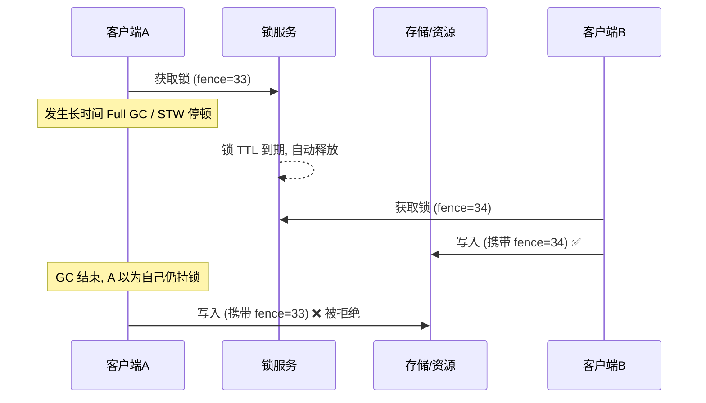
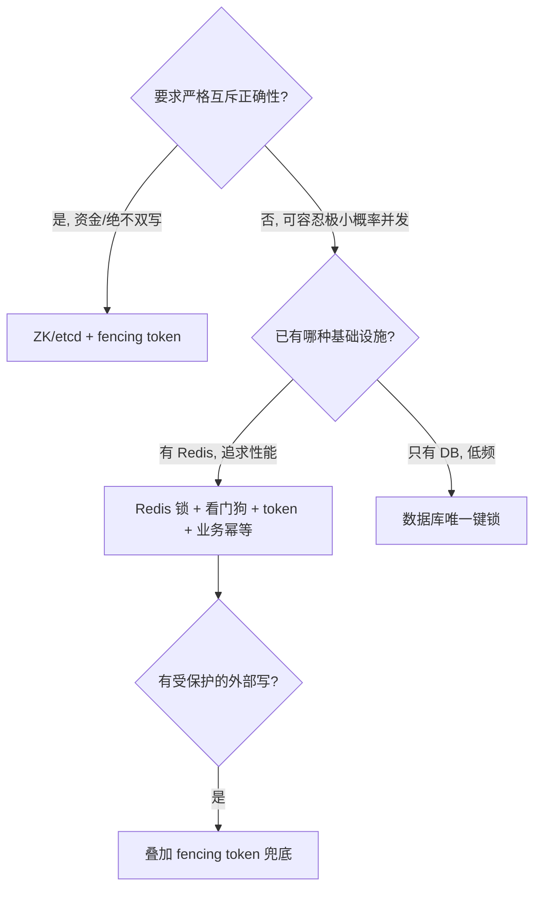

# 分布式锁（Distributed Lock）

> **摘要**：多实例并发访问同一共享资源时，进程内互斥量失效，需要一把所有实例都认的分布式锁。它看似一行 `SET key val NX EX`，但要在生产环境用对，必须处理**原子加解锁、锁提前过期、误删他人锁、看门狗续约、可重入、主从/脑裂丢锁、GC/STW 停顿下的正确性、羊群效应**等一系列问题。本文建立评价维度框架，用它系统对比数据库、Redis 单机、Redlock、ZooKeeper、etcd 五种实现，深入 **fencing token 这一真正保证正确性的机制**，并覆盖性能、故障模式、测试与选型。

> **前置阅读**：解锁的原子性与唯一性依赖[幂等机制](../../base/idempotence.md)；锁只保互斥，跨资源一致性仍需[分布式事务](../../base/distributed_transaction.md)；节点存活判定与[服务注册](../service_registry/service_registry.md)的心跳同源。

---

## 1. 问题定义与语义要求

多个实例可能同时操作同一资源（扣库存、生成唯一编号、防重复下单、定时任务防并发触发）。进程内锁只在单进程有效，跨实例必须借助一个**外部共享存储**仲裁「同一时刻只有一个持有者」。

一把可用的分布式锁至少要满足：

- **互斥**：任意时刻至多一个客户端持有。
- **不死锁**：持有者宕机后锁能自动释放（靠 TTL 或会话）。
- **只解自己的锁**：不能误删/误放他人的锁。
- **可用性**：锁服务本身要高可用，否则成为全局单点。

进阶要求（按场景取舍）：**可重入、阻塞/超时获取、公平性、以及真正的正确性保证**（见第 4 节）。

---

## 2. 评价维度

| 维度 | 含义 |
| :--- | :--- |
| 互斥正确性 | 极端情况（宕机/网络分区/STW）下是否仍严格互斥 |
| 防死锁 | 持有者失联后锁能否自动释放 |
| 容错/高可用 | 锁存储部分故障时是否可用、是否丢锁 |
| 性能 | 加解锁延迟与吞吐 |
| 公平性 | 是否按请求顺序获得锁（防饿死） |
| 可重入 | 同一持有者能否重复获取 |
| 运维成本 | 依赖的组件与复杂度 |

关键认知：**没有任何基于 TTL 的锁能在「持有者任意长停顿」下保证严格互斥**——这是第 4 节的核心，也是很多线上事故的根因。

---

## 3. 实现方案详解

### 3.1 数据库锁

用唯一键实现互斥，过期时间列实现防死锁，抢占用 CAS 防并发：

```text
DB-LOCK-ACQUIRE(key, owner, ttl)
    if INSERT(key, owner, expire_at ← now + ttl) succeeds then
        return TRUE                              // 唯一键保证只有一个插入成功
    row ← SELECT * WHERE lock_key = key
    if row.expire_at < now then                  // 已过期，尝试抢占
        n ← UPDATE SET owner, expire_at ← now+ttl
              WHERE lock_key = key AND expire_at = row.expire_at   // CAS
        return n == 1
    end if
    return FALSE
```

- 优点：不引入新组件、强一致（单库）。
- 缺点：性能低、给 DB 加压；`SELECT ... FOR UPDATE` 方式还会长期占用行锁与连接。适合低频、已有 DB 的场景。

### 3.2 Redis 单实例锁：三个必须原子的点

```text
REDIS-LOCK(key, token, ttl)
    return SET key token NX PX ttl               // 原子：不存在才设 + 同时设过期
```

- **加锁必须一条命令**：`SETNX` + `EXPIRE` 分两步，若在中间宕机会留下永不过期的锁（死锁）。`SET ... NX PX` 一次完成。
- **value 必须是客户端唯一 token**（UUID）：用于解锁时确认「这是我的锁」。
- **解锁必须校验 token 且原子**（Lua）：否则会误删——A 的锁已过期被 B 获取，A 结束时直接 `DEL` 删掉的是 B 的锁。

```lua
-- 解锁：仅当 value 等于自己的 token 才删除（GET 与 DEL 原子）
if redis.call("GET", KEYS[1]) == ARGV[1] then
	return redis.call("DEL", KEYS[1])
else
	return 0
end
```

### 3.3 看门狗（自动续约）

TTL 设短则业务没跑完锁就过期（互斥被破坏）；设长则宕机后锁长期滞留。**看门狗**化解这个两难：加锁给较短 TTL，后台线程每隔 $\text{TTL}/3$ 续期，业务结束或进程崩溃则停止续约。

```text
WATCHDOG(key, token, ttl)
    every ttl/3 do
        ok ← RENEW-IF-MATCH(key, token, ttl)     // 仅当仍是自己的锁才续期(Lua)
        if not ok then stop                       // 锁已丢失, 停止续约并告警
    end every
```

续约的风险：续约线程若因 Full GC / 阻塞而**没能及时续期**，锁会过期被他人获取——这把问题推向了第 4 节的停顿场景。Redisson 的 watchdog 即此机制（默认 30s、每 10s 续）。

### 3.4 可重入锁

同一持有者重复获取要计数而非阻塞自己。用 Redis Hash 记录 `持有者→重入次数`（Lua 原子）：

```text
REENTRANT-LOCK(key, field ← owner:thread, ttl)   // Lua
    if EXISTS(key) == 0 or HEXISTS(key, field) == 1 then
        HINCRBY(key, field, 1)                     // 首次获取或重入 +1
        PEXPIRE(key, ttl)
        return TRUE
    end if
    return FALSE                                   // 被他人持有
// 解锁：HINCRBY -1；计到 0 才 DEL
```

### 3.5 Redlock（多 Redis 实例）

单主 Redis 有可靠性缺口：主写入锁后**未同步到从就宕机**，从升主后新主没有这把锁 → 两客户端同时持锁。Redlock 向 $N$ 个**独立**主节点分别加锁，多数成功且在有效期内才算持有：

```text
REDLOCK-ACQUIRE(key, token, ttl, nodes[1..N])
    start ← NOW()
    acquired ← 0
    for each node in nodes do
        if SET key token NX PX ttl on node (with small per-node timeout) then
            acquired ← acquired + 1
        end if
    end for
    validity ← ttl - (NOW() - start) - CLOCK_DRIFT
    if acquired ≥ ⌊N/2⌋ + 1 and validity > 0 then
        return TRUE, validity
    else
        UNLOCK on all nodes                        // 未达多数, 释放已获取的
        return FALSE
    end if
```

- 提升了单点容错，但 **Martin Kleppmann 与 antirez 的著名争论**指出：Redlock 依赖「进程停顿有界」与「时钟不跳变」的假设，在 STW/时钟漂移下仍不能提供严格正确性。结论见第 4 节——真正的正确性靠 fencing token，而非堆更多锁副本。

### 3.6 ZooKeeper 临时顺序节点（含羊群效应）

```text
ZK-LOCK(lockPath)
    myNode ← CREATE lockPath + "/lock-" (EPHEMERAL_SEQUENTIAL)
    loop
        children ← SORT(GET-CHILDREN(lockPath))
        if myNode == children[0] then return HELD    // 序号最小者持锁
        pred ← 前一个比 myNode 小的节点
        WATCH pred                                    // 只监听前驱, 不监听全部
        WAIT until pred deleted
    end loop
```

- **临时节点**：客户端会话断开（宕机）自动删除 → 天然防死锁，比 TTL 更精确。
- **顺序节点**：天然公平（先到序号小）。
- **只监听前驱**：避免「羊群效应」——若所有等待者都监听同一个锁的释放，释放时会惊动全部客户端造成风暴；只监听前驱则每次只唤醒一个。
- 基于 ZAB 共识，主从切换不丢锁，正确性强于 Redis；代价是吞吐低于 Redis、运维重。

### 3.7 etcd 租约（Lease）

etcd 用 `Lease + Txn(CAS) + Watch` 实现锁：key 绑定租约（会话），租约到期自动删除；用事务保证「不存在才创建」；watch 前驱等待。基于 Raft，正确性与 ZK 同级，是 Kubernetes 生态的选择。

### 3.8 选型对比

| 实现 | 互斥正确性 | 防死锁 | 容错 | 性能 | 公平 | 典型用法 |
| :--- | :--- | :--- | :--- | :--- | :--- | :--- |
| 数据库 | 强(单库) | 过期列 | 弱(单点) | 低 | 否 | 低频、已有 DB |
| Redis 单机 | 弱 | TTL | 弱 | 高 | 否 | 高频、可容忍偶发并发 |
| Redlock | 中(有争议) | TTL | 中 | 中 | 否 | 多 Redis、无共识存储 |
| ZooKeeper | 强 | 会话 | 强 | 中 | 是 | 强正确性/公平 |
| etcd | 强 | 租约 | 强 | 中 | 是 | K8s 生态 |

---

## 4. 正确性的边界：锁不是万能的（fencing token）

**任何基于 TTL 的锁都无法在「持有者任意长停顿」下保证互斥**。经典事故序列：



A 在 GC 停顿期间锁已过期、B 已获取，A 恢复后仍以为自己持锁并写入——这会造成双写。看门狗/Redlock 都挡不住（GC 停顿超过 TTL 时续约也没执行）。

**唯一真正的解法是 fencing token**：锁服务每次授予锁时返回一个**单调递增的令牌**，客户端写入受保护资源时携带该令牌，**资源端记录见过的最大令牌并拒绝更小的令牌**。上图中 A 的 `fence=33 < 34` 被存储拒绝，双写被阻断。

> 结论：Redis 锁 + 业务幂等/fencing 适合绝大多数场景；要求**严格互斥正确性**（资金、绝不双写）时，用 ZK/etcd + fencing token，而不是指望「更强的锁」。

下面的组件演示 TTL、看门狗与 token 校验的交互（把业务耗时调到超过 TTL 且关看门狗，会看到 B 抢锁）：

<DistributedLockExplorer />

---

## 5. 性能与并发

- **锁粒度**：粒度越粗竞争越激烈、吞吐越低。应锁「具体资源」而非「一大类」——如锁 `order:123` 而非锁「订单表」。
- **分段锁**：把一个热点资源拆成 N 段分别加锁（类似 `ConcurrentHashMap` 分段），把竞争分散，提升并发。
- **减少持锁时间**：锁内只做必要的临界区操作，IO/远程调用尽量移出锁外。
- **获取策略**：非阻塞 `tryLock` 快速失败 vs 阻塞带超时；自旋重试要加退避，避免忙等打爆锁服务。
- **能不用锁就不用**：优先用原子操作（DB 原子扣减、`INCR`、CAS）或单分区串行化替代分布式锁，锁是最后手段。

---

## 6. 故障模式与处理

| 故障 | 成因 | 对策 |
| :--- | :--- | :--- |
| 死锁（锁不释放） | 加解锁非原子、无 TTL、解锁失败 | `SET NX PX` 原子加锁 + TTL 兜底 |
| 误删他人锁 | 解锁不校验 token | Lua：GET==token 才 DEL |
| 锁提前过期 | TTL < 业务耗时 | 看门狗续约 + 合理 TTL |
| 主从切换丢锁 | 主未同步即宕、从升主 | Redlock 缓解 / 改用 ZK-etcd |
| STW/网络停顿双写 | 停顿 > TTL，锁被他人获取 | **fencing token**（唯一真正解） |
| 续约线程失效 | 续约线程 GC/阻塞未及时续期 | 监控续约、续约失败即中止业务并告警 |
| 羊群效应 | 大量等待者监听同一锁释放 | ZK 只监听前驱节点 |
| 时钟漂移 | Redlock 依赖各节点时钟 | 限制漂移、严格场景不依赖时钟锁 |

---

## 7. 工程实现

教学级实现见 [`src/`](./src/TOPICS.md)：用带 TTL 的内存 KV 模拟 Redis，演示唯一 token、看门狗续约、以及 **fencing token 阻断 STW 双写**。

- `store.go`：带 TTL 的 KV（`SetNX`/`DelIfMatch`/`RenewIfMatch`）+ 单调 `Incr`（生成 fencing token）。
- `lock.go`：锁（唯一 token + 看门狗 + 获取时返回 fencing token）。
- `main.go`：互斥、锁提前过期、看门狗续约、以及「A 停顿→B 获取→A 用旧 fence 写入被拒」四个场景。

`go run .` 的关键观察：无 fencing 时旧持有者的迟到写入会成功（双写），加 fencing 后被资源端按令牌拒绝。

---

## 8. 测试与验证

- **并发唯一性**：大量协程抢锁，断言「同一时刻只有一个成功」且临界区计数正确。
- **过期/抢占**：注入「持有者不续约」，验证锁到期被他人获取、旧持有者解锁被拒（token 不符）。
- **fencing 正确性**：模拟 STW（持有者暂停），验证旧令牌写入被资源拒绝。
- **混沌/Jepsen 式**：注入网络分区、主从切换，验证是否出现双持（Redis 锁在此类测试中会暴露不安全）。

---

## 9. 选型决策树与工业实践



工业实践：**Redisson**（Redis，watchdog + 可重入 + Redlock）、**Curator**（ZooKeeper 锁配方，处理羊群与重连）、**etcd concurrency 包**（Lease + 选主）、Google **Chubby**（Paxos 锁服务，fencing 序号是其内建能力）。

---

## 10. 集成边界

- **负责**：互斥获取/释放、TTL/续约、token/fencing、可重入计数。
- **不负责**：跨资源一致性（交给[分布式事务](../../base/distributed_transaction.md)）、业务幂等（交给[幂等机制](../../base/idempotence.md)）、节点存活探测（交给[服务注册](../service_registry/service_registry.md)）。
- **典型集成**：任务调度防并发触发（[任务调度](../task_scheduler/task_scheduler.md)）、库存/账户临界区、选主。

---

## 11. 常见误区与澄清

- **误区：加了分布式锁就绝对安全。** TTL 锁在 STW/停顿超过 TTL 时仍会双持；受保护的外部写必须叠加 fencing token 或业务幂等。
- **误区：Redlock 比单机锁"更正确"。** 它提升的是容错，不是极端情况下的正确性；对时钟/停顿敏感。
- **误区：解锁直接 DEL 即可。** 必须校验 token 且原子，否则误删他人锁。
- **误区：TTL 设很长最保险。** 长 TTL 会让宕机后锁长期滞留，正确做法是短 TTL + 看门狗。
- **误区：ZK 锁监听锁节点即可。** 监听全部会引发羊群效应，应只监听前驱。
- **澄清：锁 vs 事务。** 锁保「互斥」，事务/补偿保「跨资源一致性」，二者不可互相替代。

---

## 12. 引用关系

- 边界与知识点索引：[`TOPICS.md`](./TOPICS.md)；Go 实现：[`src/`](./src/TOPICS.md)
- 关联：[幂等机制](../../base/idempotence.md)、[分布式事务](../../base/distributed_transaction.md)、[任务调度](../task_scheduler/task_scheduler.md)、[服务注册](../service_registry/service_registry.md)
- 中间件实现：Redis 专题（`middleware/redis/`）
