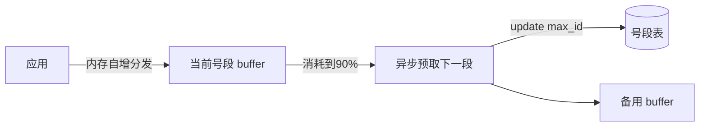

# 分布式 ID 生成器（ID Generator）

> **摘要**：单机自增主键在分库分表后失效：多个库各自自增会冲突，且无法全局排序。分布式 ID 组件要在**全局唯一、趋势递增、高性能、高可用**四个目标间做权衡。本文按「为什么需要 → 方案对比（UUID / 号段 / Snowflake）→ Snowflake 位段与时钟回拨 → 号段模式 → 高可用 → 面试问答」推进。

> **关联**：ID 的「趋势递增」直接影响数据库 B+ 树写入性能与[分片](../../base/sharding_and_migration.md)路由；生成过程的幂等与去重呼应[幂等机制](../../base/idempotence.md)。

---

## 一、为什么需要分布式 ID

核心诉求四选优先级要清晰：

- **全局唯一**：跨库跨机器不冲突（硬要求）。
- **趋势递增**：作为聚簇索引主键时，递增可避免 B+ 树页分裂与随机写放大；也便于按时间排序、分页。
- **高性能**：生成延迟低、QPS 高，不能成为写链路瓶颈。
- **高可用**：生成服务挂了会阻断所有写入，必须无单点。

此外常有**安全性**诉求：ID 不应能被轻易推测（如订单量、增速），纯自增会泄露业务规模。

---

## 二、方案对比

| 方案 | 唯一性 | 趋势递增 | 性能 | 依赖 | 主要问题 |
| :--- | :--- | :--- | :--- | :--- | :--- |
| UUID/GUID | 强 | 否（无序） | 高（本地生成） | 无 | 128 位过长、无序、作聚簇主键写放大严重 |
| DB 自增 | 强 | 是 | 低 | 单库 | 单点、扩展性差 |
| DB 号段（segment） | 强 | 是 | 高 | DB | 依赖 DB，但按段批发大幅降压 |
| Redis INCR | 强 | 是 | 高 | Redis | 依赖 Redis 持久化与高可用 |
| Snowflake | 强 | 是（按时间） | 高（本地） | 时钟 | 时钟回拨、workerId 分配 |

结论：**趋势递增 + 高性能 + 弱外部依赖**综合最优的是 Snowflake 及其变体；对 DB 友好且简单的是号段模式。二者常组合使用。

---

## 三、Snowflake：位段设计

Snowflake 生成 64 位整数，典型划分为 `1 符号位 + 41 时间戳 + 10 机器 + 12 序列`：

- **时间戳（毫秒，相对自定义 epoch）**：决定趋势递增和可用年限，41 位约 69 年。
- **机器位（机房 + 机器）**：决定可部署实例数，10 位 = 1024 台。
- **序列位**：同一毫秒内自增，决定单机每毫秒上限，12 位 = 4096 个/ms（单机 409.6 万 QPS）。

位段是一次**固定预算下的容量权衡**——机器位多了，时间戳或序列位就得让位。用下面的组件调整分配，直观感受三者此消彼长：

<SnowflakeBitLayout />

---

## 四、时钟回拨：Snowflake 的核心难点

Snowflake 依赖机器时钟单调递增。若 NTP 校时或运维改时导致**时钟回拨**，可能生成与历史重复的 ID。对策分级：

- **记录上次生成时间戳 `lastTimestamp`**：
	- 当前时间 == last：正常，序列号自增；序列号用尽则自旋等待到下一毫秒。
	- 当前时间 > last：正常，序列号归零。
	- 当前时间 < last（回拨）：
		- **小幅回拨**（如 < 几毫秒）：阻塞等待时钟追上 `lastTimestamp` 再生成。
		- **大幅回拨**：拒绝生成并告警，或切换备用 workerId / 使用扩展位，避免长时间阻塞。
- **弱化对时钟的依赖**：如美团 Leaf-segment（号段）完全不依赖时钟；Leaf-snowflake 用 ZooKeeper 持久化上报时间检测回拨。

```go
func (s *Snowflake) NextID() (int64, error) {
	s.mu.Lock()
	defer s.mu.Unlock()
	now := time.Now().UnixMilli()
	if now < s.lastTs { // 时钟回拨
		if s.lastTs-now <= maxBackwardMs {
			for now < s.lastTs { // 小幅回拨：等待追上
				now = time.Now().UnixMilli()
			}
		} else {
			return 0, fmt.Errorf("clock moved backwards by %dms", s.lastTs-now)
		}
	}
	if now == s.lastTs {
		s.seq = (s.seq + 1) & seqMask
		if s.seq == 0 { // 当毫秒序列用尽，自旋到下一毫秒
			for now <= s.lastTs {
				now = time.Now().UnixMilli()
			}
		}
	} else {
		s.seq = 0
	}
	s.lastTs = now
	return ((now - epoch) << tsShift) | (s.workerID << workerShift) | s.seq, nil
}
```

---

## 五、号段模式（Segment）

思路：不是每次向 DB 取一个 ID，而是**一次批发一段**（如 `[1000, 2000)`），在内存里自增分发，用完再取下一段。

- 把对 DB 的访问从「每个 ID 一次」降到「每段一次」，QPS 压力下降数量级。
- **双 buffer 预取**：当前段消耗到阈值（如 90%）时异步预取下一段，避免取段瞬间的毛刺阻塞。
- 优点：强依赖 DB 但简单、递增、易理解；缺点：ID 连续可被推测，DB 宕机时最多用完当前段。



---

## 六、高可用与选型

- **Snowflake 的 workerId 分配**：需保证每个实例的机房+机器位全局唯一，常用 ZooKeeper/etcd 注册或配置中心下发，避免两台机器用同一 workerId 产生重复。
- **号段的 DB 高可用**：号段表放主从/集群；即使 DB 短暂不可用，当前 buffer 仍可继续发号。
- **组合策略**：对时钟敏感或需强递增用号段；对性能和去中心化要求高用 Snowflake；很多团队两者都提供，按业务选。

---

## 七、面试高频问答

- **为什么不用 UUID 做主键？** 无序导致聚簇索引随机写、页分裂、写放大；128 位也偏长。
- **Snowflake 时钟回拨怎么处理？** 小幅等待、大幅拒绝或切 workerId；或改用不依赖时钟的号段方案。
- **序列号 12 位不够用怎么办？** 借位（调大序列位）、多 workerId、或降级到「等待下一毫秒」。
- **号段模式如何避免取段抖动？** 双 buffer 提前异步预取下一段。
- **如何保证 workerId 唯一？** ZooKeeper/etcd/配置中心统一分配。
- **如何兼顾防推测？** 位段基础上加扰动、或业务 ID 与自增 ID 分离。

---

## 八、引用关系

- 边界与知识点索引：[`TOPICS.md`](./TOPICS.md)
- Golang demo：[`src/`](./src/TOPICS.md)
- 关联：[分片与扩容迁移](../../base/sharding_and_migration.md)、[幂等机制](../../base/idempotence.md)、[服务注册](../service_registry/TOPICS.md)（workerId 分配）
- 上游方法论：[设计可扩展分布式系统的方法论](../../设计可扩展分布式系统的方法论.md)（分布式 ID 章节）
