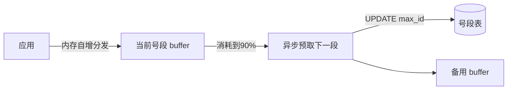
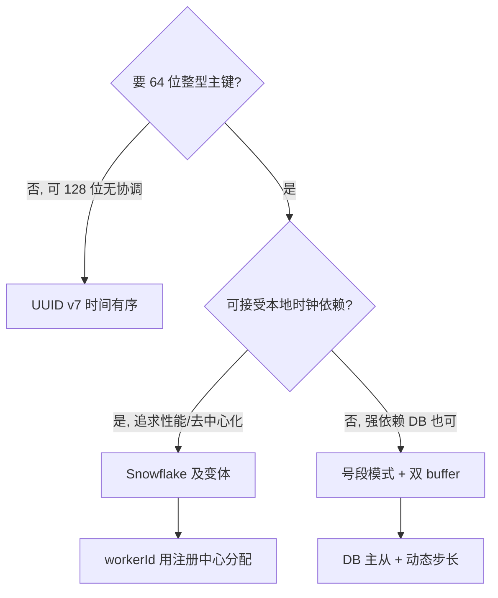

# 分布式 ID 生成器（ID Generator）

> **摘要**：单机自增主键在分库分表后失效——多个库各自自增会冲突、无法全局排序。分布式 ID 要在**全局唯一、趋势递增、高性能、高可用、防推测**之间权衡。本文建立评价维度框架，系统对比 UUID（含时间有序的 v7）、DB 自增/多主步长、号段（Leaf-segment）、Redis、Snowflake 五类方案，深入 Snowflake 位段权衡与时钟回拨、号段双 buffer、ID 有序性对 B+ 树写入的影响、workerId 分配、性能与故障模式。

> **前置阅读**：ID 的「趋势递增」直接影响数据库 B+ 树写入性能与[分片](../../base/sharding_and_migration.md)路由；workerId 分配依赖[服务注册](../service_registry/service_registry.md)/[配置中心](../config_center/config_center.md)；生成幂等呼应[幂等机制](../../base/idempotence.md)。

---

## 1. 问题定义与目标

分库分表后需要一个跨库全局唯一的主键生成器。核心目标及其优先级：

- **全局唯一**（硬要求）：跨库跨机器不冲突。
- **趋势递增**：作聚簇索引主键时，递增避免 B+ 树页分裂与随机写放大（详见第 6 节）；便于按时间排序分页。注意区分**严格单调递增**（相邻 ID 连续，代价高）与**趋势递增**（整体递增、局部可乱序，够用且便宜）。
- **高性能**：低延迟、高 QPS，不成为写链路瓶颈。
- **高可用**：ID 服务是所有写的前置依赖，挂了会阻断全站写入，必须无单点。
- **防推测（安全）**：ID 不应泄露业务规模（订单量、日增），纯连续自增会被竞品通过 ID 差值估算体量。

---

## 2. 评价维度

| 维度 | 含义 |
| :--- | :--- |
| 唯一性 | 是否绝对不冲突 |
| 有序性 | 无序 / 趋势递增 / 严格单调 |
| 性能 | 本地生成（快）还是远程依赖（慢） |
| 可用性 | 是否有单点、依赖能否降级 |
| 长度 | 64 位整型 vs 128 位（索引与存储成本） |
| 防推测 | 是否可被枚举/估算体量 |
| 依赖 | 无 / DB / Redis / 时钟 |

---

## 3. 方案详解

### 3.1 UUID / GUID（含时间有序的 v7）

本地生成、无需协调，但形态差异大：

- **UUID v4（随机）**：完全无序，128 位。作 MySQL 聚簇主键会导致**随机插入 → 页分裂 → 写放大**（见第 6 节），且比 64 位整型占用更多索引空间。
- **UUID v1（时间+MAC）**：含时间但字节序不利于排序，且泄露 MAC。
- **UUID v7（时间有序，2022 新标准）**：高位是毫秒时间戳、低位随机，**既全局唯一又趋势递增**，是「想要 UUID 便利又要索引友好」的现代选择。
- 结论：需要 128 位无协调 ID 时优先 v7；但多数系统仍偏好 64 位整型（更省索引、range 友好）。

### 3.2 DB 自增与多主步长

单库 `AUTO_INCREMENT` 简单但单点、扩展差。多主可用**步长错开**避免冲突：$M$ 个实例设相同 `auto_increment_increment = M`、不同 `auto_increment_offset`，各自生成不重叠的等差数列。缺点：扩容改步长困难、仍强依赖 DB、每个 ID 一次 DB 交互。

### 3.3 号段模式（Segment / Leaf-segment）

不逐个取号，而是**一次向 DB 批发一段**（如 `[1000, 2000)`），在内存自增分发，用完再取下一段：

```text
SEGMENT-NEXT(gen)
    if gen.cur ≥ gen.max then
        (gen.cur, gen.max) ← DB-ALLOCATE(gen.step)   // UPDATE max_id = max_id + step 返回新区间
    end if
    id ← gen.cur
    gen.cur ← gen.cur + 1
    return id
```

- 把 DB 访问从「每 ID 一次」降到「每段一次」，QPS 降几个数量级。
- **双 buffer 预取**：当前段消耗到阈值（如 90%）就**异步**预取下一段放入备用 buffer，切段时无需等 DB，消除取段毛刺。
- **动态步长**：根据消耗速度动态调整 step（低峰小 step 省浪费、高峰大 step 抗突发），Leaf 的做法。
- 缺点：ID 连续可被推测；DB 宕机时最多用完当前 buffer。

### 3.4 Redis

`INCR` / `INCRBY`（批量取一段减少往返）生成，性能高、天然递增。代价：强依赖 Redis 的持久化与高可用——若 `RDB/AOF` 丢数据可能**回退导致重复**，需 AOF everysec + 主从/集群兜底。

### 3.5 Snowflake 及变体

本地按位拼装 64 位整型，无需每次远程调用，兼顾性能、趋势递增与弱依赖，是最流行的方案（详见第 4 节）。变体：**Sonyflake**（更长时间、更少机器位）、**百度 UidGenerator**（RingBuffer 预生成、消费/填充分离，削峰）、**美团 Leaf-snowflake**（用 ZK 分配 workerId 并检测时钟回拨）。

### 3.6 选型对比

| 方案 | 唯一性 | 有序性 | 性能 | 长度 | 依赖 | 主要问题 |
| :--- | :--- | :--- | :--- | :--- | :--- | :--- |
| UUID v4 | 强 | 无序 | 高(本地) | 128 | 无 | 无序、写放大、偏长 |
| UUID v7 | 强 | 趋势递增 | 高(本地) | 128 | 无 | 仍 128 位 |
| DB 自增/多主 | 强 | 单调/趋势 | 低 | 64 | DB | 单点、扩容改步长难 |
| 号段 | 强 | 趋势递增 | 高 | 64 | DB | 可推测、依赖 DB |
| Redis | 强 | 趋势递增 | 高 | 64 | Redis | 持久化丢数据可能重复 |
| Snowflake | 强 | 趋势递增(按时间) | 高(本地) | 64 | 时钟 | 时钟回拨、workerId 分配 |

---

## 4. Snowflake 深入

### 4.1 位段设计与权衡

Snowflake 生成 64 位整数，典型划分为 `1 符号位 + 41 时间戳 + 10 机器 + 12 序列`：

- **时间戳（毫秒，相对自定义 epoch）**：决定趋势递增和可用年限，41 位约 69 年。
- **机器位（机房 + 机器）**：决定可部署实例数，10 位 = 1024 台。
- **序列位**：同一毫秒内自增，决定单机每毫秒上限，12 位 = 4096 个/ms（单机 409.6 万 QPS）。

位段是一次**固定预算下的容量权衡**——机器位多了，时间戳或序列位就得让位。用下面的组件调整分配，直观感受三者此消彼长：

<SnowflakeBitLayout />

---

### 4.2 时钟回拨：Snowflake 的核心难点

Snowflake 依赖机器时钟单调递增。若 NTP 校时或运维改时导致**时钟回拨**，可能生成与历史重复的 ID。对策分级：

- **记录上次生成时间戳 `lastTimestamp`**：
	- 当前时间 == last：正常，序列号自增；序列号用尽则自旋等待到下一毫秒。
	- 当前时间 > last：正常，序列号归零。
	- 当前时间 < last（回拨）：
		- **小幅回拨**（如 < 几毫秒）：阻塞等待时钟追上 `lastTimestamp` 再生成。
		- **大幅回拨**：拒绝生成并告警，或切换备用 workerId / 使用扩展位，避免长时间阻塞。
- **弱化对时钟的依赖**：如美团 Leaf-segment（号段）完全不依赖时钟；Leaf-snowflake 用 ZooKeeper 持久化上报时间检测回拨。

```go
func (s *Snowflake) NextID() (int64, error) {
	s.mu.Lock()
	defer s.mu.Unlock()
	now := time.Now().UnixMilli()
	if now < s.lastTs { // 时钟回拨
		if s.lastTs-now <= maxBackwardMs {
			for now < s.lastTs { // 小幅回拨：等待追上
				now = time.Now().UnixMilli()
			}
		} else {
			return 0, fmt.Errorf("clock moved backwards by %dms", s.lastTs-now)
		}
	}
	if now == s.lastTs {
		s.seq = (s.seq + 1) & seqMask
		if s.seq == 0 { // 当毫秒序列用尽，自旋到下一毫秒
			for now <= s.lastTs {
				now = time.Now().UnixMilli()
			}
		}
	} else {
		s.seq = 0
	}
	s.lastTs = now
	return ((now - epoch) << tsShift) | (s.workerID << workerShift) | s.seq, nil
}
```

### 4.3 workerId 分配

Snowflake 的正确性依赖「每个实例的机房+机器位全局唯一」，两台机器用同一 workerId 会产生重复 ID。分配方式：

- **静态配置**：小规模手工分配，简单但易错、扩容麻烦。
- **注册中心自增**：启动时向 ZooKeeper/etcd 申请一个未占用的 workerId（ZK 持久顺序节点/etcd 事务），释放后可回收。
- **配置中心下发**：由[配置中心](../config_center/config_center.md)统一管理。
- **K8s StatefulSet 序号**：有状态副本的稳定序号天然可作 workerId。
- **启动自检**：拿到 workerId 后校验时钟、上报心跳，避免 IP 复用导致的冲突（Leaf-snowflake 用 ZK 记录每个 workerId 的最后上报时间检测回拨）。

### 4.4 序列耗尽

同一毫秒序列位用尽（12 位 = 4096），则**自旋等待到下一毫秒**再发。若单机 QPS 常态逼近上限，应调大序列位（借时间/机器位）或水平扩展实例。

---

## 5. ID 有序性与 B+ 树写入

为什么反复强调「趋势递增」？因为 MySQL(InnoDB) 主键是**聚簇索引**，数据按主键顺序物理存放：

- **递增主键**：新行总是追加到最后一个页，页顺序写满、填充率高、几乎不分裂——写入快、空间紧凑。
- **随机主键（UUID v4）**：新行插到随机位置，频繁触发**页分裂**、页填充率低、缓冲池命中差——写放大严重、碎片多。

这解释了主键有序性的三档选择：**自增/号段/Snowflake（64 位、趋势递增，最佳）> UUID v7（128 位但时间有序，可接受）> UUID v4（无序，最差）**。若因业务必须用 UUID，优先 v7 而非 v4。

---

## 6. 性能与并发

- **本地生成 vs 远程依赖**：Snowflake/UUID 本地生成，无网络往返，性能最高；号段/Redis 有远程依赖，用「批量预取」摊薄。
- **单机并发**：Snowflake 的 `NextID` 有临界区（读写 `lastTs`/`seq`），高并发下用互斥或 CAS；百度 UidGenerator 用 **RingBuffer 预生成** + 生产/消费分离，把生成从请求路径移到后台，削峰并消除锁竞争。
- **号段双 buffer 预取**：当前段消耗到阈值即**异步**预取下一段，切段不阻塞请求：



---

## 7. 故障模式与处理

| 故障 | 成因 | 对策 |
| :--- | :--- | :--- |
| 时钟回拨生成重复 | NTP 校时/运维改时 | 小幅等待、大幅拒绝告警、切 workerId、或改用号段 |
| workerId 冲突 | 静态误配/IP 复用 | 注册中心统一分配 + 启动自检 |
| 号段 DB 宕机 | 依赖 DB | 双 buffer 撑一段窗口、DB 主从、告警补段 |
| Redis 丢数据回退 | RDB/AOF 未落盘 | AOF everysec + 主从/集群，或改用不回退方案 |
| 序列耗尽阻塞 | 单机 QPS 超上限 | 调大序列位、水平扩展 |
| ID 被推测体量 | 连续自增 | 位段加扰动、业务号与自增号分离 |

---

## 8. 工程实现

教学级实现见 [`src/`](./src/TOPICS.md)：

- `snowflake.go`：Snowflake 生成器（位段、序列自增、时钟回拨处理）。
- `segment.go`：号段模式（双 buffer + 阈值预取，mock DB 批发区间）。
- `main.go`：Snowflake 顺序/并发唯一性校验 + 号段跨段连续发号演示。

`go run .` 可观察：Snowflake 并发一万个 ID 无重复；号段跨多个区间连续发号且唯一。

---

## 9. 测试与验证

- **唯一性**：多协程并发生成大量 ID，断言无重复。
- **单调/趋势**：断言同实例生成的 ID 单调递增（Snowflake 同毫秒内也递增）。
- **时钟回拨**：注入回拨的时钟，验证「小幅等待、大幅拒绝」的分级行为。
- **压测**：单机 QPS 与 P99；号段在不同 step 下的 DB 访问频率。

---

## 10. 选型决策树与工业实践



工业实践：美团 **Leaf**（segment + snowflake 双模式）、百度 **UidGenerator**（RingBuffer 预生成）、**Sonyflake**、TiDB **AUTO_RANDOM**（打散热点）、MongoDB **ObjectId**（12 字节时间有序）、以及标准 **UUID v7**。

---

## 11. 常见误区与澄清

- **误区：UUID 适合做 MySQL 主键。** v4 无序会导致页分裂与写放大；要用就用 v7，或改 64 位趋势递增 ID。
- **误区：Snowflake 一定严格单调。** 它是「趋势递增」，不同毫秒/不同机器间不保证严格连续；要严格单调用号段/DB 自增。
- **误区：时钟回拨小概率可忽略。** 生产必现（NTP、虚拟机迁移），必须显式处理，否则产生重复主键事故。
- **误区：号段 step 越大越好。** step 大则 DB 压力小但宕机浪费多、ID 跳变大；应按消耗速度动态调整。
- **误区：连续 ID 无所谓安全。** 连续自增会泄露体量，敏感业务需加扰动或分离业务号。

---

## 12. 引用关系

- 边界与知识点索引：[`TOPICS.md`](./TOPICS.md)；Go 实现：[`src/`](./src/TOPICS.md)
- 关联：[分片与扩容迁移](../../base/sharding_and_migration.md)、[幂等机制](../../base/idempotence.md)、[服务注册](../service_registry/service_registry.md)（workerId 分配）、[配置中心](../config_center/config_center.md)
- 上游方法论：[设计可扩展分布式系统的方法论](../../设计可扩展分布式系统的方法论.md)（分布式 ID 章节）
