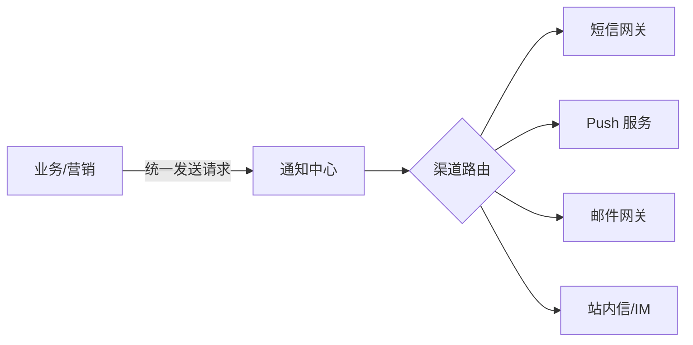

# 通知/消息推送（Notification）

> **摘要**：通知组件统一承接「把一条消息通过某个渠道送达用户」的能力：站内信、Push、短信、邮件、IM。它要解决**多渠道抽象、模板管理、去重与频控、可靠送达与重试、合规退订**。本文按「职责边界 → 多渠道抽象 → 发送链路 → 去重与频控 → 可靠送达 → 合规 → 面试问答」推进。

> **关联**：异步发送依赖[消息可靠性](../../base/message_reliability.md)与[任务调度](../task_scheduler/task_scheduler.md)（定时/延迟通知）；去重依赖[幂等机制](../../base/idempotence.md)；营销触达场景见[营销系统](../../scenarios/marketing/marketing_system.md)。

---

## 一、职责边界

- **负责**：渠道接入与抽象、模板渲染、去重、频控、发送重试、送达回执、退订管理。
- **不负责**：业务上「什么时候该发、发给谁」的决策（那是营销/业务系统的事）。通知组件是「执行层」，接收「发送指令」并可靠执行。

清晰的边界让通知组件可被多业务复用，而不耦合任一业务规则。

---

## 二、多渠道抽象

不同渠道（短信、Push、邮件、IM）的 API、限制、时效、成本差异很大，但对上游应暴露统一接口：

- **渠道路由/降级**：首选 Push，失败或未安装 App 降级到短信；短信多供应商按成功率/成本切换。
- **模板管理**：内容与代码解耦，支持变量占位、多语言、审核。

---

## 三、发送链路

一条通知从请求到送达要穿过多层，每层都会「过滤掉」一部分，用下面的组件感受这个漏斗：

<NotificationPipelineExplorer />

典型链路：接收请求 → **去重** → **频控** → 模板渲染 → 渠道路由 → 发送 → 回执/重试。发送环节几乎都异步化（进[消息队列](../../base/message_reliability.md)），避免上游被慢渠道阻塞，同时削峰。

---

## 四、去重与频控（通知特有难点）

- **去重**：同一业务事件可能重复触发发送（上游重试、消息重投）。用「业务幂等键（如 `事件ID+用户+渠道`）+ 去重表/缓存」保证同一通知只发一次，避免重复打扰与短信资损（见[幂等机制](../../base/idempotence.md)）。
- **频控（疲劳度控制）**：限制单用户在单位时间/单渠道收到的通知条数（如每天最多 3 条营销短信），跨活动统一计数。频控是防止「营销轰炸→用户投诉/退订」的关键，也直接省成本。
- **静默时段**：夜间不发打扰类通知。

---

## 五、可靠送达

- **至少一次 + 幂等**：发送失败重试（退避），配合去重保证不重发。
- **死信与告警**：多次重试失败进死信，人工/异步处理。
- **送达回执**：渠道回调更新送达状态（已送达/已读/失败），用于统计与重试决策。
- **优先级队列**：验证码/告警等高优先级通知与营销通知分队列，避免营销积压拖慢关键通知。

---

## 六、合规

- **退订（opt-out）**：营销类必须支持退订，且退订后不再发送，否则违规。
- **用户偏好**：尊重用户的渠道与频次偏好。
- **审计**：发送记录可追溯，满足合规与投诉排查。

---

## 七、面试高频问答

- **通知组件的核心难点是什么？** 去重与频控（防重复、防疲劳），以及多渠道可靠送达。
- **如何保证不重复发送？** 业务幂等键 + 去重表，配合至少一次重试。
- **验证码短信积压怎么办？** 高优先级独立队列，与营销通知隔离。
- **Push 发不到怎么办？** 渠道降级（Push→短信）、多供应商切换。
- **为什么要异步发送？** 慢渠道不阻塞上游、削峰、便于重试与限速。
- **营销通知合规要点？** 支持退订、频控、静默时段与审计。

---

## 八、引用关系

- 边界与知识点索引：[`TOPICS.md`](./TOPICS.md)
- Golang demo：[`src/`](./src/TOPICS.md)
- 关联：[消息可靠性](../../base/message_reliability.md)、[幂等机制](../../base/idempotence.md)、[任务调度](../task_scheduler/task_scheduler.md)
- 场景应用：[营销系统](../../scenarios/marketing/marketing_system.md)触达链路、IM 专题（`scenarios/chat/`）
