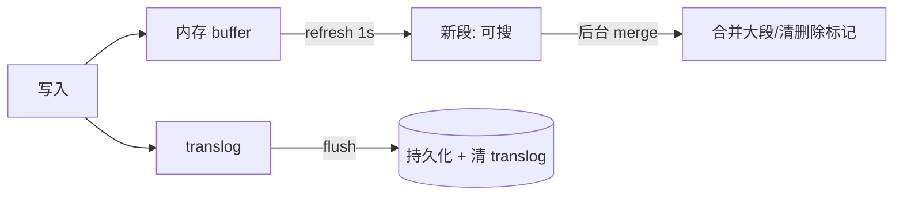

# 搜索组件（Search Component）

> **摘要**：搜索组件把「关键词 → 相关文档」工程化，核心是**倒排索引**（定位含词文档）与**相关性排序**（TF-IDF/BM25）。本文建立评价维度，深入分词、倒排索引结构与压缩、段（segment）架构与近实时（refresh/translog）、分片副本与 scatter-gather、深分页、相关性排序与 LTR、向量检索与混合召回（RRF）、数据同步一致性与故障模式。

> **前置阅读**：写入经[消息可靠性](../../base/message_reliability.md)异步同步到索引；高并发读依赖[缓存](../cache_component/cache_component.md)；分片路由用[一致性哈希](../consistent_hash/consistent_hash.md)思想。上层业务编排见[搜索业务专题](../../scenarios/search/search_system.md)。

---

## 1. 问题定义与目标

从海量文档中按关键词返回**最相关**的少量结果，要求：低延迟、高召回与高精度并重、**近实时**（写入秒级可搜）、**索引可从源库全量重建**（搜索不是主存）。这决定了它是「读密集 + 最终一致 + 可重建」的系统。

`WHERE content LIKE '%词%'` 无法命中索引、需全表扫描，不支持分词、相关性排序、高亮、纠错——量一大即不可用。搜索引擎（Lucene/Elasticsearch）用**倒排索引**把「文档→词」翻转为「词→文档」，把「扫全部文档」变成「查一次词表」。

---

## 2. 评价维度

| 维度 | 含义 |
| :--- | :--- |
| 召回 Recall | 相关文档被找回的比例 |
| 精度 Precision / 相关性 | 返回结果的相关程度、排序质量（NDCG） |
| 延迟 | 查询 P99 |
| 新鲜度 | 写入到可搜的延迟（NRT） |
| 可扩展 | 数据/QPS 增长的水平扩展能力 |
| 可重建 | 能否从源库全量回灌重建索引 |

---

## 3. 分词（Tokenization）

建索引与查询前把文本切成词元（term）：

- 英文按空格/标点切分 + 词干还原（running→run）+ 小写化 + 去停用词。
- 中文需分词器（IK、jieba），中文无天然空格，「南京市长江大桥」的切分直接影响召回。
- **同义词扩展**（提召回）、**拼写纠错**（编辑距离/纠错词典）、**前缀/自动补全**（edge-ngram）。
- **建索引与查询必须用同一套分词规则**，否则词对不上；同义词可只在查询期扩展以便调整。

---

## 4. 倒排索引与压缩

核心结构：`term → posting list（文档 ID 列表 + 词频 tf + 位置 positions）`。

- **布尔检索**：「A AND B」取两个 posting list 求交、「A OR B」求并；有序 posting list 用**跳表**加速求交。
- **索引压缩**：posting list 的文档 ID 先做**差值编码（delta）**再用 **VByte / Frame-of-Reference / Roaring Bitmap** 压缩，海量文档下大幅省内存并提升缓存命中——这是搜索引擎能把大索引放进内存的关键。
- 下面的组件展示倒排索引、AND/OR 求交并与打分排序：

<SearchIndexExplorer />

---

## 5. 段架构与近实时（NRT）

Lucene 索引由多个**不可变的段（segment）**组成，这是理解搜索写入的关键：

- **不可变段**：新文档写入内存 buffer，`refresh` 后生成一个新的可搜段（默认 1s，这就是「近实时」的来源）；段不可改，**删除是打标记**（.del），**更新 = 删除旧 + 写新**。
- **translog（事务日志）**：refresh 只让文档可搜但未落盘，`flush`（commit）才真正持久化；translog 记录未 commit 的操作，宕机后重放，保证不丢。
- **段合并（merge）**：小段会越来越多（每次 refresh 一个），后台把小段合并成大段并物理清除已删标记，降低段数、提升查询效率——合并是 IO 密集的后台成本，需限速。

---

## 6. 分布式检索：分片、副本与 scatter-gather

- **分片（shard）**：索引按文档路由（`hash(routing) % 分片数`）拆到多个分片并行，突破单机容量与吞吐。**分片数创建后一般不可变**（改需 reindex），要预估容量。
- **副本（replica）**：每个分片有副本，提供高可用与读扩展。
- **scatter-gather**：一次查询要**发到所有分片**各自取 TopK，再由协调节点归并成全局 TopK（两阶段：query 阶段各分片返回 doc id + 分数，fetch 阶段取详情）。
- **深分页问题**：取第 10000 页（from=10000,size=10）时，每个分片都要返回 `from+size` 条给协调节点归并，代价随 from 线性增长、可能 OOM。对策：用 **search_after（游标）** 或 scroll 顺序翻页，避免大 from；限制最大分页深度。

---

## 7. 相关性排序

- **TF-IDF**：$\text{score}=tf\times idf$，$idf=\log(N/df)$，稀有词权重高。
- **BM25（ES 默认）**：对词频做**饱和**（词频高到一定程度收益递减）并引入**文档长度归一化**：

$$\text{BM25}=\sum_t idf(t)\cdot\frac{tf\cdot(k_1+1)}{tf+k_1\,(1-b+b\cdot \frac{|d|}{\text{avgdl}})}$$

  典型 $k_1=1.2,\ b=0.75$。相比 TF-IDF，长文档不再因词多而虚高、高频词不再线性加分，实战更优。
- **业务因子**：时间新鲜度、点击率、字段 boost（标题 > 正文）叠加进最终分。
- **LTR（学习排序）**：用点击/转化行为日志训练模型对候选精排，是相关性进一步提升的手段（业务侧见[搜索专题](../../scenarios/search/search_system.md)）。

---

## 8. 数据同步与一致性

- 业务库写入经 **binlog / [消息队列](../../base/message_reliability.md)** 异步同步到索引——搜索是**最终一致**，有秒级延迟。
- **不做主存**：权威数据在 DB，搜索只做检索；索引损坏/schema 变更时能从源库**全量重建**。
- **零停机重建**：用**索引别名（alias）**——重建到新索引，构建完成后把别名原子切到新索引，旧索引再删除，查询方无感。

---

## 9. 向量检索与混合召回

关键词检索解决「字面匹配」，语义检索用**向量检索**：文本编码成向量，用近似最近邻（ANN，如 **HNSW**）找语义相近内容。现代搜索常**混合召回**：倒排（关键词，精确）+ 向量（语义，模糊）各出一路，再用 **RRF（Reciprocal Rank Fusion，按排名倒数融合）** 或加权合并统一排序，兼顾字面与语义。向量基础见 `fundamentals/`。

---

## 10. 故障模式与处理

| 故障 | 成因 | 对策 |
| :--- | :--- | :--- |
| 深分页 OOM | 大 from 各分片返回过多 | search_after/scroll、限制分页深度 |
| 分片热点 | 路由不均或热点 routing | 合理分片数 + 路由键、热点单独处理 |
| 段合并抖动 | merge IO 占满 | 限速合并、错峰 |
| 同步延迟/丢失 | binlog/MQ 积压或丢 | 监控 lag、至少一次 + 幂等、可全量重建兜底 |
| 分片数不足 | 创建时预估过小 | reindex 到新索引 + 别名切换 |
| 查询打爆集群 | 慢查询/大聚合 | 查询限流、超时、断路 |

---

## 11. 工程实现

教学级实现见 [`src/`](./src/TOPICS.md)：`index.go` 提供倒排索引 + **TF-IDF 与 BM25 两种打分**、AND/OR 检索；`main.go` 对比两种打分的排序差异。`go run .` 可见长文档在 BM25 下不再因词多而虚高。

---

## 12. 测试与验证

- **相关性**：用带标注的查询集算 NDCG/MAP，对比排序算法与参数调整效果。
- **召回/精度**：AND vs OR、同义词扩展前后的召回变化。
- **近实时**：写入到可搜的延迟是否符合 refresh 设定。
- **压测**：查询 P99、深分页与大聚合的表现、段合并对延迟的影响。

---

## 13. 选型

- **全文检索**：Elasticsearch / OpenSearch（分布式、生态全）、Lucene（库）、Solr。
- **向量检索**：Milvus、Faiss、pgvector，或 ES 8+ 内置向量。
- 中小规模可直接用 DB 全文索引；规模化用 ES 系。

---

## 14. 常见误区与澄清

- **误区：用 LIKE 做搜索。** 全表扫描、无分词与排序；应用倒排索引。
- **误区：搜索可当主存。** 搜索最终一致、可重建，权威数据在 DB。
- **误区：TF-IDF 足够。** BM25 的词频饱和 + 长度归一化实战更优，是默认。
- **误区：随便深分页。** 大 from 会各分片放大、OOM，用 search_after。
- **误区：分片数随便设。** 创建后难改，需预估容量或 reindex + 别名。
- **误区：中文搜索直接用英文分析器。** 必须用中文分词器，且建/查一致。

---

## 15. 引用关系

- 边界与知识点索引：[`TOPICS.md`](./TOPICS.md)；Go 实现：[`src/`](./src/TOPICS.md)
- 关联：[消息可靠性](../../base/message_reliability.md)、[缓存组件](../cache_component/cache_component.md)、[一致性哈希](../consistent_hash/consistent_hash.md)
- 场景应用：[搜索业务专题](../../scenarios/search/search_system.md)；向量基础见 `fundamentals/`
