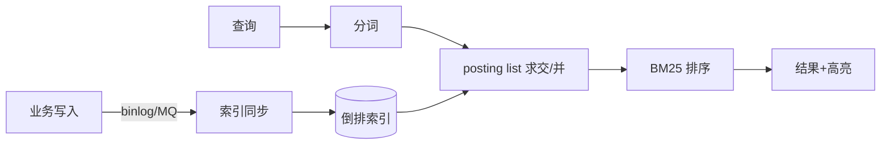

# 搜索组件（Search Component）

> **摘要**：搜索组件把「关键词 → 相关文档」这一需求工程化，核心是**倒排索引**（快速定位含词文档）与**相关性排序**（TF-IDF/BM25）。本文按「为什么不用 LIKE → 分词 → 倒排索引 → 相关性排序 → 检索链路 → 近实时与一致性 → 向量检索 → 面试问答」推进。

> **关联**：写入通过[消息可靠性](../../base/message_reliability.md)异步同步到索引；高并发读依赖[缓存](../cache_component/cache_component.md)；分片路由用[一致性哈希](../consistent_hash/consistent_hash.md)思想。

---

## 一、为什么不用数据库 LIKE

`WHERE content LIKE '%关键词%'` 无法命中索引、需全表扫描，且不支持分词、相关性排序、高亮、拼写纠错。数据量一大就不可用。搜索引擎（Elasticsearch/Lucene）用**倒排索引**把「文档→词」翻转成「词→文档」，把「扫描全部文档」变成「查一次词表」。

---

## 二、分词（Tokenization）

建索引和查询前都要把文本切成词元（term）：

- 英文按空格/标点切分 + 词干还原（running→run）。
- 中文需分词器（IK、jieba），因为中文没有天然空格；「南京市长江大桥」的切分直接影响召回。
- 统一大小写、去停用词（的、了、a、the）、同义词扩展。

**建索引与查询必须用同一套分词规则**，否则查询词与索引词对不上。

---

## 三、倒排索引

倒排索引的核心结构：`term → posting list（含该词的文档 ID 列表，常附词频、位置）`。

查询「A AND B」= 取 A、B 两个 posting list 求交集；「A OR B」= 求并集。有序 posting list 可用跳表加速求交。

下面的组件展示 4 篇文档的倒排索引、AND/OR 求交并与 TF-IDF 排序：

<SearchIndexExplorer />

---

## 四、相关性排序

命中文档要按相关性排序，经典打分：

- **TF-IDF**：$\text{score} = tf \times idf$。词频 $tf$ 越高越相关；逆文档频率 $idf = \log(N/df)$ 让「稀有词」权重更高（出现在越少文档里的词区分度越大）。
- **BM25**：TF-IDF 的改进，对词频做饱和处理（词频高到一定程度收益递减）并引入文档长度归一化，是 Elasticsearch 默认排序，实战效果优于朴素 TF-IDF。

排序还会叠加业务因子：时间新鲜度、点击率、权重字段（标题命中 > 正文命中）。

---

## 五、检索链路与近实时

- **数据同步**：业务库写入通过 binlog 或[消息队列](../../base/message_reliability.md)异步同步到搜索索引——搜索是**最终一致**，存在秒级延迟（Near Real-Time）。
- **不要把搜索当主存**：搜索索引用于检索，权威数据仍在数据库；重建索引要能从源库全量回灌。

---

## 六、向量检索（扩展）

关键词检索解决「字面匹配」，语义检索用**向量检索**：把文本编码成向量，用近似最近邻（ANN，如 HNSW）找语义相近的内容。现代搜索常「倒排（关键词）+ 向量（语义）」混合召回，再统一排序。相似度与向量基础见 `fundamentals/`。

---

## 七、面试高频问答

- **为什么不用 LIKE 做搜索？** 全表扫描、无法分词与排序；倒排索引把查询降到查词表。
- **倒排索引是什么？** 词→文档列表；AND/OR 即 posting list 求交/并。
- **TF-IDF 和 BM25 区别？** BM25 对词频做饱和 + 文档长度归一化，效果更好，是 ES 默认。
- **中文搜索的关键难点？** 分词；建索引与查询要用同一分词器。
- **搜索数据怎么和 DB 同步？** binlog/MQ 异步同步，最终一致，可全量重建。
- **语义搜索怎么做？** 向量编码 + ANN，常与倒排混合召回。

---

## 八、引用关系

- 边界与知识点索引：[`TOPICS.md`](./TOPICS.md)
- Golang demo：[`src/`](./src/TOPICS.md)
- 关联：[消息可靠性](../../base/message_reliability.md)、[缓存组件](../cache_component/cache_component.md)、[一致性哈希](../consistent_hash/consistent_hash.md)
- 场景应用：搜索业务专题（`scenarios/search/`）
