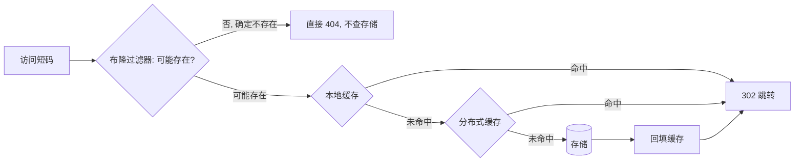
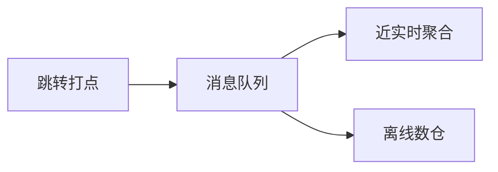

# 短链系统（Short Link）

> **摘要**：短链把长 URL 映射为短码（`sho.rt/abc123`），用于营销投放、短信触达、二维码与访问统计。它是典型的**读远多于写、可用性极敏感**（短链挂了所有投放都点不开）的系统。本文建立评价维度，系统对比三种短码生成策略并给出**防枚举的可逆扰动算法**，覆盖容量估算、存储分片、多级缓存 + 布隆过滤器防穿透（含参数量化）、跳转语义（301/302/307/308）、异步统计与 UV 去重、故障模式与选型。

> **前置阅读**：短码生成常复用[分布式 ID 生成器](../id_generator/id_generator.md)；读多写少缓存见[缓存一致性](../../base/cache_consistency.md)/[缓存组件](../cache_component/cache_component.md)；防刷见[限流](../../base/high_availability/rate_limiting.md)；统计异步化见[消息可靠性](../../base/message_reliability.md)。

---

## 1. 问题定义与容量估算

功能：长链转短链（写）、短码解析跳转（读）、访问统计、生命周期管理。做容量估算（Fermi）来驱动设计：

- **规模**：假设 5 年累计 10 亿条短链。存储 ≈ $10^9 \times$（短码 + 长链 + 元数据，约 500B）$\approx 500\text{GB}$，需分片。
- **写 QPS**：$10^9 / (5 \times 365 \times 86400) \approx 6/s$（均值），峰值按数十倍算，写压力不大。
- **读 QPS**：读写比常 $100{:}1$ 以上，峰值可达数万~数十万 QPS——**读是设计重点**。
- **码长**：由总量决定，$62^6 \approx 568$ 亿够十亿级，$62^7$ 达万亿级。这是第一个设计决策。

核心非功能诉求：**解析低延迟、极高可用、读可水平扩展**。

---

## 2. 评价维度（短码生成）

| 维度 | 含义 |
| :--- | :--- |
| 唯一性 | 是否需要处理冲突 |
| 码长 | 相同容量下越短越好 |
| 可枚举性 | 短码是否可被顺序遍历猜出（信息泄露/爬取风险） |
| 长链复用 | 相同长链是否复用同一短码（省存储） |
| 生成性能 | 是否依赖远程/是否需查重 |

---

## 3. 短码生成策略

| 策略 | 做法 | 唯一性 | 可枚举 | 长链复用 | 缺点 |
| :--- | :--- | :--- | :--- | :--- | :--- |
| 发号器 + 62 进制 | 自增 ID → base62 | 天然无冲突 | 是(需扰动) | 需额外索引 | 连续可遍历 |
| 哈希取段 | `hash(长链)` 取前几位 | 需处理冲突 | 否 | 天然复用 | 冲突再哈希/加盐 |
| 随机码 | 随机 N 位 | 需查重 | 否 | 否 | 量大冲突率升高、查重开销 |

主流是**发号器 + 62 进制**：全局唯一 ID（[分布式 ID](../id_generator/id_generator.md)）+ 进制转换，天然无冲突、码短。下面的组件演示 ID→短码与容量关系：

<ShortLinkBase62 />

### 3.1 防枚举：可逆扰动

发号器的连续 ID 直接 base62 后短码也连续，竞品/爬虫可顺序遍历猜出全部短链、估算业务体量。解法是在编码前做**双射的可逆扰动**，使短码看起来无序但仍无冲突：

- **乘法逆元法**：取模数 $M = 62^L$ 与一个与 $M$ 互质的常数 $K$，扰动 $s = (id \times K) \bmod M$，还原 $id = (s \times K^{-1}) \bmod M$（$K^{-1}$ 为 $K$ 在模 $M$ 下的乘法逆元）。互质保证双射，无冲突。
- **Feistel 网络**：轻量分组加密构造双射置换，扰动更彻底。

```text
OBFUSCATE(id, K, M)          // M = 62^L, gcd(K, M) = 1
    return (id × K) mod M
DEOBFUSCATE(s, K_inv, M)     // K_inv = 模 M 下 K 的逆元
    return (s × K_inv) mod M
```

这样既保留「发号器无冲突」的优点，又消除可枚举性——`src/obfuscate.go` 有可运行实现。

---

## 4. 存储与分片

- **模型**：短码为主键的 KV（`短码 → 长链 + 创建者 + 有效期 + 状态`）。KV 存储（如 Redis/HBase）或关系库均可。
- **分片**：500GB + 高读需分库分表，按**短码哈希**分片（解析总带短码，天然均匀，见[分片](../../base/sharding_and_migration.md)）；若要「相同长链复用」还需一张 `长链哈希 → 短码` 的反查表。
- **冷热**：短链有明显时效（营销活动过期即冷），可对冷数据降存储成本、热数据留缓存。

---

## 5. 读链路：多级缓存与防穿透

读是瓶颈，短码**一旦生成基本不变**，缓存命中率可做到很高：



- **多级缓存**：本地缓存扛超热点短码 + 分布式缓存共享，遵循[缓存组件](../cache_component/cache_component.md)。
- **布隆过滤器防穿透**：防刷者构造大量**不存在**的短码穿透到存储。布隆过滤器前置拦截「确定不存在」的请求。参数量化：$n=10^9$、误判率 $p=1\%$ 时，位数组 $m = -\frac{n\ln p}{(\ln 2)^2} \approx 1.2\text{GB}$、哈希函数 $k=\lceil \frac{m}{n}\ln 2\rceil \approx 7$。误判只会「放行到存储再确认」，不会误杀。
- **空值缓存**：查存储确认不存在的短码，短 TTL 缓存空值，避免重复穿透。

---

## 6. 跳转语义

| 状态码 | 语义 | 是否可统计后续点击 | 用途 |
| :--- | :--- | :--- | :--- |
| 301/308 | 永久重定向（浏览器缓存） | 否（后续不回服务） | 服务器压力小但失去统计与可控性 |
| 302/307 | 临时重定向（每次回服务） | 是 | **短链默认**：可统计、可动态改目标、可 AB/地域路由 |

短链系统几乎都用 **302**——统计与可控性是核心价值。（307/308 相对 302/301 的区别是「不允许把 POST 改写成 GET」，短链一般是 GET 访问，用 302 即可。）此外支持**自定义短码**（校验唯一 + 保留字过滤）与失效后的兜底页。

---

## 7. 风控与生命周期

- **防刷/防爆破**：生成与解析按 IP/用户[限流](../../base/high_availability/rate_limiting.md)；识别高频枚举扫描并封禁。
- **恶意链接拦截**：生成时校验目标域名黑名单/接入安全网关，防止短链被用于钓鱼、诈骗、绕过审核（短链是内容审核的常见规避手段）。
- **生命周期**：有效期、访问次数上限、手动失效、黑名单；失效短码返回明确提示而非裸 404。

---

## 8. 统计：异步打点与 UV 去重

跳转是热路径，统计绝不能拖慢它：



- **异步化**：跳转时只投递一条埋点到[消息队列](../../base/message_reliability.md)，聚合在下游做，跳转本身零额外阻塞。
- **PV** 直接累加；**UV 去重**在海量下用 **HyperLogLog**（基数估计，固定 ~12KB 估算亿级去重，误差约 0.8%），精确去重成本太高。
- 维度：地域、设备、来源、时段——只有 302 能持续采集。

---

## 9. 故障模式与处理

| 故障 | 成因 | 对策 |
| :--- | :--- | :--- |
| 缓存穿透 | 大量不存在短码 | 布隆过滤器 + 空值缓存 |
| 缓存雪崩 | 大批短码 TTL 同时到期 | TTL 加抖动、热点永不过期后台刷新 |
| 发号器不可用 | ID 服务故障 | 号段本地 buffer 兜底、降级只读 |
| 热点短码 | 爆款活动单短码超高 QPS | 本地缓存 + CDN 边缘缓存 302 |
| 统计丢失 | MQ 故障 | 至少一次 + 聚合幂等，允许统计最终一致 |

---

## 10. 工程实现

教学级实现见 [`src/`](./src/TOPICS.md)：

- `base62.go`：62 进制编解码。
- `obfuscate.go`：乘法逆元可逆扰动（防枚举，双射无冲突）。
- `store.go`：发号 + 生成 + 解析（相同长链复用短码）。
- `main.go`：编解码往返、扰动前后对比、短链生成/解析。

`go run .` 可见：连续 ID 经扰动后短码不再连续，但仍能无损还原，验证「防枚举且无冲突」。

---

## 11. 测试与验证

- **无冲突**：批量生成断言短码唯一。
- **扰动双射**：随机大量 id 做 `deobfuscate(obfuscate(id)) == id` 往返校验。
- **解析正确**：短码解析回原长链。
- **压测**：解析路径 P99、缓存命中率、布隆过滤器误判率。

---

## 12. 选型与工业实践

- **生成**：发号器 + base62 + 可逆扰动是通用主流；需长链复用则加反查表或改哈希方案。
- **工业**：bit.ly、TinyURL、新浪短链等均为「发号/哈希 + 302 + 重缓存 + 异步统计」架构；短码长度与自定义能力是产品差异点。

---

## 13. 常见误区与澄清

- **误区：短码用 301 省资源。** 301 被浏览器缓存后拿不到后续点击统计，也无法改目标，短链应用 302。
- **误区：发号器 base62 直接用即可。** 连续短码可被枚举，敏感场景需可逆扰动。
- **误区：不存在的短码查存储即可。** 会被构造无效短码打穿，需布隆过滤器 + 空值缓存。
- **误区：UV 精确去重。** 亿级精确去重成本高，用 HyperLogLog 估计足够。
- **误区：统计同步写。** 会拖慢热路径跳转，必须异步进 MQ。

---

## 14. 引用关系

- 边界与知识点索引：[`TOPICS.md`](./TOPICS.md)；Go 实现：[`src/`](./src/TOPICS.md)
- 复用组件：[分布式 ID 生成器](../id_generator/id_generator.md)、[缓存组件](../cache_component/cache_component.md)
- 依赖机制：[缓存一致性](../../base/cache_consistency.md)、[限流](../../base/high_availability/rate_limiting.md)、[消息可靠性](../../base/message_reliability.md)、[分片与扩容迁移](../../base/sharding_and_migration.md)
