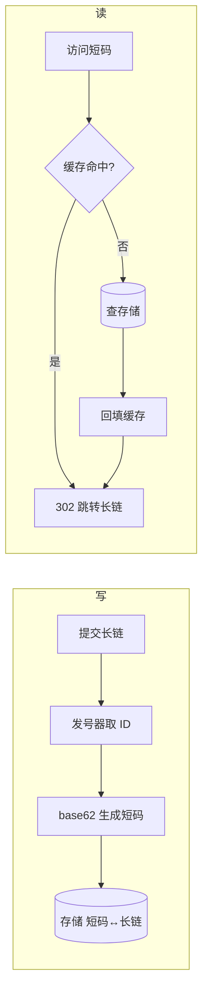

# 短链系统（Short Link）

> **摘要**：短链把长 URL 映射为一个短码（如 `sho.rt/abc123`），用于营销投放、短信触达、二维码与访问统计。它是一个「读远多于写」的高并发系统，核心在于**短码生成策略、跳转链路、防刷风控与统计**。本文按「需求与容量 → 短码生成 → 读写链路与缓存 → 跳转 301/302 → 风控 → 统计 → 面试问答」推进。

> **关联**：短码生成常复用[分布式 ID 生成器](../id_generator/id_generator.md)；读多写少的缓存设计见[缓存一致性](../../base/cache_consistency.md)；防刷与限流见[限流](../../base/high_availability/rate_limiting.md)。

---

## 一、需求与容量估算

功能：长链转短链（写）、短码解析跳转（读）、访问统计、失效管理。核心非功能诉求是**解析低延迟**与**高可用**（短链挂了所有投放都点不开）。

容量直觉：读写比常达 100:1 甚至更高。若要支撑 10 亿条短链，6 位 62 进制（$62^6 \approx 568$ 亿）绰绰有余，7 位可达万亿级。**码长由总量决定**，是第一个设计决策。

---

## 二、短码生成策略

| 策略 | 做法 | 优点 | 缺点 |
| :--- | :--- | :--- | :--- |
| 发号器 + 62 进制 | 自增 ID → base62 | 无冲突、码短、单调增 | 连续可枚举，需防遍历 |
| 哈希取段 | `hash(长链)` 取前几位 | 相同长链天然复用 | 需处理哈希冲突（再哈希/加盐） |
| 随机码 | 随机生成 N 位 | 不可预测 | 需查重、量大时冲突率升高 |

主流是**发号器 + 62 进制**：全局唯一 ID 交给[分布式 ID 生成器](../id_generator/id_generator.md)，再做进制转换，天然无冲突。下面的组件演示 ID 到短码的映射与容量关系：

<ShortLinkBase62 />

> 62 进制字母表 `0-9a-zA-Z`。若要**防枚举**（避免竞品/爬虫顺序遍历猜出全部短链），可对自增 ID 做可逆扰动（如乘法逆元 / 加密置换）后再编码，使短码看起来无序但仍无冲突。

---

## 三、读写链路与缓存

- **存储**：短码为主键的 KV（短码 → 长链 + 元数据），量大用分库分表或 KV 存储。
- **缓存**：热门短码放缓存扛读，遵循[缓存一致性](../../base/cache_consistency.md)；短码一旦生成基本不变，缓存友好。
- **不存在的短码**：用空值缓存 + 布隆过滤器防穿透（防刷客户端构造大量无效短码）。

---

## 四、跳转：301 还是 302

- **301 永久重定向**：浏览器/中间层会缓存，后续请求不再经过短链服务 → 服务器压力小，但**无法统计**后续点击，也无法更新目标或做 AB。
- **302 临时重定向（推荐）**：每次都回到短链服务 → 可统计、可动态改目标、可做地域/设备路由，代价是服务承压。

短链系统几乎都选 **302**，因为统计和可控性是核心价值。

---

## 五、风控与生命周期

- **防刷**：对生成/解析接口按 IP/用户[限流](../../base/high_availability/rate_limiting.md)；识别高频枚举访问。
- **恶意链接拦截**：生成时校验目标域名黑名单，防止短链被用于钓鱼/诈骗。
- **生命周期**：有效期、访问次数上限、手动失效、黑名单。

---

## 六、统计指标

- 生成成功率、解析延迟、跳转成功率；
- PV/UV、地域/设备/来源分布（302 才能采集）；
- 码冲突率（随机码方案）、无效访问率、恶意拦截率。

统计写入量大，通常异步化：跳转时打点 → 消息队列 → 离线/近实时聚合，避免拖慢跳转（见[消息可靠性](../../base/message_reliability.md)）。

---

## 七、面试高频问答

- **短码怎么生成、如何保证唯一？** 发号器出全局唯一 ID + 62 进制转换，天然无冲突。
- **6 位够用吗？** $62^6 \approx 568$ 亿，够十亿级；不够加到 7 位。
- **301 还是 302？** 302，为了统计、动态改目标与可控性。
- **发号连续可被枚举怎么办？** 对 ID 做可逆扰动后再编码 + 接口限流风控。
- **如何扛高并发读？** 短码不可变，重缓存 + 空值缓存/布隆过滤器防穿透。
- **统计怎么不拖慢跳转？** 跳转打点异步进 MQ，离线聚合。

---

## 八、引用关系

- 边界与知识点索引：[`TOPICS.md`](./TOPICS.md)
- Golang demo：[`src/`](./src/TOPICS.md)
- 复用组件：[分布式 ID 生成器](../id_generator/id_generator.md)
- 依赖机制：[缓存一致性](../../base/cache_consistency.md)、[限流](../../base/high_availability/rate_limiting.md)、[消息可靠性](../../base/message_reliability.md)
