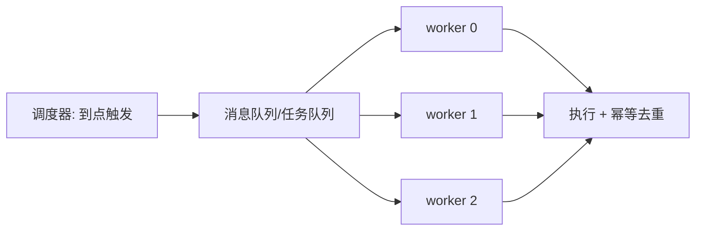
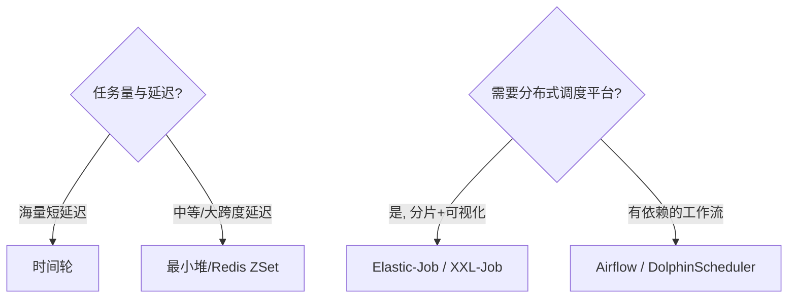

# 任务调度（Task Scheduler）

> **摘要**：任务调度统一管理定时（cron）、延迟、批处理任务，要在海量任务下做到**触发准时、可靠执行、分布式不重不漏、可水平扩展**。本文建立评价维度，系统对比四种触发数据结构（轮询/最小堆/时间轮/多层时间轮，含伪代码与复杂度），并覆盖生产落地关键：任务持久化与崩溃恢复、misfire（漏触发）补偿、执行语义、调度与执行分离、分片调度、失败处理、故障模式与选型。

> **前置阅读**：执行「至少一次 + 幂等」依赖[幂等机制](../../base/idempotence.md)与[消息可靠性](../../base/message_reliability.md)；防多实例并发触发用[分布式锁](../distributed_lock/distributed_lock.md)；分片思想同[一致性哈希](../consistent_hash/consistent_hash.md)。

---

## 1. 问题定义与目标

统一承接三类任务并保证其按预期运行：

- **准时触发**：实际触发时间尽量贴近计划时间（触发延迟小）。
- **可靠执行**：任务不丢，宕机/重启后能恢复。
- **分布式不重不漏**：多实例部署下同一任务不被并发触发，也不漏触发。
- **可扩展**：任务量与执行量增长时可水平扩展。
- **可观测**：触发延迟、成功率、堆积、死信可监控。

---

## 2. 评价维度（触发结构）

| 维度 | 含义 |
| :--- | :--- |
| 入队/触发复杂度 | 添加任务与取到期任务的时间成本 |
| 精度 | 触发时间与计划时间的偏差 |
| 规模 | 能承载的在途任务量 |
| 延迟跨度 | 是否适合从秒到天的大跨度延迟 |
| 持久化友好 | 结构能否方便地落盘与崩溃恢复 |

---

## 3. 任务模型

| 类型 | 触发条件 | 例子 | 要点 |
| :--- | :--- | :--- | :--- |
| 一次性 | 指定时刻执行一次 | 活动上线 banner | 触发后即结束 |
| 周期（cron） | cron 表达式周期触发 | 每天凌晨对账 | 注意**时区/夏令时**：跨时区服务需明确基准时区，夏令时切换可能导致某小时任务重复或缺失 |
| 延迟 | 相对当前延迟后触发 | 下单 30 分钟未支付关单 | **数量巨大**（每单一个），是设计重点 |

---

## 4. 触发数据结构

朴素「轮询扫库找到期任务」在量大时开销高、精度差（扫描间隔即精度下限）。工程上按规模选择：

### 4.1 最小堆 / 延迟队列

按到期时间排序，取堆顶判断是否到期：

```text
HEAP-SCHEDULER-LOOP(heap)
    loop
        if heap is empty then WAIT-FOR-NEW-TASK(); continue
        top ← PEEK-MIN(heap)              // 最早到期的任务
        if top.dueAt ≤ NOW() then
            POP-MIN(heap); TRIGGER(top)
        else
            SLEEP(top.dueAt - NOW())       // 精确睡到下一个到期点, 不空转
        end if
    end loop
```

入队/取出 $O(\log n)$，精度高（睡到精确到期点）、延迟跨度任意。Java `DelayQueue`、Redis ZSet（score=到期时间戳）属此类。规模受单结构容量限制。

### 4.2 时间轮（Timing Wheel）

环形槽位，指针每格前进一步，任务按「到期时间 mod 槽数」入槽，超过一圈用 **rounds** 计数：

```text
WHEEL-ADD(wheel, task, delay)
    slot ← (wheel.pos + delay) mod wheel.slots
    task.rounds ← delay / wheel.slots
    APPEND task to wheel.buckets[slot]
WHEEL-TICK(wheel)                          // 每个时间单位前进一格
    wheel.pos ← (wheel.pos + 1) mod wheel.slots
    for each task in wheel.buckets[wheel.pos] do
        if task.rounds == 0 then TRIGGER(task); remove
        else task.rounds ← task.rounds - 1
    end for
```

入队/触发 $O(1)$，适合海量短延迟任务（Kafka、Netty、Dubbo 使用）。下面的组件演示槽位 + rounds：

<TimingWheelExplorer />

### 4.3 多层时间轮

单层时间轮用 rounds 承载长延迟时，每格仍要遍历判断 rounds，长延迟任务在槽里空等多圈。**多层时间轮**（秒轮/分轮/时轮，类似钟表进位）解决：长延迟先挂在高层轮，随指针推进逐层「降级」到低层轮，避免空转。Kafka 的 `DelayQueue + 分层时间轮` 即此。

### 4.4 对比

| 结构 | 入队/触发 | 精度 | 规模 | 延迟跨度 |
| :--- | :--- | :--- | :--- | :--- |
| 轮询扫库 | $O(n)$/次 | 低(=扫描间隔) | 大(靠 DB) | 任意 |
| 最小堆/ZSet | $O(\log n)$ | 高 | 中 | 任意 |
| 单层时间轮 | $O(1)$ | 高 | 大 | 较短 |
| 多层时间轮 | $O(1)$ 摊还 | 高 | 大 | 任意 |

---

## 5. 持久化与崩溃恢复

内存结构（堆/时间轮）快但**进程重启即丢**。生产必须持久化：

- **任务落库**：任务先写 DB/持久化存储，内存结构只作「加速触发的索引」。
- **崩溃恢复**：重启时从 DB 重新加载「未完成 + 到期未来」的任务重建内存结构；对「本应触发却因宕机漏掉」的任务做补偿（见 misfire）。
- **触发即改状态**：触发前把任务置为 `执行中` 并记录时间；恢复时扫描长期停在 `执行中`（超时）的任务重新触发，保证不漏。
- **纯内存方案（如 Redis ZSet）** 需开启持久化，否则宕机丢任务。

---

## 6. misfire（漏触发）处理

调度器停机/阻塞期间错过的触发点，恢复后如何处理，要有明确策略（Quartz 的 misfire 概念）：

- **立即补一次**：错过多次也只执行一次（多数周期任务，如对账，补跑一次即可）。
- **全部补齐**：每个错过点都补执行（少见，需幂等）。
- **丢弃、等下一个周期**：错过的就算了（对时效强、补跑无意义的任务）。

选择取决于任务语义，必须显式配置而非默认。

---

## 7. 执行语义与状态机

分布式调度几乎都是**至少一次**触发（宕机重启、重试、恢复补偿都会重复），因此**执行体必须幂等**：任务唯一 ID + 状态机（`待执行 → 执行中 → 已完成/失败`）或去重表，保证重复触发只生效一次。追求「恰好一次」成本高，主流是「至少一次 + 幂等」。

---

## 8. 分布式协调与调度/执行分离

多实例部署要避免同一任务被并发触发，同时要能扩展执行能力。关键是**调度与执行分离**：调度器只负责「到点了把任务投出去」，执行由 worker 池/[消息队列](../../base/message_reliability.md)承接，二者独立扩展。

协调策略：

- **主备选主**：一个 leader 调度，其余待命（ZK/etcd 选主）。简单，但调度吞吐受单点限制。
- **抢占/分布式锁**：触发前抢[分布式锁](../distributed_lock/distributed_lock.md)，抢到才触发。
- **分片调度（规模化推荐）**：任务按分片键分给多实例并行调度执行（Elastic-Job 模式），实例增减时重新分片，兼顾吞吐与均衡。



---

## 9. 失败处理

- **重试 + 退避**：失败按指数退避重试（1min/5min/30min），避免下游抖动时集中重试。
- **死信 / 人工介入**：超过最大重试进入死信，告警人工处理，避免毒任务无限重试阻塞。
- **执行超时**：任务设超时，防卡死占用资源；超时按失败处理并可重试。
- **分片失败转移**：分片实例宕机，其分片重新分配给存活实例。

---

## 10. 故障模式与处理

| 故障 | 成因 | 对策 |
| :--- | :--- | :--- |
| 重复触发 | 多实例并发、恢复补偿 | 选主/锁/分片 + 执行幂等 |
| 漏触发 | 宕机错过触发点 | 持久化 + 恢复扫描 + misfire 策略 |
| 任务堆积 | 执行慢于触发 | 调度执行分离、扩 worker、限流削峰 |
| 长任务阻塞调度 | 执行占用调度线程 | 调度只投递、执行独立线程池 |
| 时钟/时区错乱 | 跨时区、夏令时 | 明确基准时区、夏令时特判 |
| 内存结构丢失 | 进程重启 | 落库 + 重启重建 |

---

## 11. 工程实现

教学级实现见 [`src/`](./src/TOPICS.md)，含两种触发结构：

- `wheel.go`：单层时间轮（`Add`/`Advance`，rounds 承载长延迟）。
- `heap.go`：最小堆延迟调度器（按到期时间取任务）。
- `main.go`：两种结构分别注册延迟任务并推进/触发。

`go run .` 可观察两种结构对同一批延迟任务的触发顺序一致。

---

## 12. 测试与验证

- **触发正确性**：注册不同延迟任务，断言在正确的逻辑时刻触发。
- **崩溃恢复**：模拟重启，验证未完成任务被重新加载、漏触发被补偿。
- **并发不重**：多实例 + 锁/分片，断言同一任务只触发一次。
- **压测**：触发延迟分位、堆积深度随任务量的变化。

---

## 13. 选型与工业实践



工业：**Quartz**（单机/集群、cron、misfire）、**XXL-Job / Elastic-Job**（分布式调度平台、分片、可视化）、**Airflow / DolphinScheduler**（有向依赖的工作流编排）、**K8s CronJob**（容器化定时）、**Redisson 延迟队列 / Kafka 时间轮**（延迟消息）。

---

## 14. 常见误区与澄清

- **误区：轮询扫库就够了。** 量大时开销高、精度差；海量用时间轮，中等用堆/ZSet。
- **误区：内存时间轮无需持久化。** 重启即丢任务，必须落库 + 恢复重建。
- **误区：调度器直接执行任务。** 长任务会阻塞调度，应调度/执行分离。
- **误区：靠调度保证只执行一次。** 触发是至少一次，执行体必须幂等兜底。
- **误区：漏触发默认全补。** misfire 策略要按任务语义显式选择（补一次/全补/丢弃）。
- **误区：cron 忽略时区。** 跨时区与夏令时会导致重复或缺失触发。

---

## 15. 引用关系

- 边界与知识点索引：[`TOPICS.md`](./TOPICS.md)；Go 实现：[`src/`](./src/TOPICS.md)
- 关联：[分布式锁](../distributed_lock/distributed_lock.md)、[幂等机制](../../base/idempotence.md)、[消息可靠性](../../base/message_reliability.md)、[一致性哈希](../consistent_hash/consistent_hash.md)（分片）
- 场景应用：订单超时关单（[电商](../../scenarios/ecommerce/ecommerce_system.md)/[预订](../../scenarios/booking/booking_system.md)）
