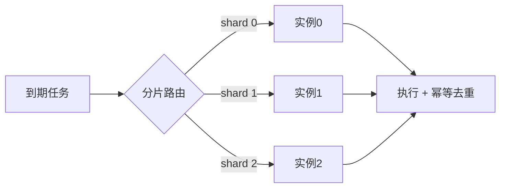

# 任务调度（Task Scheduler）

> **摘要**：任务调度组件统一管理**定时任务**（cron）、**延迟任务**（下单 30 分钟未支付则取消）与**批处理任务**，保证任务按时触发、可靠执行、失败可恢复。核心难点在「海量延迟任务的高效触发」与「分布式下不重不漏地执行」。本文按「任务模型 → 触发数据结构（时间轮/延迟队列）→ 执行语义 → 失败处理 → 分布式协调 → 面试问答」推进。

> **关联**：执行「至少一次 + 幂等」呼应[幂等机制](../../base/idempotence.md)与[消息可靠性](../../base/message_reliability.md)；防止多实例并发触发用到[分布式锁](../distributed_lock/distributed_lock.md)。

---

## 一、任务模型

| 类型 | 触发条件 | 例子 |
| :--- | :--- | :--- |
| 一次性任务 | 指定时刻执行一次 | 活动开始时上线 banner |
| 周期任务 | cron 表达式周期触发 | 每天凌晨对账 |
| 延迟任务 | 相对当前的延迟后触发 | 下单 30 分钟未支付自动关单 |

延迟任务是重点：数量巨大（每笔订单一个），要求触发精度与低成本并存。

---

## 二、触发数据结构

朴素做法「轮询扫库找到期任务」在量大时开销高、精度差。工程上有两类结构：

- **优先队列（最小堆）/ 延迟队列**：按到期时间排序，取堆顶判断是否到期。实现简单，适合中等规模；`DelayQueue`、Redis ZSet（score=到期时间戳）都属此类。
- **时间轮（Timing Wheel）**：把时间划分成环形槽位，指针每格前进一步，任务按「到期时间 mod 槽数」入槽。$O(1)$ 入队与触发，适合海量短延迟任务（Kafka、Netty 使用）。超过一圈的延迟用 **rounds** 或**多层时间轮**（时/分/秒进位）承载。

下面的组件演示单层时间轮如何用「槽位 + rounds」存放任意长度的延迟任务：

<TimingWheelExplorer />

| 结构 | 入队/触发复杂度 | 适用 |
| :--- | :--- | :--- |
| 最小堆 / ZSet | $O(\log n)$ | 中等规模、延迟跨度大 |
| 单层时间轮 + rounds | $O(1)$ | 海量、延迟较短 |
| 多层时间轮 | $O(1)$ 摊还 | 海量、延迟跨度大 |

---

## 三、执行语义

分布式调度几乎都是**至少一次**触发（宕机重启、重试都会导致重复触发），因此**执行体必须幂等**：用任务唯一 ID + 状态机（`待执行/执行中/已完成`）或去重表，保证重复触发只生效一次。追求「恰好一次」成本高，主流是「至少一次 + 幂等」。

---

## 四、失败处理

- **重试 + 退避**：失败按指数退避重试（如 1min/5min/30min），避免下游抖动时集中重试。
- **死信 / 人工介入**：超过最大重试次数进入死信，告警人工处理，避免毒任务无限重试。
- **超时控制**：任务执行设超时，防止卡死占用调度资源。

---

## 五、分布式协调

多实例部署时，必须避免同一任务被多台机器同时触发：

- **主备（选主）**：选一个 leader 负责调度，其余待命（ZK/etcd 选主）。简单但单点吞吐受限。
- **抢占 / 分布式锁**：触发前抢[分布式锁](../distributed_lock/distributed_lock.md)，抢到才执行。
- **分片调度（推荐规模化）**：把任务按分片键分给多个实例并行执行（Elastic-Job 模式），实例增减时重新分片，兼顾吞吐与均衡。

---

## 六、观测指标

- 触发延迟（实际触发时间 − 计划时间）、调度准点率；
- 执行成功率、平均执行时长、超时率；
- 待执行堆积深度、死信数量、重试次数分布。

---

## 七、面试高频问答

- **海量延迟任务怎么高效触发？** 时间轮（$O(1)$）或 Redis ZSet；避免轮询全表。
- **时间轮如何处理超过一圈的延迟？** rounds 计数或多层时间轮进位。
- **分布式下如何不重复执行？** 选主/分布式锁/分片调度，且执行体幂等兜底。
- **任务失败怎么办？** 退避重试 + 死信 + 告警，执行设超时。
- **为什么执行必须幂等？** 触发是至少一次，重启和重试都会重复。
- **cron 型 vs 延迟型区别？** cron 按时间表周期触发；延迟型按相对延迟一次触发，量更大。

---

## 八、引用关系

- 边界与知识点索引：[`TOPICS.md`](./TOPICS.md)
- Golang demo：[`src/`](./src/TOPICS.md)
- 关联：[分布式锁](../distributed_lock/distributed_lock.md)、[幂等机制](../../base/idempotence.md)、[消息可靠性](../../base/message_reliability.md)
- 场景应用：订单超时关单（电商专题，规划中）
