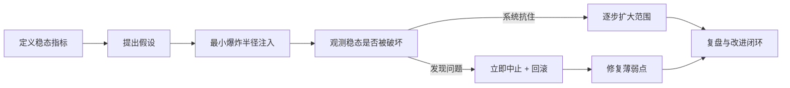

# 混沌工程

> **摘要**：系统的容错能力（熔断、降级、重试、多副本）只有在真实故障下才能验证。混沌工程通过**主动、可控地注入故障**，在事故真正发生前发现薄弱环节，把「我以为能扛住」变成「实测能扛住」。本文讲混沌工程的原则、注入类型、实验流程与安全边界。

> **关联**：验证的正是[熔断](../base/high_availability/circuit_breaker.md)、[降级](../base/high_availability/degradation.md)、[跨组件隔离](../components/cross_component/cross_component.md)是否真的生效；与[容量压测](./capacity_and_stress_testing.md)、[事件响应](./incident_response.md)配套。

---

## 一、核心原则

- **以稳态为基准**：先定义系统「正常」的可测量稳态（如成功率、延迟），实验就是看注入故障后稳态是否被破坏。
- **假设驱动**：每个实验有明确假设（如「杀掉一个实例，成功率不受影响」），验证真伪。
- **在生产（或准生产）中做**：只有真实环境才有真实依赖与流量；但要有严格的爆炸半径控制。
- **最小化爆炸半径**：从小流量、单实例开始，逐步扩大，随时可中止。

---

## 二、常见注入类型

| 类别 | 注入 | 验证目标 |
| :--- | :--- | :--- |
| 网络 | 延迟、丢包、断网 | 超时、重试、熔断是否生效 |
| 依赖 | 下游不可用、返回错误 | 降级与兜底是否触发 |
| 资源 | CPU/内存/磁盘打满 | 隔离与限流是否保护核心 |
| 实例 | 随机杀进程/节点 | 冗余与故障转移是否无感 |
| 时钟 | 时钟偏移 | 依赖时钟的逻辑（如[分布式锁](../components/distributed_lock/distributed_lock.md)）是否安全 |

---

## 三、实验流程

---

## 四、安全边界

- **前置条件**：完善的[可观测性](./observability.md)（否则出问题看不见）、可靠的一键中止/回滚、避开业务高峰。
- **分级**：实验按风险分级审批；高风险实验需更严格的窗口与值班保障。
- **止损**：预设自动中止条件（如成功率跌破阈值立即停止注入）。

---

## 五、验收与闭环

- 每个实验产出：假设是否成立、发现的薄弱点、改进项与负责人。
- 把「演练发现的问题」纳入[事件响应](./incident_response.md)的改进项追踪，形成闭环，避免同类问题重复。
- 关键容错能力应定期演练（游戏日 GameDay），而非一次性。

---

## 六、常见误区与澄清

- **误区：混沌工程等于压测。** 压测验证「容量够不够」，混沌验证「故障时容错（熔断/降级/隔离）是否真生效」。
- **误区：只能在测试环境做。** 只有生产的真实依赖与流量才能暴露真实薄弱点，靠最小爆炸半径控制风险。
- **误区：没准备就能开始注入。** 前提是完善可观测性 + 可靠的一键中止/回滚，否则出问题看不见也停不下。
- **误区：一上来就大范围注入。** 应最小爆炸半径起步、自动止损、避开高峰、分级审批。
- **误区：演练做完就结束。** 价值在「发现→修复→改进」闭环 + 定期演练（GameDay），一次性演练意义有限。

---

## 七、引用关系

- 验证机制：[熔断](../base/high_availability/circuit_breaker.md)、[降级](../base/high_availability/degradation.md)、[跨组件协同](../components/cross_component/cross_component.md)
- 配套治理：[可观测性](./observability.md)、[容量压测](./capacity_and_stress_testing.md)、[事件响应](./incident_response.md)
