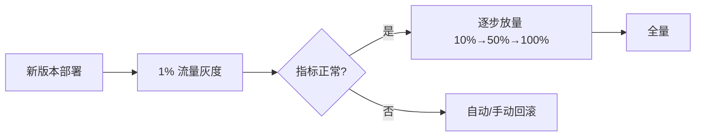

# 灰度发布与回滚治理

> **摘要**：绝大多数线上故障源于「变更」。发布治理的目标是让变更**小步、可观测、可回滚**：用灰度把影响范围从「全站」缩到「一小撮」，用门禁在指标异常时自动阻断，用一键回滚快速止损。本文讲灰度策略、自动门禁、回滚机制与数据兼容。

> **关联**：门禁指标来自[可观测性](./observability.md)与[SLO](./sla_slo_management.md)；配置变更走同样纪律见[配置中心](../components/config_center/config_center.md)；回滚是[事件响应](./incident_response.md)的首选止血手段。

---

## 治理目标

- 变更影响范围可控。
- 失败场景可快速止损。
- 上线过程可追踪、可审计。

---

## 一、灰度策略（金丝雀发布）

核心是「先放一小部分，验证没问题再扩大」：

分批维度：按**流量比例**、**实例/分批（滚动）**、**地域/租户**、**用户白名单**。灰度期间新旧版本并存，因此接口/数据必须**向前兼容**。

---

## 治理流程

- 发布前：变更评审、风险评估、回滚预案确认。
- 发布中：分批灰度、实时观测、门禁校验。
- 发布后：指标对比、稳定性观察、复盘归档。

---

## 二、自动门禁

灰度每一批都要有「放行/阻断」的客观判据，而非靠人肉盯盘：

- **门禁指标**：错误率、P99 延迟、资源水位、核心业务指标，任一越线即阻断并告警。
- **对比基线**：新版本与旧版本（或历史同期）对比，避免被大盘波动误判。
- **自动回滚**：达到阻断条件时自动回滚，把 MTTR 降到分钟级。

---

## 关键机制

- 灰度策略：按流量、地域、租户、实例分批放量。
- 自动门禁：错误率、延迟、资源阈值触发阻断。
- 回滚机制：版本快照、一键回滚、数据兼容保障。
- 变更审计：变更单、责任人、时间线、影响面记录。

---

## 三、回滚与数据兼容（expand/contract）

回滚代码容易，回滚**数据库变更**难——这是发布治理最大的坑。原则是**变更向前/向后兼容**，用「扩展/收缩」两阶段：

- **扩展（expand）**：先加新列/新表，代码同时兼容新旧结构（双写或兼容读），此阶段可随时回滚。
- **切换**：灰度切到使用新结构。
- **收缩（contract）**：确认稳定后再删除旧列/旧结构。

绝不「加列的同时就删旧列」——一旦回滚，旧代码找不到列直接崩。破坏性 DDL（删列、改类型）必须与代码发布解耦、分多次进行。

---

## 验收指标

- 发布成功率。
- 回滚触发率与回滚成功率。
- 变更导致的故障占比。
- 发布窗口内故障恢复时长。

---

## 四、面试高频问答

- **为什么要灰度？** 多数故障源于变更；灰度把影响面从全站缩到一小撮，可控可回滚。
- **灰度怎么决定放行？** 自动门禁：错误率/延迟/资源与基线对比，越线即阻断。
- **数据库变更怎么安全回滚？** expand/contract 两阶段，保持新旧兼容，破坏性 DDL 与发布解耦。
- **为什么不能加列同时删旧列？** 回滚后旧代码找不到列会崩，必须分阶段。
- **回滚为什么是首选止血？** 变更是主要故障源，回滚最快恢复，根因可事后再查。

---

## 五、引用关系

- 依赖：[可观测性](./observability.md)、[SLA/SLO 管理](./sla_slo_management.md)
- 关联：[配置中心](../components/config_center/config_center.md)（配置灰度/回滚）、[事件响应](./incident_response.md)、[跨组件协同](../components/cross_component/cross_component.md)（变更编排）
