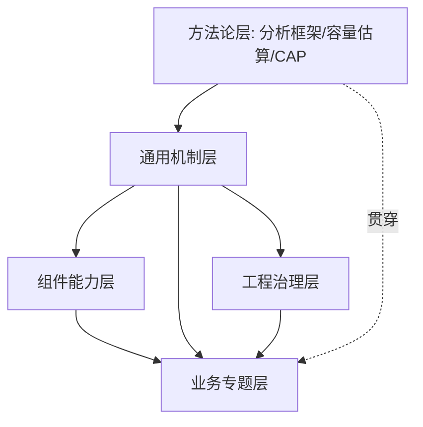
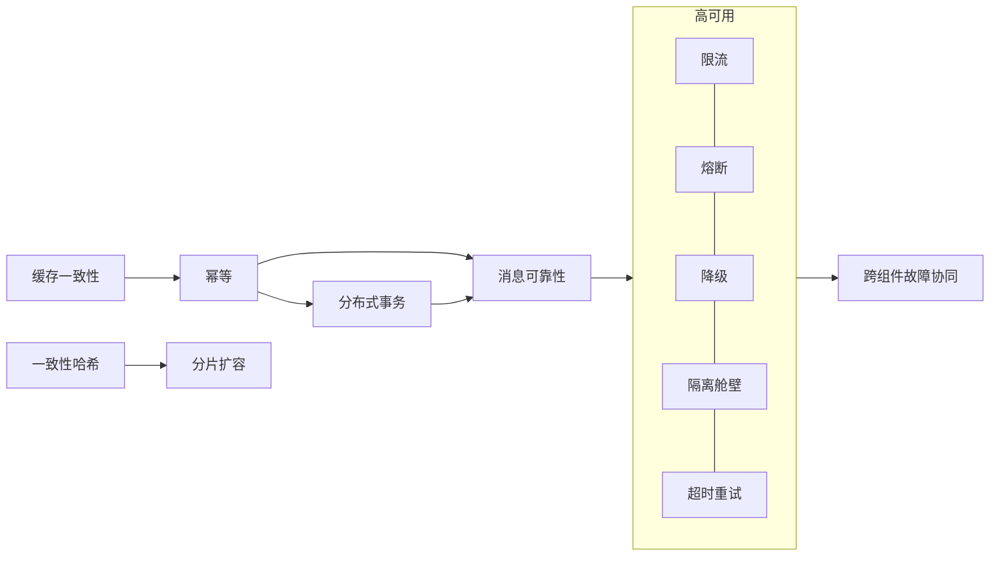

# 系统设计知识地图与问题速查

> **用途**：这是整个系统设计模块的「总览路线图」。它把五层内容用一张依赖关系图串起来，给出建议学习路径与「常见问题 → 文档」速查，帮助你从「零散知识点」走向「成体系、能融会贯通」。

---

## 一、五层全景与依赖关系

- **方法论层**打地基（怎么拆问题、估容量、做取舍）。
- **通用机制层**是可迁移的技术内核（一致性、高可用、安全）。
- **组件能力层**把机制封装成可复用单元（限流器、ID、缓存…）。
- **工程治理层**保证方案稳定上线与演进（SLO、灰度、混沌…）。
- **业务专题层**在真实约束下组合以上一切。

---

## 二、核心机制依赖图（融会贯通的关键）

系统设计的题目千变万化，但底层反复用到这几组机制及其协同关系：

一句话串联：**幂等是一切重试/补偿的地基；分布式事务与消息可靠性用它实现最终一致；高可用五件套（限流/熔断/降级/隔离/超时重试）共同阻断故障级联；缓存一致性与一致性哈希/分片解决数据的性能与扩展。**

---

## 三、建议学习路径

1. 方法论：[设计可扩展分布式系统的方法论](./设计可扩展分布式系统的方法论.md)
2. 一致性三件套：[幂等](./base/idempotence.md) → [分布式事务](./base/distributed_transaction.md) → [消息可靠性](./base/message_reliability.md) → [缓存一致性](./base/cache_consistency.md)
3. 高可用：[限流](./base/high_availability/rate_limiting.md) → [熔断](./base/high_availability/circuit_breaker.md) → [降级](./base/high_availability/degradation.md) → [隔离舱壁](./base/high_availability/bulkhead_isolation.md) → [超时重试](./base/high_availability/timeout_and_retry.md) → [负载均衡](./base/high_availability/load_balancing.md)
4. 扩展与安全：[分片与扩容迁移](./base/sharding_and_migration.md)、[认证](./base/security/authentication.md)/[授权](./base/security/authorization.md)/[服务身份](./base/security/service_identity.md)
5. 组件：[一致性哈希](./components/consistent_hash/consistent_hash.md)、[ID 生成](./components/id_generator/id_generator.md)、[缓存](./components/cache_component/cache_component.md)、[分布式锁](./components/distributed_lock/distributed_lock.md)、[任务调度](./components/task_scheduler/task_scheduler.md)、[短链](./components/short_link/short_link.md)、[搜索](./components/search_component/search_component.md)、[服务注册](./components/service_registry/service_registry.md)、[配置中心](./components/config_center/config_center.md)、[通知](./components/notification/notification.md)、[规则引擎](./components/rule_engine/rule_engine.md)、[跨组件协同](./components/cross_component/cross_component.md)
6. 治理：[SLA/SLO](./governance/sla_slo_management.md) → [可观测性](./governance/observability.md) → [灰度回滚](./governance/release_and_rollback.md) → [容量压测](./governance/capacity_and_stress_testing.md) → [混沌工程](./governance/chaos_engineering.md) → [事件响应](./governance/incident_response.md)
7. 业务专题：[电商](./scenarios/ecommerce/ecommerce_system.md)、[支付](./scenarios/payment/payment_system.md)、[IM](./scenarios/chat/chat_system.md)、[排行榜](./scenarios/leaderboard/leaderboard_system.md)、[Feed/营销](./scenarios/marketing/marketing_system.md)、[搜索](./scenarios/search/search_system.md)、[广告](./scenarios/advertising/advertising_system.md)、[地图](./scenarios/map/map_system.md)、[云盘](./scenarios/cloud_drive/cloud_drive_system.md)、[预订](./scenarios/booking/booking_system.md)

---

## 四、常见问题 → 文档速查

| 设计问题 | 对应文档 |
| :--- | :--- |
| 如何防止重复下单/重复支付 | [幂等](./base/idempotence.md)、[支付](./scenarios/payment/payment_system.md) |
| 跨服务如何保证一致性 | [分布式事务](./base/distributed_transaction.md) |
| 消息如何不丢不重 | [消息可靠性](./base/message_reliability.md) |
| 缓存和数据库如何保持一致 | [缓存一致性](./base/cache_consistency.md) |
| 缓存击穿/穿透/雪崩区别 | [缓存一致性](./base/cache_consistency.md) |
| 限流算法有哪些 | [限流](./base/high_availability/rate_limiting.md) |
| 熔断/降级/隔离怎么配合 | [熔断](./base/high_availability/circuit_breaker.md)、[隔离舱壁](./base/high_availability/bulkhead_isolation.md) |
| 重试风暴怎么防 | [超时与重试](./base/high_availability/timeout_and_retry.md) |
| 分库分表怎么扩容迁移 | [分片与扩容迁移](./base/sharding_and_migration.md) |
| 一致性哈希解决什么问题 | [一致性哈希](./components/consistent_hash/consistent_hash.md) |
| 分布式 ID 怎么生成 | [ID 生成器](./components/id_generator/id_generator.md) |
| 分布式锁怎么实现、有什么坑 | [分布式锁](./components/distributed_lock/distributed_lock.md) |
| 海量延迟任务怎么调度 | [任务调度](./components/task_scheduler/task_scheduler.md) |
| 短链系统怎么设计 | [短链](./components/short_link/short_link.md) |
| 服务发现为什么选 AP | [服务注册](./components/service_registry/service_registry.md) |
| 配置怎么不重启动态生效 | [配置中心](./components/config_center/config_center.md) |
| LRU/LFU 淘汰策略 | [缓存组件](./components/cache_component/cache_component.md) |
| 秒杀怎么防超卖 | [电商](./scenarios/ecommerce/ecommerce_system.md) |
| 排行榜怎么设计 | [排行榜](./scenarios/leaderboard/leaderboard_system.md) |
| 写扩散还是读扩散 | [IM](./scenarios/chat/chat_system.md) |
| 大文件上传/秒传 | [云盘](./scenarios/cloud_drive/cloud_drive_system.md) |
| 附近的人怎么查 | [地图](./scenarios/map/map_system.md) |
| 广告竞价与计费 | [广告](./scenarios/advertising/advertising_system.md) |
| SLO/错误预算怎么用 | [SLA/SLO](./governance/sla_slo_management.md) |
| 如何估算容量/实例数 | [容量压测](./governance/capacity_and_stress_testing.md) |
| 故障了怎么处理 | [事件响应](./governance/incident_response.md) |

---

## 五、交互推演组件一览

本模块内嵌了多个可交互推演组件，帮助把抽象机制变成「可操作、看得见」的直觉：Saga 补偿、Cache Aside 时序、投递语义、一致性哈希环、Snowflake 位段、令牌桶/漏桶、短码编码、分布式锁续约、时间轮、服务健康检查、配置灰度、缓存淘汰、倒排索引、通知漏斗、故障级联、分片迁移、错误预算、利特尔法则、库存超卖、ZSet 排名、写/读扩散、支付状态机、Geohash、广告竞价、重试风暴等。它们分布在对应主题文档中，可直接在页面上调参观察。

---

## 六、系统设计方法（评审 checklist）

设计或评审一个系统时的推荐推进顺序，正好对应本模块五层：

1. **澄清需求与边界**：功能/非功能需求、QPS 与数据量估算——方法论层。
2. **给出高层架构**：服务拆分、数据流、存储与中间件选型——方法论 + 机制层。
3. **深入核心难点**：一致性、高可用、扩展性的具体机制——机制层 + 组件层。
4. **治理与演进**：可观测、灰度、容量、故障预案——治理层。
5. **权衡取舍**：每个决策说清「为什么这样、代价是什么」——贯穿始终。

---

## 引用

- 模块总览与信息架构：[`README.md`](./README.md)
- 各层知识点索引：[base](./base/TOPICS.md)、[components](./components/cross_component/TOPICS.md)、[governance](./governance/TOPICS.md)、[scenarios](./scenarios/TOPICS.md)
