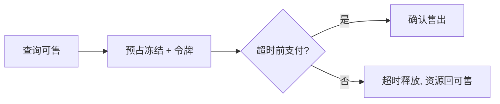

# 预订系统（酒店/机票/票务）

> **摘要**：预订系统的核心是**有限资源的库存锁定与防超卖**（房间、座位、时段），叠加**支付前的预占与超时释放**、**支付回调乱序处理**。与电商秒杀相通，但资源更「独占」（一个座位只能给一个人）。本文按「资源模型 → 预占与超时释放 → 防超卖 → 状态机与乱序回调 → 高并发抢购 → 面试问答」推进。

> **关联**：库存原子性见[电商](../ecommerce/ecommerce_system.md)；一致性用[分布式事务](../../base/distributed_transaction.md)与[幂等](../../base/idempotence.md)；超时释放用[任务调度](../../components/task_scheduler/task_scheduler.md)。

---

## 一、资源与库存模型

资源是**可数、独占**的：某日某房型 N 间、某场次某座位 1 个。库存有两种粒度：

- **计数型**（酒店房型剩 N 间）：类似电商库存，用原子扣减。
- **具体位型**（电影座位、机票座位）：每个座位是独立实体，需精确到「这一个」的锁定，不能只减计数。

---

## 二、预占与超时释放

预订区别于电商的关键：**下单到支付有较长时间窗**（选座后要付款），期间必须先「占住」资源不让别人抢，但又不能永久占用：

- **预占（库存冻结）**：创建预订单时冻结资源，附带**预占令牌 + 超时时间**。
- **超时释放**：超时未支付则由[定时任务/时间轮](../../components/task_scheduler/task_scheduler.md)释放冻结，资源回到可售。
- **支付确认**：支付成功则把「冻结」转为「售出」；这一步要幂等（支付回调会重发）。

---

## 三、防超卖

与电商同源——先查后改必超卖，必须原子扣减：

<InventoryDeductionExplorer />

- 计数型：`UPDATE stock=stock-1 WHERE stock>0` 或 Redis 预扣。
- 具体位型：座位状态用乐观锁/CAS（`UPDATE seat SET status='held' WHERE id=? AND status='free'`），只有一个请求能成功。
- 热门场次抢购：排队削峰 + [限流](../../base/high_availability/rate_limiting.md) + 库存隔离。

---

## 四、状态机与乱序回调

预订单状态机：`待支付 → 已支付 → 已确认/出票 →（取消/退订）`。难点是**支付回调乱序/重复**：

- 支付成功回调可能晚于超时释放到达——需判断预占是否已释放（幂等 + 状态校验），已释放则走退款而非确认。
- 回调重复：状态机终态幂等忽略（见[支付](../payment/payment_system.md)）。

---

## 五、高并发抢购

热门票（演唱会、春运票）是极端秒杀：

- 排队系统（发放资格令牌）+ 限流 + 库存 Redis 预扣。
- 具体座位并发选座：座位锁 + 短超时，防止「占而不买」长期锁座。
- 防刷：验证码、设备/账号风控。

---

## 六、指标体系

- 预订成功率、超卖率（必须为 0）；
- 预占超时释放及时率、取消率；
- 支付确认时延 P99、回调处理成功率。

---

## 七、面试高频问答

- **预订和电商库存有何不同？** 有较长「预占→支付」窗口，需冻结 + 超时释放；座位型需精确锁定具体资源。
- **怎么防超卖？** 原子扣减/座位 CAS，杜绝先查后改。
- **超时未支付怎么回收？** 定时任务/时间轮释放冻结资源。
- **支付回调晚于超时释放怎么办？** 幂等 + 状态校验，已释放则退款而非确认。
- **热门票怎么抗？** 排队令牌 + 限流 + Redis 预扣 + 座位短锁。
- **回调重复扣款？** 状态机终态幂等忽略。

---

## 八、引用关系

- 边界与知识点索引：[`TOPICS.md`](./TOPICS.md)
- 机制/组件：[分布式事务](../../base/distributed_transaction.md)、[幂等](../../base/idempotence.md)、[限流](../../base/high_availability/rate_limiting.md)、[任务调度](../../components/task_scheduler/task_scheduler.md)、[分布式锁](../../components/distributed_lock/distributed_lock.md)
- 相邻专题：[电商](../ecommerce/ecommerce_system.md)、[支付](../payment/payment_system.md)
