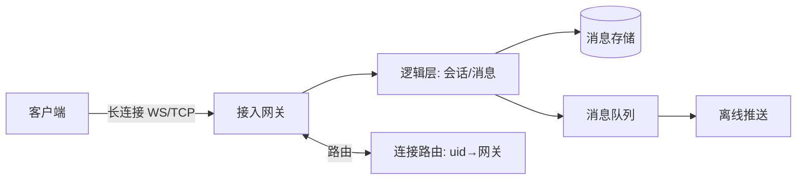

# 聊天（IM）系统

> **摘要**：IM 要在**海量长连接**下做到消息**不丢、不重、有序、多端同步**，并区分单聊与群聊、在线与离线。核心难点是长连接接入层、消息可靠投递语义、写扩散/读扩散选择与群消息放大。本文按「架构分层 → 长连接接入 → 消息可靠与有序 → 单聊/群聊存储 → 写扩散vs读扩散 → 在线状态与多端 → 关键设计要点」推进。

> **关联**：投递语义见[消息可靠性](../../base/message_reliability.md)；去重见[幂等](../../base/idempotence.md)；ID 有序见[分布式 ID](../../components/id_generator/id_generator.md)；推送见[通知组件](../../components/notification/notification.md)。

---

## 一、架构分层

接入层维持海量长连接，逻辑层处理消息与会话，存储层持久化消息，路由记录「用户在哪台网关」以便投递。

---

## 二、长连接接入

- **协议**：WebSocket / 自定义 TCP，配合心跳保活与断线重连。
- **连接路由**：用户与网关的映射（`uid → gatewayId`）存在注册中心/Redis，投递时先查路由再推给对应网关。
- **海量连接**：单机连接数受内存/FD 限制，水平扩展多网关，接入层无状态化（状态在路由表）。

---

## 三、消息可靠与有序

- **可靠投递**：采用「至少一次 + 客户端去重」。发送端消息落库后返回，接收端 ack 确认，未 ack 重推；客户端按消息 ID 去重（见[消息可靠性](../../base/message_reliability.md)、[幂等](../../base/idempotence.md)）。
- **有序**：每个会话分配单调递增的 `seq`（会话内序号），客户端按 seq 排序与查漏补齐；跨会话不要求全局有序。用[分布式 ID](../../components/id_generator/id_generator.md)或会话级自增生成 seq。
- **离线消息**：接收方离线时消息存入其「收件箱/离线队列」，上线后按 seq 增量拉取。

---

## 四、单聊与群聊存储

- **单聊**：一条消息逻辑上属于一个会话，常「一份存储 + 双方各自会话指针」。
- **读扩散（拉模型）**：消息只存一份（发件箱），读时聚合。写便宜、存储省，读要合并。
- **写扩散（推模型）**：消息写入每个接收者的收件箱。读快，但群大时写放大严重。

---

## 五、写扩散 vs 读扩散（群聊/Feed 的核心权衡）

群聊/朋友圈的关键抉择，用下面的组件感受写放大：

<FanoutExplorer />

- **小群/普通用户**：写扩散（推），读快、体验好。
- **万人大群/大 V**：写扩散写放大爆炸，改用读扩散（拉）或**推拉结合**（活跃成员推、不活跃拉）。
- 微信大群多采用「读扩散 + 会话内 seq」，微博 Feed 用推拉结合。

---

## 六、在线状态与多端同步

- **在线状态**：用 Redis 存 `uid → 在线/离线 + 最后活跃`，心跳更新，超时判离线（同[服务注册](../../components/service_registry/service_registry.md)的心跳思路）。状态变更广播给关注方需控制频率防风暴。
- **多端同步**：同一账号多设备，消息要多端可见且已读状态同步。用「会话级 seq + 每端已读位点」实现多端一致的已读/未读。

---

## 七、指标体系

- 消息投递成功率、端到端投递延迟 P99；
- 消息丢失率（≈0）、重复率、乱序率；
- 长连接在线数、断连重连成功率；
- 离线消息拉取延迟。

---

## 八、关键设计要点

- **不丢不重**：落库 + ack 重推（至少一次）+ 客户端按消息 ID 去重。
- **有序**：会话内单调 seq，客户端按 seq 排序补齐；不追求全局有序。
- **群聊扩散**：小群写扩散（推）、大群/大 V 读扩散（拉）或推拉结合。
- **海量长连接**：多网关水平扩展 + 连接路由表 + 心跳保活。
- **离线消息**：存离线队列/收件箱，上线按 seq 增量拉取。
- **多端已读**：会话 seq + 每端已读位点。

---

## 九、引用关系

- 边界与知识点索引：[`TOPICS.md`](./TOPICS.md)
- 机制/组件：[消息可靠性](../../base/message_reliability.md)、[幂等](../../base/idempotence.md)、[分布式 ID](../../components/id_generator/id_generator.md)、[服务注册](../../components/service_registry/service_registry.md)、[通知组件](../../components/notification/notification.md)
- 治理：[限流](../../base/high_availability/rate_limiting.md)、[降级](../../base/high_availability/degradation.md)、[可观测性](../../governance/observability.md)
