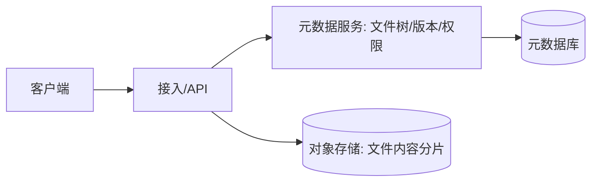

# 云盘系统

> **摘要**：云盘的核心是**大文件可靠上传下载**与**元数据一致性**。关键能力：分片上传、断点续传、秒传（去重）、元数据与对象存储分离、分享与回收站。本文按「架构分层 → 分片上传与断点续传 → 秒传去重 → 元数据一致性 → 下载与分享 → 成本 → 关键设计要点」推进。

> **关联**：上传提交的一致性靠[幂等](../../base/idempotence.md)与[消息可靠性](../../base/message_reliability.md)；元数据分片见[分片与扩容迁移](../../base/sharding_and_migration.md)。

---

## 一、架构分层

核心设计是**元数据与内容分离**：文件内容（大、不可变、按分片）放对象存储；文件树、版本、权限、配额等元数据放数据库。二者的一致性（先传内容再提交元数据）是难点。

---

## 二、分片上传与断点续传

大文件不能一次性上传（超时、失败重传代价大）：

- **分片（chunk）**：把文件切成固定大小分片（如 4MB）分别上传，可并发、可单片重试。
- **断点续传**：记录已上传分片，中断后只补传缺失分片。客户端先问服务端「哪些分片已存在」，再续传。
- **合并提交**：所有分片上传完成后提交一次「合并」，服务端校验分片完整性（数量 + 校验和）后写入元数据，文件才「可见」。这是一个两阶段协议，提交必须幂等。

---

## 三、秒传（去重）

「秒传」的原理：上传前先算文件内容哈希（如 SHA-256），若服务端已存在相同哈希的内容，**只需建立一条新的元数据引用，无需真正上传**——即时完成。

- **内容寻址 + 引用计数**：相同内容全局存一份，多个用户/文件通过引用指向它；删除时引用计数减一，归零才真正删。
- **收益**：热门文件（同一安装包被无数人上传）大幅节省存储与带宽。
- **注意**：需防「哈希碰撞」（用强哈希 + 大小校验）与「未授权访问」（不能凭哈希直接下载他人文件，需权限校验）。

---

## 四、元数据一致性

- **提交协议**：内容先落对象存储，成功后再提交元数据；两者跨系统，用「先传内容 → 校验 → 提交元数据」顺序，失败可重试（幂等），避免「元数据指向不存在的内容」。
- **可见性窗口**：对象存储与元数据的最终一致，需保证提交完成前文件不对外可见。
- **版本**：文件更新产生新版本，元数据记录版本链，支持历史恢复与回收站。

---

## 五、下载与分享

- **下载**：元数据鉴权后返回对象存储的**临时签名 URL**（有时效），客户端直连对象存储/CDN 下载，不经过应用服务器，省带宽。
- **防盗链**：签名 URL 限时限域，防止链接被盗用。
- **分享**：分享链接是一条带权限与有效期的元数据记录，可设密码、有效期、只读/可编辑。

---

## 六、成本治理

- **去重压缩**：内容去重（秒传的副产品）+ 压缩。
- **冷热分层**：长期不访问的文件转低成本冷存储，按生命周期策略迁移。
- **跨区域复制**：按可靠性需求选择复制策略，平衡成本与容灾。

---

## 七、关键设计要点

- **大文件上传**：分片上传 + 并发 + 断点续传 + 合并提交（幂等）。
- **秒传**：内容哈希去重 + 引用计数，命中则只建元数据引用。
- **秒传风险**：哈希碰撞（强哈希 + 大小校验）、越权（须权限校验）。
- **元数据与内容一致**：先传内容再提交元数据，提交前不可见，失败幂等重试。
- **签名 URL 下载**：客户端直连对象存储/CDN 省带宽，限时防盗链。
- **降成本**：去重压缩 + 冷热分层 + 生命周期迁移。

---

## 八、引用关系

- 边界与知识点索引：[`TOPICS.md`](./TOPICS.md)
- 机制：[幂等](../../base/idempotence.md)、[消息可靠性](../../base/message_reliability.md)、[分片与扩容迁移](../../base/sharding_and_migration.md)
- 治理：[容量压测](../../governance/capacity_and_stress_testing.md)、[可观测性](../../governance/observability.md)
