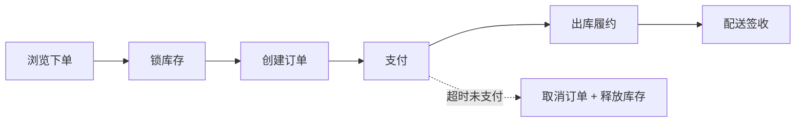

# 电商交易系统

> **摘要**：电商交易把「商品 → 库存 → 订单 → 支付 → 履约 → 售后」串成端到端链路，核心难点是**库存不超卖、订单状态一致、秒杀高并发、支付资金安全**。本文按「业务对象与主链路 → 库存与超卖 → 订单状态机 → 秒杀削峰 → 售后逆向 → 指标 → 关键设计要点」推进，是通用机制与组件在真实业务的组合落地。

> **关联**：一致性靠[分布式事务](../../base/distributed_transaction.md)与[幂等](../../base/idempotence.md)；扣减靠[分布式锁](../../components/distributed_lock/distributed_lock.md)/原子操作；峰值靠[限流](../../base/high_availability/rate_limiting.md)与[消息削峰](../../base/message_reliability.md)；支付细节见[支付系统](../payment/payment_system.md)。

---

## 一、核心对象与主链路

核心对象：商品（SPU/SKU）、库存、订单、支付单、履约单、售后单。主链路（正向）：

其中「下单锁库、支付、履约」跨多个服务与资源，是一致性设计的重灾区。

---

## 二、库存扣减与超卖防护

超卖是电商第一号问题。「先查库存再扣减」在并发下必然超卖——用下面的组件对比三种方案：

<InventoryDeductionExplorer />

- **DB 原子扣减**：`UPDATE stock=stock-1 WHERE id=? AND stock>0`，靠行锁串行化，简单可靠，但热点行是并发瓶颈。
- **Redis 预扣减**：秒杀等超高并发下先在 Redis 用 Lua 原子扣减，异步落库，再与 DB 对账兜底。
- **库存分桶**：把一个热点 SKU 的库存拆成 N 份分散到多 key/多行，降低单点竞争。
- **扣减时机**：下单预占 vs 支付扣减，需配合超时释放（未支付订单定时[任务](../../components/task_scheduler/task_scheduler.md)关单回补库存）。

---

## 三、订单状态机

订单状态必须用状态机约束，杜绝非法跳转与重复操作（重复支付回调、重复发货）。跨服务的下单（订单+库存+营销）用 [Saga](../../base/distributed_transaction.md) 编排 + 补偿，中间态对外展示为「处理中」，最终一致由对账兜底。

---

## 四、秒杀场景

秒杀是「瞬时超高并发 + 有限库存」，核心是层层削峰、把大部分请求挡在下游之前：

- **前端**：按钮置灰、验证码、答题削峰。
- **接入层**：[限流](../../base/high_availability/rate_limiting.md)、防刷（同用户/IP 频控）。
- **库存**：Redis 预扣减 + 库存隔离（秒杀库存与普通库存分开）。
- **异步下单**：抢到资格后进[消息队列](../../base/message_reliability.md)异步创建订单，削峰填谷，避免 DB 被瞬时打爆。
- **兜底**：售罄快速返回，避免无效请求穿透到 DB。

---

## 五、售后逆向链路

退货退款是「正向链路的镜像」：退款要走[支付](../payment/payment_system.md)的退款状态机（幂等、防重复退款），库存视情况回补，资金变更需记账与对账。逆向链路同样要状态机化，避免「重复退款」资损。

---

## 六、指标体系

- 交易：下单成功率、支付成功率、超卖数（必须为 0）；
- 性能：下单/支付 P99 延迟、秒杀峰值 QPS 与拒绝率；
- 履约：出库时效、配送时效、取消率；
- 售后：退款成功率、售后率、资损金额。

---

## 七、关键设计要点

- **防超卖**：DB 原子扣减（`stock>0`）或 Redis 预扣减 + 对账，杜绝先查后改。
- **秒杀削峰**：层层削峰——前端 → 限流防刷 → Redis 预扣 → 异步下单 → 售罄快返。
- **未支付订单**：定时任务超时关单并回补库存。
- **下单跨服务一致性**：Saga 编排 + 补偿 + 对账，状态机约束。
- **热点 SKU 扣减**：库存分桶打散热点行。
- **重复支付/发货**：状态机 + 幂等键防重。

---

## 八、引用关系

- 边界与知识点索引：[`TOPICS.md`](./TOPICS.md)
- 机制：[分布式事务](../../base/distributed_transaction.md)、[幂等](../../base/idempotence.md)、[缓存一致性](../../base/cache_consistency.md)、[限流](../../base/high_availability/rate_limiting.md)、[消息可靠性](../../base/message_reliability.md)
- 组件：[分布式锁](../../components/distributed_lock/distributed_lock.md)、[任务调度](../../components/task_scheduler/task_scheduler.md)、[分布式 ID](../../components/id_generator/id_generator.md)
- 相邻专题：[支付系统](../payment/payment_system.md)、[营销系统](../marketing/marketing_system.md)
