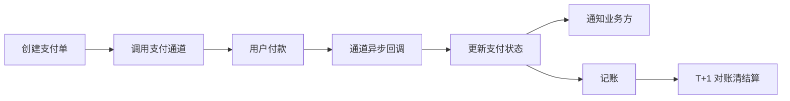

# 支付系统

> **摘要**：支付系统的第一诉求是**资金零差错**——不能多扣、少扣、重复扣、丢单。它把「交易一致性、幂等防重、记账、对账、通道治理」拧成一个对错误零容忍的链路。本文按「主链路 → 幂等与状态机 → 复式记账 → 对账清结算 → 通道路由与高可用 → 指标 → 面试问答」推进。

> **关联**：一致性用 [TCC](../../base/distributed_transaction.md)；防重用[幂等](../../base/idempotence.md)；回调可靠用[消息可靠性](../../base/message_reliability.md)；是[电商](../ecommerce/ecommerce_system.md)/[营销](../marketing/marketing_system.md)的资金底座。红包拆分算法见 [red_packet_split](../../../fundamentals/algorithms/red_packet_split.md)。

---

## 一、支付主链路

关键点：支付结果以**通道异步回调**为准（同步返回不可信），且回调会**重复发送**，因此回调处理必须幂等。

---

## 二、幂等与状态机（资损护城河）

支付/退款用状态机约束流转，对重复与非法事件幂等忽略。渠道重发的「支付成功」回调在终态被忽略，杜绝重复入账。用下面的组件体验：

<PaymentStateMachineExplorer />

- **幂等键**：商户订单号 / 支付流水号唯一约束，保证同一笔支付只处理一次（见[幂等](../../base/idempotence.md)）。
- **状态机**：`创建→支付中→已支付→(退款中→已退款)`，非法跳转拒绝；终态幂等。

---

## 三、复式记账

资金变动用**复式记账（double-entry）**：每笔交易同时记借贷两方，且借贷金额相等，保证「账永远平”。

- 例：用户付款 100 元 → 借「用户应付」100，贷「商户应收」100。
- 任何时刻全账户借贷总额相等（$\sum \text{借} = \sum \text{贷}$），这是对账的数学基础。
- 记账要与状态变更在一致的事务边界内（或用 [TCC/Outbox](../../base/distributed_transaction.md) 保证最终一致 + 对账兜底）。

---

## 四、对账清结算

对账是资金安全的最后防线：**任何异步链路都有不一致窗口，必须靠对账发现并修正**。

- **内部对账**：支付单、账务流水、订单三方比对，发现差异（多付/少付/状态不一致）。
- **外部对账**：与支付通道/银行的对账文件（日切）逐笔比对。
- **差错处理**：差异生成差错工单，走补单/冲正/人工核实闭环。
- **清结算**：按周期把资金结算给商户，需准确的账务与手续费计算。

---

## 五、通道路由与高可用

- **多通道路由**：接入多个支付通道，按成功率/成本/限额动态选路；单通道故障自动切换。
- **熔断降级**：通道抖动时[熔断](../../base/high_availability/circuit_breaker.md)快速失败并切备用通道。
- **回调可靠**：通道回调用[消息队列](../../base/message_reliability.md)异步处理 + 重试；同时主动向通道**查询补偿**（对账回查），双保险防丢单。

---

## 六、指标体系

- 资金：资损金额（核心，趋近 0）、对账差异笔数与修复时效；
- 交易：支付成功率、平均支付时长、通道成功率；
- 稳定性：回调处理成功率、补单率、通道切换次数。

---

## 七、面试高频问答

- **支付结果以什么为准？** 通道异步回调，且回调会重发，处理必须幂等。
- **怎么防重复扣款？** 幂等键（商户订单号）+ 状态机终态幂等。
- **为什么用复式记账？** 借贷恒等（账永远平），是对账的数学保证。
- **对账的作用？** 发现并修正异步链路的不一致，是资金安全最后防线。
- **回调丢了怎么办？** 主动向通道查询补偿（回查）+ 消息重试，双保险。
- **跨账户转账一致性？** TCC（冻结/确认/取消）+ 对账兜底。

---

## 八、引用关系

- 边界与知识点索引：[`TOPICS.md`](./TOPICS.md)
- 机制：[分布式事务](../../base/distributed_transaction.md)、[幂等](../../base/idempotence.md)、[消息可靠性](../../base/message_reliability.md)、[熔断](../../base/high_availability/circuit_breaker.md)
- 相邻专题：[电商](../ecommerce/ecommerce_system.md)、[营销](../marketing/marketing_system.md)
- 关联算法：[红包拆分](../../../fundamentals/algorithms/red_packet_split.md)
