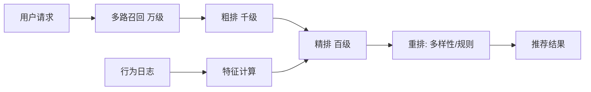

# 推荐系统

> **摘要**：推荐系统从海量物品中为每个用户选出最可能感兴趣的少量内容。它与搜索、广告共享「多路召回 → 排序漏斗」骨架，但更强调**个性化、实时性、冷启动与多样性**。本文按「链路 → 多路召回 → 排序 → 特征与训练服务一致 → 冷启动与探索 → 多样性 → 面试问答」推进。

> **关联**：漏斗与向量召回同[搜索](../search/search_system.md)/[广告](../advertising/advertising_system.md)；行为日志流靠[消息可靠性](../../base/message_reliability.md)；结果缓存靠[缓存组件](../../components/cache_component/cache_component.md)。

---

## 一、整体链路

和搜索一样是「漏斗式」：召回要全要快，排序逐层精细，最后重排保体验。差别在于**没有明确 query**，用「用户画像 + 上下文」代替查询意图。

---

## 二、多路召回

单一召回覆盖不全，工业界并行多路再合并：

- **协同过滤（CF）**：基于「相似用户/相似物品」的行为，经典有效。
- **内容召回**：基于物品标签/文本相似。
- **向量召回**：用户/物品编码成向量，ANN（HNSW）找近邻，捕捉语义，是现代主力。
- **兜底召回**：热门、新品、运营位，保证新用户/长尾也有结果。

多路结果去重合并后进入排序。

---

## 三、排序

- **粗排**：轻量模型把万级候选缩到千级，平衡效果与算力。
- **精排**：复杂模型（深度 CTR/CVR 预估）对百级候选精细打分，是效果核心。
- **重排**：多样性打散（避免刷屏同类）、业务规则、疲劳度控制、生态调控。

目标通常是多目标（点击 + 时长 + 转化 + 留存）的加权/多任务模型，而非单一 CTR。

---

## 四、特征与训练/服务一致性

- **离线 + 实时特征**：用户长期画像离线算，实时行为（刚点了什么）在线算，融合提升时效。
- **训练/服务一致（train-serving skew）**：训练用的特征口径必须与线上服务一致，否则模型效果打折——常用统一特征平台 + 特征快照解决。这是推荐工程的高频坑。

---

## 五、冷启动与探索

- **新用户**：无行为，用人口属性、热门、兜底策略起步，快速收集反馈。
- **新物品**：无曝光，给予探索流量测试其表现。
- **EE（探索与利用）**：不能只推「已知最优」（利用），要留一定探索预算发现新兴趣/新物品，常用 $\epsilon$-greedy、UCB、Thompson 采样。纯利用会导致信息茧房与生态僵化。

---

## 六、多样性与体验

- 去重、同类打散、作者/来源打散，避免「一屏全是同一类」。
- 疲劳度：已看过/已负反馈的内容降权。
- 生态平衡：给中小创作者/新内容流量，维持内容供给。

---

## 七、指标体系

- 效果：CTR、CVR、人均时长、次日/7 日留存；
- 生态：覆盖率、多样性、新内容曝光占比；
- 工程：推荐请求 P99 延迟、特征新鲜度、召回命中率。

---

## 八、面试高频问答

- **推荐和搜索区别？** 搜索有明确 query，推荐用画像+上下文代替，更强调个性化与探索。
- **为什么多路召回？** 单路覆盖不全，多路互补再合并提高召回。
- **向量召回怎么做？** 用户/物品编码成向量 + ANN 近邻检索，捕捉语义。
- **训练服务不一致会怎样？** 特征口径不一致导致线上效果远差于离线，需统一特征平台。
- **冷启动怎么解？** 属性/热门兜底 + 探索流量 + EE 策略。
- **为什么要探索？** 纯利用导致信息茧房，探索发现新兴趣、扶持新内容。
- **只优化 CTR 有什么问题？** 标题党/短期诱导，需多目标（时长/转化/留存）平衡。

---

## 九、引用关系

- 边界与知识点索引：[`TOPICS.md`](./TOPICS.md)
- 相邻/机制：[搜索](../search/search_system.md)、[广告](../advertising/advertising_system.md)、[消息可靠性](../../base/message_reliability.md)、[缓存组件](../../components/cache_component/cache_component.md)
- 基础：向量相似度见 `fundamentals/`
