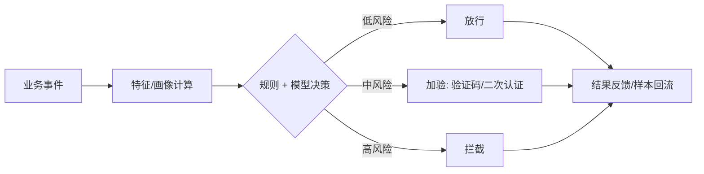

# 风控系统

> **摘要**：风控系统在关键业务动作（登录、下单、支付、提现、发帖）发生的**毫秒级**内，判断该行为是否欺诈/作弊/异常并做出放行、拦截或加验的决策。核心是**实时决策链路 + 规则与模型协同 + 名单/画像 + 攻防对抗**。本文按「决策链路 → 规则引擎 → 特征与名单 → 规则与模型协同 → 误杀漏杀权衡 → 对抗 → 关键设计要点」推进。

> **关联**：决策核心复用[规则引擎](../../components/rule_engine/rule_engine.md)；反作弊场景见[广告](../advertising/advertising_system.md)；身份见[认证](../../base/security/authentication.md)/[授权](../../base/security/authorization.md)；事件流靠[消息可靠性](../../base/message_reliability.md)。

---

## 一、实时决策链路

关键约束：**决策必须低延迟**（不能拖慢主链路）且**高可用**（风控挂了要有默认策略：核心资金链路默认从严，普通链路默认放行，避免风控故障阻断全站）。

---

## 二、规则引擎：快速迭代的核心

风控对抗变化极快，规则要能「不发版就上线」，因此普遍用[规则引擎](../../components/rule_engine/rule_engine.md)：

- 规则可配置、可灰度、可 A/B、可秒级生效与回滚（配合[配置中心](../../components/config_center/config_center.md)）。
- 规则 + 模型分工：规则处理明确、可解释的策略（如「同设备 1 分钟 5 次下单」）；模型处理复杂、隐性的模式（如团伙欺诈）。

---

## 三、特征与名单

- **画像/特征**：主体（用户/设备/IP）的实时与历史特征（频次、金额、地理跳变、设备指纹）。实时特征需低延迟计算（滑动窗口计数）。
- **名单体系**：黑名单（确定坏）、白名单（确定好，免打扰）、灰名单（可疑，加验），支持快速命中。
- **关联图谱**：把用户-设备-IP-银行卡等关联成图，识别「一人多号」「团伙」等群体欺诈——单点看正常，成团看异常。

---

## 四、误杀与漏杀的权衡

风控本质是**分类问题的阈值权衡**：

- **误杀（False Positive）**：把正常用户判为风险 → 伤害体验、投诉、流失。
- **漏杀（False Negative）**：放过真实欺诈 → 资损。
- 阈值决定两者的平衡：资金链路宁可误杀多加验（从严），普通行为宁可漏杀保体验（从宽）。用「加验」这一中间档缓冲，而非非黑即白。

---

## 五、对抗与闭环

- **样本回流**：决策结果与事后确认（是否真欺诈）回流，持续训练模型、迭代规则。
- **攻防演进**：黑产会试探规则，需持续更新；规则/模型要可解释、可回溯，便于复盘与申诉。
- **离线 + 实时结合**：实时拦截高风险，离线批量挖掘团伙、补充名单。

---

## 六、指标体系

- 效果：拦截率、欺诈漏过率、资损金额；
- 体验：误杀率、加验通过率、申诉率；
- 工程：决策延迟 P99、规则生效时效、可用性。

---

## 七、关键设计要点

- **规则引擎**：对抗变化快，规则要可配置、秒级生效与回滚，不能靠发版。
- **规则 + 模型分工**：规则处理明确可解释策略，模型处理复杂隐性模式，二者互补。
- **误杀/漏杀权衡**：调阈值 + 中间「加验」档，资金从严、体验从宽。
- **团伙识别**：关联图谱把用户-设备-IP 连成图，看群体异常。
- **风控故障兜底**：默认策略——核心资金从严、普通链路放行，避免阻断全站。
- **持续提升**：样本回流闭环，实时拦截 + 离线挖掘。

---

## 八、引用关系

- 边界与知识点索引：[`TOPICS.md`](./TOPICS.md)
- 组件/机制：[规则引擎](../../components/rule_engine/rule_engine.md)、[配置中心](../../components/config_center/config_center.md)、[限流](../../base/high_availability/rate_limiting.md)、[消息可靠性](../../base/message_reliability.md)
- 相邻专题：[广告反作弊](../advertising/advertising_system.md)、[支付](../payment/payment_system.md)
